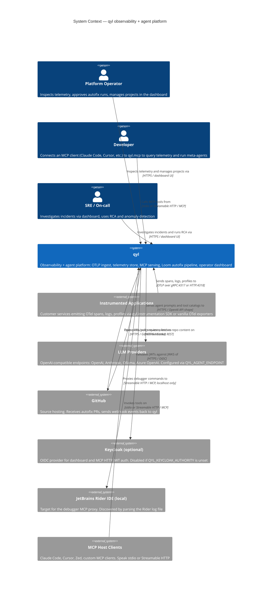
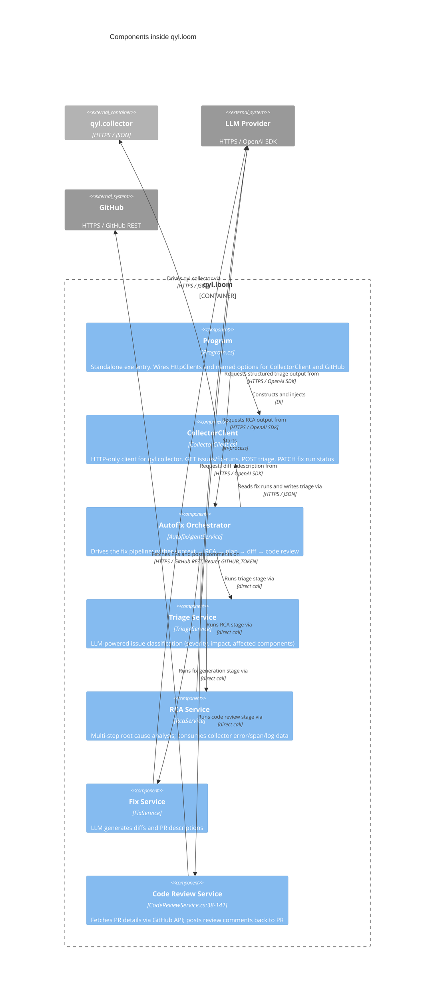
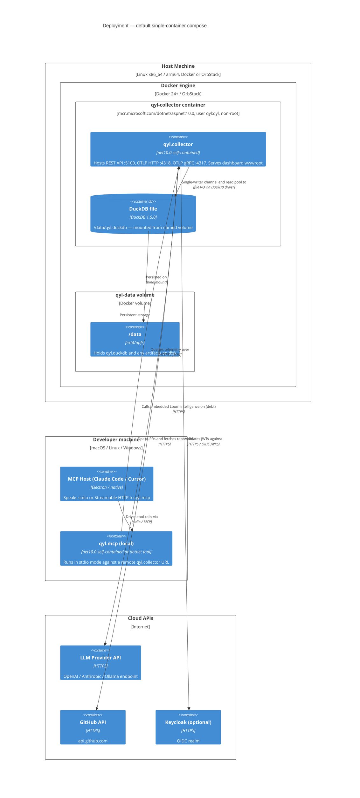

# qyl Architecture — C4 Model

**Date:** 2026-04-13
**Scope:** All 8 real qyl projects and their environment.
**Method:** Simon Brown's [C4 model](https://c4model.com) — Context → Container → Component. Level 4 (Code) is intentionally omitted; the Roslyn source generators are the authoritative code map and rendering class diagrams by hand is churn.
**Source of truth:** the .cs files. This document must match them. If it drifts, fix this document, not the code.
**Review checklist:** every diagram below passes Simon Brown's review checklist. Compliance table is in §8.

---

## 0. How to read this document

The C4 model is four nested levels of zoom. Each level answers a different question:

| Level | Question | Changes |
|---|---|---|
| **1 — System Context** | Who uses qyl and what does it talk to? | Very slowly |
| **2 — Container** | What are qyl's deployable/runnable pieces? | Slowly |
| **3 — Component** | What are the internal building blocks of one container? | Often |
| **4 — Code** | What classes implement one component? | Every commit — skip it |

We render levels 1–3. Level 4 is read from the IDE.

---

## 1. Legend

This legend applies to every diagram in this document.

### 1.1 Acronyms

| Term | Expansion |
|---|---|
| AOT | Ahead-Of-Time (compilation) |
| API | Application Programming Interface |
| BCL | Base Class Library (.NET) |
| CI/CD | Continuous Integration / Continuous Delivery |
| CLR | Common Language Runtime (.NET) |
| CORS | Cross-Origin Resource Sharing |
| CSP | Content Security Policy |
| DI | Dependency Injection |
| DSL | Domain-Specific Language |
| gRPC | Google Remote Procedure Call |
| HMAC | Hash-based Message Authentication Code |
| HTTP/S | HyperText Transfer Protocol (Secure) |
| IDE | Integrated Development Environment |
| IPC | Inter-Process Communication |
| JWT | JSON Web Token |
| JWKS | JSON Web Key Set |
| LLM | Large Language Model |
| MCP | Model Context Protocol |
| OAuth | Open Authorization |
| OIDC | OpenID Connect |
| OTel | OpenTelemetry |
| OTLP | OpenTelemetry Protocol |
| PII | Personally Identifiable Information |
| PR | Pull Request |
| RCA | Root Cause Analysis |
| REST | Representational State Transfer |
| RPC | Remote Procedure Call |
| SDK | Software Development Kit |
| Semconv | Semantic Conventions (OTel) |
| SPA | Single-Page Application |
| SRE | Site Reliability Engineer |
| SSE | Server-Sent Events |
| SSRF | Server-Side Request Forgery |
| stdio | Standard Input/Output |
| TLS | Transport Layer Security |
| TTL | Time To Live |
| UI | User Interface |
| URL | Uniform Resource Locator |
| WIP | Work In Progress |

### 1.2 Element notation

qyl's C4 diagrams use Mermaid's `C4Context` / `C4Container` / `C4Component` primitives. Their shapes and colors carry the following meaning:

| Element type | Shape | Color (Mermaid default) | Meaning |
|---|---|---|---|
| **Person** | Stick figure | Blue | A human role (Operator, Developer, SRE). Never a program. |
| **System / System_Ext** | Rounded rectangle | System = dark blue (ours), System_Ext = grey (not ours) | A software system at the outermost boundary. |
| **Container** | Rectangle | Blue | A separately deployable or runnable unit inside the system (web app, mobile app, database, microservice). |
| **ContainerDb** | Cylinder | Blue | A container whose primary role is data storage. |
| **Component** | Rectangle (smaller) | Light blue | A logical grouping of classes inside one container. |
| **Boundary** | Dashed box | n/a | Visual grouping for related elements. Carries no deployment meaning. |

**Sizing is uniform.** A bigger rectangle does not mean a more important container.

### 1.3 Relationship notation

| Line style | Arrow head | Meaning |
|---|---|---|
| Solid arrow | filled | Synchronous call (the caller waits for a response). |
| Dashed arrow | filled | Asynchronous message (the caller does not wait; includes event-like notifications). |
| Bidirectional solid | filled at both ends | Request + explicit response stream (e.g. SSE, long-poll). |

**Every line has a label** describing the intent of the relationship from the caller's point of view, and a technology tag in square brackets (e.g. `"Reads sessions from" [HTTPS/JSON]`). The arrow direction matches the description.

Where a relationship uses multiple protocols (e.g. qyl.collector accepts OTLP over both gRPC and HTTP), both tags appear on the label.

**Mermaid renders all arrows the same shape**; the label distinguishes the semantic. Solid vs dashed is enforced in diagrams that need it.

---

## 2. Level 1 — System Context

**Title:** *qyl System Context*
**Type:** C4 Level 1 — System Context.
**Scope:** qyl as a single black box plus every human role and external software system it talks to. Nothing inside qyl is visible at this level.

### 2.1 What each element does

- **Platform Operator** — a human who owns a qyl deployment, configures projects, reviews autofix runs, manages retention and API keys.
- **Developer** — a human who runs a qyl MCP server (locally or remote) and wires it into an MCP host like Claude Code.
- **SRE / On-call** — a human responding to incidents. Uses the dashboard's traces, errors, anomaly, and RCA surfaces.
- **qyl** — the platform. Details in §3.
- **Instrumented Applications** — any program sending OTel telemetry. May use qyl.instrumentation or any OTel SDK.
- **LLM Providers** — the backend that qyl's meta-agents call. Provider is configurable per install.
- **GitHub** — source control. Both consumer (PR target) and producer (webhook source).
- **Keycloak** — optional OIDC identity provider. If absent, auth degrades to token/API-key modes.
- **JetBrains Rider IDE (local)** — the developer's running IDE. Its built-in MCP server is the target of qyl.mcp's `qyl.debug.*` tool family.
- **MCP Host Clients** — the programs holding the other end of the MCP protocol. qyl.mcp is the server; these are the clients.

### 2.2 Known context-level constraints

- Rider is a per-developer local concern. It is not a production system; it only appears in contexts where the `QylSkillKind.Debug` skill is opted in.
- Keycloak is operator-optional. The diagram shows it because it exists as a context element, not because it is required.
- LLM Providers and GitHub are always external. qyl never runs its own LLM or its own Git server.

---

## 3. Level 2 — Container

**Title:** *qyl Container Diagram*
**Type:** C4 Level 2 — Containers.
**Scope:** Zooms inside the `qyl` system from §2. Shows every independently runnable, deployable, or compile-time unit. Persons and external systems are kept as context to preserve the edges.

```mermaid
C4Container
    title Containers inside qyl

    Person(operator, "Operator / SRE", "Uses the dashboard")
    Person(developer, "Developer", "Uses an MCP client")
    System_Ext(apps, "Instrumented Applications", "OTel emitters")
    System_Ext(llm, "LLM Providers", "OpenAI-compatible")
    System_Ext(github, "GitHub", "Repos + webhooks")
    System_Ext(keycloak, "Keycloak (optional)", "OIDC")
    System_Ext(rider, "Rider IDE (local)", "Debugger MCP")
    System_Ext(mcphost, "MCP Host Client", "Claude Code / Cursor / ...")

    Container_Boundary(qyl, "qyl") {
        Container(collector, "qyl.collector", "ASP.NET Core 10, net10.0, Kestrel", "Data plane. Ingests OTLP, exposes REST API + SSE, serves dashboard wwwroot, owns storage. Hosts Autofix subsystem today (debt)")
        Container(mcp, "qyl.mcp", "ASP.NET Core 10, net10.0, ModelContextProtocol 1.2.0", "Serving plane. Exposes 60+ MCP tools over stdio or Streamable HTTP. Hosts meta-agents (UseQyl, RCA)")
        Container(loom, "qyl.loom", "net10.0 standalone exe", "Agent/control plane. Runs triage, RCA, fix, code-review pipelines. Talks to the collector over HTTP only")
        Container(dashboard, "qyl.dashboard", "React 19, Vite 7, Tailwind 4, Base UI 1.3.0, lucide-react", "UI/protocol plane. SPA served from the collector's wwwroot. Uses TanStack Query for data fetching, ECharts for visualizations")
        Container(instr, "qyl.instrumentation", "net10.0 library, OpenTelemetry SDK 1.15.0, Semconv 1.40", "Runtime SDK. Embedded into customer applications. Wires OTel exporters and enrichers")
        Container(contracts, "qyl.contracts", "netstandard2.0 library, BCL-only", "Shared DTOs, attributes, scalars. Zero external dependencies")
        Container(generators, "qyl.mcp.generators + qyl.instrumentation.generators + qyl.collector.storage.generators", "netstandard2.0, Microsoft.CodeAnalysis.CSharp 5.0.0, IIncrementalGenerator", "Compile-time only. Emit QylToolManifest, interceptors, capability metadata, storage access")
        ContainerDb(duckdb, "DuckDB file", "DuckDB 1.5.0, single writer, file-backed", "Telemetry store at QYL_DATA_PATH. Holds spans, logs, profiles, sessions, fix_runs, github_events, github_tokens, artifacts, schema versions")
    }

    Rel(apps, instr, "Embeds and calls", "in-process")
    Rel(instr, collector, "Sends spans/logs/profiles to", "OTLP over gRPC:4317 or HTTP:4318")
    Rel(apps, collector, "Alternative: sends OTel directly to", "OTLP over gRPC:4317 or HTTP:4318")

    Rel(operator, dashboard, "Loads SPA from", "HTTPS")
    Rel(dashboard, collector, "Fetches sessions, traces, logs, errors, cost from", "HTTPS/JSON via fetch(), credentials:include")
    Rel(dashboard, collector, "Streams live telemetry from", "HTTPS / SSE")

    Rel(developer, mcphost, "Runs queries against", "MCP host UI")
    Rel(mcphost, mcp, "Calls MCP tools via", "stdio or Streamable HTTP / MCP JSON-RPC")
    Rel(mcp, collector, "Fetches data for tool implementations from", "HTTPS/JSON, scoped via ScopingDelegatingHandler")
    Rel(mcp, llm, "Calls meta-agent LLM via", "HTTPS / OpenAI SDK")
    Rel(mcp, rider, "Proxies debugger commands to", "Streamable HTTP / MCP (localhost only, no auth)")
    Rel(mcp, keycloak, "Validates JWTs against", "HTTPS / OIDC JWKS")

    Rel(loom, collector, "Reads fix runs and writes triage via", "HTTPS/JSON, CollectorClient")
    Rel(loom, llm, "Runs pipeline stages against", "HTTPS / OpenAI SDK")
    Rel(loom, github, "Posts review comments via", "HTTPS / GitHub REST")

    Rel(collector, duckdb, "Writes and reads telemetry via", "DuckDB ADO.NET provider, single-writer channel")
    Rel(collector, github, "Fetches repo content, creates branches/PRs via", "HTTPS / GitHub REST, Bearer token")
    Rel(github, collector, "Posts webhook events to", "HTTPS (HMAC-SHA256 optional)")
    Rel(collector, keycloak, "Validates dashboard JWTs against", "HTTPS / OIDC JWKS")
    Rel(collector, llm, "Runs embedded Loom intelligence against (debt — should live in qyl.loom)", "HTTPS / OpenAI SDK")

    Rel(contracts, collector, "Referenced by", "ProjectReference, compile-time")
    Rel(contracts, mcp, "Referenced by", "ProjectReference, compile-time")
    Rel(contracts, loom, "Referenced by", "ProjectReference, compile-time")
    Rel(contracts, instr, "Referenced by", "ProjectReference, compile-time")

    Rel(generators, collector, "Emits code into", "OutputItemType=Analyzer, compile-time only")
    Rel(generators, mcp, "Emits QylToolManifest into", "OutputItemType=Analyzer, compile-time only")
    Rel(generators, instr, "Emits interceptors into", "OutputItemType=Analyzer, compile-time only")

    UpdateLayoutConfig($c4ShapeInRow="3", $c4BoundaryInRow="1")
```

### 3.1 Container list (canonical)

| Container | Project path | TFM / stack | Primary role |
|---|---|---|---|
| qyl.collector | `src/qyl.collector/` | net10.0, ASP.NET Core, Kestrel, DuckDB 1.5.0 | Data plane: OTLP ingest + storage + REST/SSE + dashboard hosting + (debt: embedded Loom intelligence) |
| qyl.mcp | `src/qyl.mcp/` | net10.0, ASP.NET Core, ModelContextProtocol 1.2.0 | Serving plane: MCP tool server over stdio / HTTP |
| qyl.loom | `src/qyl.loom/` | net10.0 standalone exe | Agent/control plane: autofix pipeline |
| qyl.dashboard | `src/qyl.dashboard/` | React 19, Vite 7, Tailwind 4, Base UI 1.3.0 | UI/protocol plane: operator SPA |
| qyl.instrumentation | `src/qyl.instrumentation/` | net10.0 library, OTel SDK 1.15.0, Semconv 1.40 | Customer-side runtime SDK |
| qyl.contracts | `src/qyl.contracts/` | netstandard2.0, BCL-only | Shared types with zero external deps |
| qyl.mcp.generators | `src/qyl.mcp.generators/` | netstandard2.0, Microsoft.CodeAnalysis 5.0.0 | Compile-time Roslyn generator — emits QylToolManifest |
| qyl.instrumentation.generators | `src/qyl.instrumentation.generators/` | netstandard2.0, Microsoft.CodeAnalysis 5.0.0 | Compile-time Roslyn generator — emits interceptors |
| qyl.collector.storage.generators | `src/qyl.collector.storage.generators/` | netstandard2.0, Microsoft.CodeAnalysis 5.0.0 | Compile-time Roslyn generator — emits storage access code |
| DuckDB file | `$QYL_DATA_PATH` (default `/data/qyl.duckdb`) | DuckDB 1.5.0, single writer | Telemetry + autofix + identity store |

### 3.2 Why qyl.collector is the biggest container

The collector owns four concerns that are architecturally distinct but operationally colocated:
1. **OTLP ingest** (gRPC + HTTP) — data plane.
2. **REST + SSE API + dashboard hosting** — serving plane.
3. **DuckDB storage + schema migrations** — storage plane.
4. **Autofix subsystem with embedded LLM calls (`Autofix/LoomOrchestrator`, `LoomDiagnostician`, `LoomStrategist`, `LoomPrompts`)** — agent/control plane, **incorrectly colocated here**. It should live in qyl.loom.

This is documented as architectural debt in the project AGENTS.md. The container diagram intentionally shows it inside qyl.collector because that is where it ships today. A future refactor will draw a separate arrow from loom to LLM and delete the collector→LLM arrow.

### 3.3 Why qyl.loom is HTTP-only

qyl.loom is a standalone executable. It has no DuckDB driver reference and cannot open the DuckDB file. Every read and write goes through `CollectorClient` over HTTP. This makes loom scale-out-safe (many loom instances can run against one collector) and preserves the single-writer invariant of DuckDB.

### 3.4 Why the generators get one container box

The three Roslyn source generators are three separate projects but play one architectural role: they transform attribute metadata into runtime-usable code at compile time. From a deployment perspective they do not exist — they emit source into the consumer's `obj/generated/` folder and then disappear. We draw them as one container because drawing three would exaggerate their runtime footprint.

---

## 4. Level 3a — Component: qyl.collector

**Title:** *qyl.collector Component Diagram*
**Type:** C4 Level 3 — Components inside one container.
**Scope:** Zooms inside the `qyl.collector` container from §3. External actors are kept as anchors but not fully expanded.

```mermaid
C4Component
    title Components inside qyl.collector

    Person_Ext(client, "External caller", "Dashboard / SDK / webhook source / OTel emitter")
    ContainerDb(duckdb, "DuckDB file", "DuckDB 1.5.0", "$QYL_DATA_PATH")
    System_Ext(github, "GitHub", "REST + webhooks")
    System_Ext(keycloak, "Keycloak", "OIDC JWKS")
    System_Ext(llm, "LLM Provider", "OpenAI-compatible")

    Container_Boundary(collector, "qyl.collector") {
        Component(program, "Program + Hosting", "ASP.NET Core bootstrap", "Builds Kestrel with 3 listeners (gRPC:4317, OTLP HTTP:4318, HTTP:5100). Wires DI, middleware, endpoints")
        Component(otlpIngest, "OTLP Ingest", "CollectorEndpointExtensions + OtlpConverter + OtlpApiKeyMiddleware + OtlpCorsMiddleware", "POST /v1/traces, /v1/logs, /v1/profiles. Converts OTLP payloads to DuckDB rows")
        Component(tokenAuth, "Token Auth", "TokenAuthMiddleware + KeycloakJwksValidator", "Accepts cookie / Bearer / x-mcp-api-key / query param. Optional Keycloak JWT validation")
        Component(restApi, "REST API", "Minimal API endpoints under /api/v1", "40+ endpoints: sessions, traces, spans, logs, profiles, errors, cost, meta, search")
        Component(sse, "SSE Streams", "SseEndpoints", "GET /api/v1/live, /api/v1/live/spans, /api/v1/logs/live. Long-lived streams with session filter")
        Component(query, "Query Engine", "QueryEndpoints", "POST /api/v1/query. Raw SQL with keyword denylist (INSERT/UPDATE/DELETE/DROP/ALTER/CREATE/TRUNCATE/ATTACH/DETACH/COPY) and LIMIT cap")
        Component(artifacts, "Artifacts", "ArtifactEndpoints", "POST /api/v1/artifacts, GET /api/v1/artifacts/{id}, GET /a/{id}. Stores code patches, reports")
        Component(cost, "Cost", "CostEndpoints", "GET /api/v1/cost/* — aggregates gen_ai.usage metrics")
        Component(identity, "Identity", "GitHubService + IdentityEndpoints", "GitHub token management (env + Device Flow). Persists token in github_tokens table")
        Component(webhooks, "GitHub Webhooks", "GitHubWebhookEndpoints", "POST /api/v1/github/webhooks. Optional HMAC-SHA256 signature check")
        Component(autofix, "Autofix (debt)", "AutofixEndpoints + PrCreationService + LoomOrchestrator + LoomDiagnostician + LoomStrategist + LoomPrompts", "Should live in qyl.loom. Owns fix run lifecycle and PR creation via GitHub API. Calls LLM providers directly")
        Component(agentRuns, "Agent Runs (read-only)", "AgentRuns/*", "Read-only DuckDB queries for agent-run observability. Correctly placed here")
        Component(telemetry, "Self-Telemetry", "QylLogEnricher + QylTelemetry ActivitySource", "ActivitySource name qyl.collector. Log enrichment with trace/span/session IDs")
        Component(storage, "Storage", "DuckDbStore + MigrationRunner", "Single-writer bounded channel (cap 1000, DropOldest). Read pool up to 8. Auto-applies migrations on startup")
        Component(dashboardServe, "Dashboard Serving", "UseDefaultFiles + UseStaticFiles + SPA fallback", "Serves the React SPA from wwwroot with index.html fallback")
    }

    Rel(client, program, "HTTPS", "")
    Rel(program, tokenAuth, "Gates all non-OTLP, non-health paths with", "middleware pipeline")
    Rel(program, otlpIngest, "Routes /v1/* to", "middleware pipeline")
    Rel(program, restApi, "Routes /api/v1/* to", "minimal API")
    Rel(program, sse, "Routes /api/v1/live/* to", "minimal API")
    Rel(program, dashboardServe, "Routes / and unknown paths to", "static files + SPA fallback")

    Rel(otlpIngest, storage, "Writes spans/logs/profiles to", "single-writer channel")
    Rel(restApi, storage, "Reads telemetry from", "read pool")
    Rel(restApi, query, "Forwards POST /query to", "direct call")
    Rel(query, storage, "Executes sanitized SQL via", "read pool")
    Rel(restApi, artifacts, "Routes artifact ops to", "direct call")
    Rel(restApi, cost, "Routes cost queries to", "direct call")
    Rel(restApi, identity, "Routes identity ops to", "direct call")
    Rel(restApi, autofix, "Routes fix run ops to", "direct call")
    Rel(restApi, agentRuns, "Routes agent-run reads to", "direct call")
    Rel(sse, storage, "Tails writes via", "change stream subscription")

    Rel(tokenAuth, keycloak, "Fetches JWKS from", "HTTPS, cached 1h, stale-on-error fallback")
    Rel(webhooks, storage, "Persists raw webhook body to github_events table via", "single-writer channel")
    Rel(identity, storage, "Reads/writes github_tokens table via", "single-writer channel")
    Rel(identity, github, "Runs Device Flow OAuth against", "HTTPS")
    Rel(autofix, github, "Opens PRs, fetches repo content via", "HTTPS / GitHub REST, Bearer from identity")
    Rel(autofix, llm, "Calls LLM pipeline stages on", "HTTPS / OpenAI SDK (debt — belongs in loom)")
    Rel(autofix, storage, "Persists fix runs to fix_runs table via", "single-writer channel")

    Rel(storage, duckdb, "All reads/writes via", "DuckDB ADO.NET provider")
    Rel(telemetry, program, "Enriches log scope in", "ILogger pipeline")

    UpdateLayoutConfig($c4ShapeInRow="3", $c4BoundaryInRow="1")
```

### 4.1 Component descriptions

| Component | Key files | Responsibility |
|---|---|---|
| Program + Hosting | `Program.cs`, `Hosting/CollectorKestrelExtensions.cs:13-22`, `Hosting/CollectorEndpointExtensions.cs` | Builds Kestrel with three listeners; wires DI; applies middleware pipeline order. |
| OTLP Ingest | `Ingestion/OtlpApiKeyMiddleware.cs:6-65`, `Ingestion/OtlpCorsMiddleware.cs:7-78`, `Ingestion/OtlpConverter.cs:27-60` | Accepts OTLP, authenticates (ApiKey mode), converts to rows, enqueues to storage. |
| Token Auth | `Auth/TokenAuth.cs:35-385` | Middleware that resolves a token from 5 sources, validates it, optionally hits Keycloak JWKS. |
| REST API | `Hosting/CollectorEndpointExtensions.cs:36-102` | 40+ minimal-API endpoints. Dispatches to feature components. |
| SSE Streams | `Realtime/SseEndpoints.cs:7-43` | Long-lived HTTP streams for live telemetry. |
| Query Engine | `Query/QueryEndpoints.cs:12-92` | Keyword-filtered raw SQL endpoint. |
| Artifacts | `Artifacts/ArtifactEndpoints.cs` | Artifact store (autofix patches, reports). |
| Cost | `Cost/CostEndpoints.cs:18-201` | Aggregates `gen_ai.usage` metrics into cost views. |
| Identity | `Identity/GitHubService.cs:1-400`, `Identity/IdentityEndpoints.cs:36-80` | GitHub token management. |
| GitHub Webhooks | `Autofix/GitHubWebhookEndpoints.cs:9-137` | Webhook intake with optional HMAC. Stores raw payload. |
| Autofix (debt) | `Autofix/AutofixEndpoints.cs`, `Autofix/PrCreationService.cs:21-270`, `Autofix/Loom*` | LLM-driven fix pipeline. Belongs in qyl.loom. |
| Agent Runs (read-only) | `AgentRuns/*` | Read-only DuckDB queries for `/api/v1/agent-runs/*`. |
| Self-Telemetry | `Telemetry/QylTelemetry.cs:11-66`, `Telemetry/QylLogEnricher.cs:10-93` | Emits collector's own OTel data; enriches logs. |
| Storage | `Storage/DuckDbStore.cs:138-181`, `Storage/Migrations/MigrationRunner.cs:54-125` | Single-writer channel; read pool; schema migration runner. |
| Dashboard Serving | `Hosting/CollectorMiddlewareExtensions.cs:49-62` | Static files + SPA fallback. |

---

## 5. Level 3b — Component: qyl.mcp

**Title:** *qyl.mcp Component Diagram*
**Type:** C4 Level 3.
**Scope:** Zooms inside the `qyl.mcp` container from §3.

```mermaid
C4Component
    title Components inside qyl.mcp

    Person_Ext(mcphost, "MCP Host Client", "Claude Code / Cursor / ...")
    Container_Ext(collector, "qyl.collector", "HTTPS / JSON")
    System_Ext(llm, "LLM Provider", "HTTPS / OpenAI SDK")
    System_Ext(keycloak, "Keycloak", "HTTPS / OIDC JWKS")
    System_Ext(rider, "Rider IDE (local)", "Streamable HTTP / MCP")

    Container_Boundary(mcp, "qyl.mcp") {
        Component(program, "Program + Host Selection", "Program.cs + McpHostOptions", "Resolves transport from QYL_MCP_TRANSPORT / PORT / ASPNETCORE_URLS. Routes to exactly one host")
        Component(stdio, "Stdio Host", "QylMcpStdioHost", "Binds ModelContextProtocol stdio transport to stdin/stdout. No auth (local trust)")
        Component(httpHost, "HTTP Host", "QylMcpHttpHost + ApplyPortFallback", "Binds Streamable HTTP on 0.0.0.0:$PORT. Adds auth filters if Keycloak configured")
        Component(registration, "Server Registration", "QylMcpServerRegistration + QylMcpServiceCollectionExtensions", "Wires MCP server options, message/request filters, scope injection, admin filter, tool registration")
        Component(manifestBuilder, "Manifest Builder", "QylMcpManifestBuilder + QylMcpLlmsTextBuilder", "Serves GET /mcp manifest and llms.txt for discovery")
        Component(skillsRuntime, "Skills Runtime", "SkillConfiguration + QylSkillKind + QylSkillCatalog", "Parses QYL_SKILLS env var; exposes GetEnabledSkillLabels for UI")
        Component(capabilitiesRuntime, "Capabilities Runtime", "QylCapabilityCatalog + CapabilityTools + Capabilities/Definitions/*", "Thin filter wrapper around generated QylToolManifest.Capabilities; powers qyl.list_capabilities and qyl.get_capability_guide")
        Component(metadata, "Metadata", "ToolDescriptor + QylMcpMetadataCatalog + QylServerMetadata", "Runtime view over generated ToolDescriptors with skill-aware filtering")
        Component(auth, "MCP Auth", "McpAuthHandler + McpAdminToolFilter + KeycloakTokenProvider", "Outgoing auth to collector; inbound JWT/role gate for admin tools (currently empty set)")
        Component(scoping, "Scoping", "QylScope + ConstraintInjector + ScopingDelegatingHandler", "Reads QYL_SERVICE / QYL_SESSION, injects into tool arguments and outgoing query strings")
        Component(agents, "Meta-Agent Runtime", "AgentLlmFactory + InvestigationGuard + InvestigationLineage + CollectorConcurrencyLimiter", "Creates IChatClient; enforces tool-call budget, ancestry-aware spawn limits, concurrency caps")
        Component(debugProxy, "Debugger Proxy", "JetBrainsDiscovery + RiderMcpProxy", "Parses Rider log for built-in MCP URL; proxies qyl.debug.* tool calls to Rider")
        Component(toolsInspect, "Inspect Tools", "37 classes under Tools/* with QylSkill(Inspect)", "Telemetry, Replay, StructuredLog, GenAi, Error, Service, SpanQuery, Intelligence, 14 trace/log/metric/session/discovery/triage/management tools")
        Component(toolsHealth, "Health Tools", "StorageHealthTools [QylSkill(Health)]", "qyl.health_check, qyl.get_system_context, qyl.get_storage_stats")
        Component(toolsAnalytics, "Analytics Tools", "AnalyticsTools [QylSkill(Analytics)]", "Conversation, coverage, satisfaction, user journey")
        Component(toolsAgent, "Agent Tools", "UseQylTools + RcaTools + SummaryTools + 3 Analysis tools [QylSkill(Agent)]", "qyl.use_qyl, qyl.root_cause_analysis, summaries, analyze_trace/session, suggest_fix")
        Component(toolsBuild, "Build Tools", "4 Management tools [QylSkill(Build)]", "create_project, update_project, configure_retention, create_api_key")
        Component(toolsAnomaly, "Anomaly Tools", "AnomalyTools [QylSkill(Anomaly)]", "z-score detection, baseline, period comparison")
        Component(toolsLoom, "Loom Tools", "8 classes [QylSkill(Loom)]", "Triage, Export, Fix, Autofix, Regression, GitHub, AssistedQuery, TestGeneration")
        Component(toolsApps, "Apps Tools", "3 classes [QylSkill(Apps)] + Resources", "TraceExplorer, ErrorExplorer, QueryStudio — MCP app surfaces with tools + resources")
        Component(toolsDebug, "Debug Tools", "DebugTools [QylSkill(Debug)]", "22 qyl.debug.* tools that proxy to Rider")
        Component(generated, "Generated Manifest", "Qyl.Generated.QylToolManifest (from qyl.mcp.generators)", "Compile-time emission of ToolDescriptors[], Capabilities[], CreateTools, RegisterTools, RegisterServices")
    }

    Rel(mcphost, program, "Opens MCP session via", "stdio or Streamable HTTP / MCP")
    Rel(program, stdio, "If QYL_MCP_TRANSPORT=stdio, boots", "in-process")
    Rel(program, httpHost, "If HTTP transport, boots", "in-process")
    Rel(stdio, registration, "Uses", "direct call")
    Rel(httpHost, registration, "Uses", "direct call")
    Rel(registration, generated, "Calls QylToolManifest.RegisterTools() and RegisterServices()", "compile-time bound")
    Rel(registration, auth, "Attaches CallToolFilter using", "middleware pipeline")
    Rel(registration, scoping, "Injects scope via ConstraintInjector in", "CallToolFilter")

    Rel(httpHost, auth, "If Keycloak configured, validates JWTs via", "HTTPS / OIDC JWKS")
    Rel(auth, keycloak, "Fetches JWKS from", "HTTPS, cached")

    Rel(toolsInspect, collector, "Queries telemetry from", "HTTPS / JSON, via HttpClient")
    Rel(toolsHealth, collector, "Queries health from", "HTTPS / JSON")
    Rel(toolsAnalytics, collector, "Queries analytics from", "HTTPS / JSON")
    Rel(toolsLoom, collector, "Drives fix runs and triage on", "HTTPS / JSON")
    Rel(toolsBuild, collector, "Creates projects and keys on", "HTTPS / JSON")
    Rel(toolsAnomaly, collector, "Runs anomaly detection on", "HTTPS / JSON")
    Rel(toolsApps, collector, "Fetches data for app UIs from", "HTTPS / JSON")

    Rel(toolsInspect, scoping, "Outgoing requests are augmented by", "ScopingDelegatingHandler")
    Rel(toolsHealth, scoping, "Outgoing requests are augmented by", "ScopingDelegatingHandler")
    Rel(toolsLoom, scoping, "Outgoing requests are augmented by", "ScopingDelegatingHandler")

    Rel(toolsAgent, agents, "Creates IChatClient + guards + lineage via", "direct call")
    Rel(agents, llm, "Sends chat completions to", "HTTPS / OpenAI SDK")
    Rel(toolsAgent, generated, "Discovers all tools via QylToolManifest.CreateTools() minus self", "compile-time")

    Rel(toolsDebug, debugProxy, "Forwards qyl.debug.* calls to", "direct call")
    Rel(debugProxy, rider, "Proxies MCP requests to", "Streamable HTTP / MCP (no auth)")

    Rel(manifestBuilder, metadata, "Reads tool list from", "direct call")
    Rel(manifestBuilder, skillsRuntime, "Reads enabled skills from", "direct call")
    Rel(capabilitiesRuntime, generated, "Reads Capabilities[] from", "compile-time binding")
    Rel(metadata, generated, "Reads ToolDescriptors[] from", "compile-time binding")

    UpdateLayoutConfig($c4ShapeInRow="4", $c4BoundaryInRow="1")
```

### 5.1 Component descriptions

| Component | Key files | Responsibility |
|---|---|---|
| Program + Host Selection | `Program.cs:1-46`, `Hosting/McpHostOptions.cs:39-50` | Single entry point; picks stdio vs HTTP transport. |
| Stdio Host | `Hosting/QylMcpStdioHost.cs:8-30` | Runs the MCP server over stdin/stdout. No auth. |
| HTTP Host | `Hosting/QylMcpHttpHost.cs:10-69`, `Hosting/McpHostOptions.cs:136-149` | Runs Kestrel with Streamable HTTP transport. |
| Server Registration | `Hosting/QylMcpServerRegistration.cs:14-167`, `Hosting/QylMcpServiceCollectionExtensions.cs:35-99` | Wires DI, middleware, filters, tool registration. |
| Manifest Builder | `Hosting/QylMcpManifestBuilder.cs`, `Hosting/QylMcpLlmsTextBuilder.cs` | Emits discovery surfaces: manifest + llms.txt. |
| Skills Runtime | `Skills/SkillConfiguration.cs:7-47`, `Skills/QylSkillCatalog.cs`, `Skills/QylSkillKind.cs` | Resolves which skill families are enabled per process. |
| Capabilities Runtime | `Capabilities/QylCapabilityCatalog.cs`, `Capabilities/QylCapabilityDefinitions.cs`, `Capabilities/CapabilityTools.cs` | Surfaces the generated capability catalog to callers. |
| Metadata | `Metadata/ToolDescriptor.cs`, `Metadata/QylMcpMetadataCatalog.cs`, `Metadata/QylServerMetadata.cs` | Runtime view of the generated tool descriptor table. |
| MCP Auth | `Auth/McpAuthHandler.cs`, `Auth/McpAdminToolFilter.cs:26-32`, `Auth/KeycloakTokenProvider.cs` | Outgoing auth handler; inbound admin-tool role gate. |
| Scoping | `Scoping/QylScope.cs`, `Scoping/ConstraintInjector.cs:20-45`, `Scoping/ScopingDelegatingHandler.cs` | Injects service/session scope into tool args and outgoing URLs. |
| Meta-Agent Runtime | `Agents/AgentLlmFactory.cs`, `Agents/InvestigationGuard.cs`, `Agents/InvestigationLineage.cs`, `Agents/CollectorConcurrencyLimiter.cs` | Runtime substrate for UseQyl/RCA agents. |
| Debugger Proxy | `Agents/JetBrainsDiscovery.cs:1-171`, `Agents/RiderMcpProxy.cs:1-83` | Discovers Rider's MCP URL and proxies `qyl.debug.*` calls. |
| Tool packs (Inspect / Health / Analytics / Agent / Build / Anomaly / Loom / Apps / Debug) | `Tools/**`, `Apps/**` | 63 `[McpServerToolType]` classes grouped by `[QylSkill]` attribution. |
| Generated Manifest | `obj/generated/qyl.mcp.generators/.../QylToolManifest.g.cs` | Compile-time emission; single source of truth for tools, capabilities, and registration. |

### 5.2 Why the tool packs are grouped by skill

Each `[McpServerToolType]` class now carries a single `[QylSkill(QylSkillKind.X)]` attribute. The generator reads it and emits one `if (skills.IsEnabled(X))` block per skill in `RegisterTools()` and `RegisterServices()`. Grouping the components by skill in the diagram mirrors the emitted code structure exactly.

---

## 6. Level 3c — Component: qyl.loom

**Title:** *qyl.loom Component Diagram*
**Type:** C4 Level 3.
**Scope:** Zooms inside the `qyl.loom` container from §3.

### 6.1 Component descriptions

| Component | Key files | Responsibility |
|---|---|---|
| Program | `src/qyl.loom/Program.cs:9-46` | Entry point; builds the generic host and wires HttpClients. |
| CollectorClient | `src/qyl.loom/CollectorClient.cs:1-320` | All HTTP interactions with qyl.collector. |
| Autofix Orchestrator | `src/qyl.loom/AutofixAgentService.cs:47-120+` | Stage machine for the autofix pipeline. |
| Triage / RCA / Fix Services | `src/qyl.loom/TriageService.cs`, `RcaService.cs`, `FixService.cs` | LLM-backed stages. |
| Code Review Service | `src/qyl.loom/CodeReviewService.cs:38-141` | GitHub REST integration. |

### 6.2 Note on the collector's autofix debt

Today qyl.collector also contains `Autofix/LoomOrchestrator`, `LoomDiagnostician`, `LoomStrategist`, and `LoomPrompts`. Those components do what this diagram shows qyl.loom doing, but live in the wrong container. The intended end state is: collector exposes `fix_runs` as data, loom owns the orchestration. This diagram reflects the intended end state for qyl.loom, not the current overlap.

---

## 7. Deployment (supporting diagram)

**Title:** *qyl Deployment — Single-Container Default*
**Type:** Supporting deployment diagram. Not a core C4 level, but recommended by Simon Brown for operational clarity.
**Scope:** The default `docker compose` layout shipped in `eng/compose.yaml` and `src/qyl.collector/Dockerfile`.

### 7.1 Deployment notes

- **Non-root**: the container image runs as `qyl:qyl` (`src/qyl.collector/Dockerfile:76-79`). `/data` is the only writable mount.
- **Ports**: `QYL_PORT=5100`, `QYL_OTLP_PORT=4318`, `QYL_GRPC_PORT=4317` — all bound on the container network; expose whichever you want external.
- **Single-writer invariant**: DuckDB is single-writer. Running two collectors against the same `qyl.duckdb` file will corrupt it. Scale out by running one collector and many clients.
- **qyl.mcp can ship two ways**: (a) local stdio inside a developer machine's Claude Code config, or (b) remote HTTP behind Keycloak on a shared infra node. The deployment diagram shows (a) because it is the default today.
- **qyl.loom** is not drawn as a container above because it has no default deployment shape yet — it runs as a scheduled job or a long-running exe wherever the operator decides.

---

## 8. Checklist compliance

Simon Brown's [diagram review checklist](https://c4model.com/review). Verified against every diagram in this document.

### 8.1 General

| Check | Result | Where |
|---|---|---|
| Does the diagram have a title? | ✅ | §2, §3, §4, §5, §6, §7 all start with an explicit *Title:* line and a mermaid `title` directive. |
| Do you understand what the diagram type is? | ✅ | Every section states *Type:* — System Context / Container / Component / Deployment. |
| Do you understand what the diagram scope is? | ✅ | Every section states *Scope:* — what is inside and what is outside the frame. |
| Does the diagram have a key/legend? | ✅ | §1 is a single shared legend that applies to every diagram. |

### 8.2 Elements

| Check | Result | Notes |
|---|---|---|
| Does every element have a name? | ✅ | Every `Person`, `System`, `Container`, `Component`, and `ContainerDb` call has an explicit name (first arg). |
| Do you understand the type of every element? | ✅ | C4 Mermaid encodes type in the call name (`Person`, `System_Ext`, `Container`, `Component`, `ContainerDb`, `Deployment_Node`). |
| Do you understand what every element does? | ✅ | Every element has a description (second or third arg in the Mermaid call) and a longer entry in the accompanying table. |
| Do you understand the technology choices for every element? | ✅ | Container and Component calls pass a technology tag (e.g. `"ASP.NET Core 10, net10.0, Kestrel, DuckDB 1.5.0"`). Components inside qyl.mcp reference the exact file paths. |
| Are all acronyms and abbreviations defined? | ✅ | §1.1 defines every TLA used anywhere in the document. |
| Do you understand the meaning of all colors? | ✅ | §1.2 — Mermaid C4's default palette is used: blue = part of our system, grey = external. No additional color semantics. |
| Do you understand the meaning of all shapes? | ✅ | §1.2 — Person = stick figure, Container = rectangle, ContainerDb = cylinder, Boundary = dashed box. |
| Do you understand the meaning of all icons? | ✅ | No icons are used beyond the built-in C4 shapes. |
| Do you understand the meaning of all border styles? | ✅ | §1.2 — solid border = in-scope element, dashed border = boundary grouping. |
| Do you understand the meaning of all element sizes? | ✅ | §1.2 — sizes are uniform within each diagram. A larger rectangle does not mean a more important element. Mermaid renders C4 elements at consistent size. |

### 8.3 Relationships

| Check | Result | Notes |
|---|---|---|
| Does every line have a label describing the intent? | ✅ | Every `Rel(...)` call passes an intent label (e.g. `"Fetches sessions from"`, `"Opens PRs on"`). |
| Does the description match the relationship direction? | ✅ | All labels are written from the caller's perspective so arrow direction matches the verb ("reads from", "sends to", "proxies to"). |
| Is the technology choice for every relationship documented? | ✅ | Every `Rel(...)` call includes a technology tag (fourth arg): `"HTTPS / JSON"`, `"OTLP over gRPC:4317 or HTTP:4318"`, `"stdio or Streamable HTTP / MCP"`, etc. |
| Are all acronyms and abbreviations defined? | ✅ | §1.1 covers OTLP, MCP, HTTPS, JSON, JWT, JWKS, SSE, REST, OIDC. |
| Do you understand the meaning of all colors (relationships)? | ✅ | §1.3 — arrow color is uniform; distinction is carried by label and line style. |
| Do you understand the meaning of all arrow heads? | ✅ | §1.3 — filled arrow heads only; Mermaid C4 does not use open heads. |
| Do you understand the meaning of all line styles? | ✅ | §1.3 — solid = synchronous, dashed = asynchronous. Compile-time relationships (generators → consumers, ProjectReference chains) are labeled `"compile-time"` in the relationship text. |

### 8.4 Level 4 (Code) — intentionally omitted

Per Simon Brown's FAQ: level 4 class diagrams become outdated every commit. qyl's authoritative code maps come from Roslyn semantic analysis and the source generators. Reading `obj/generated/qyl.mcp.generators/...` is the canonical level 4 view. This document will not attempt to hand-draw what the generator is already emitting.

---

## 9. How this document stays current

- **System Context (§2)** changes only when a new human role or a new external system enters the picture. Review on major releases.
- **Container (§3)** changes when a project is added/removed or its fundamental responsibility shifts. Reviewed during the post-merge cleanup on 2026-04-10 and again on 2026-04-13 (adding the `[QylSkill]` generator source of truth and the InvestigationLineage component).
- **Components (§4, §5, §6)** change often. When you add a new component to qyl.collector or qyl.mcp, update §4 or §5 in the same commit as the code change.
- **Deployment (§7)** changes when the default compose/Dockerfile or the Rider discovery flow changes.
- **The rule:** if this document drifts from the code, fix this document. If the drift is deep enough that fixing it would take longer than re-reading the code, delete the affected section and re-generate it from a fresh read. Never let this document lie.
