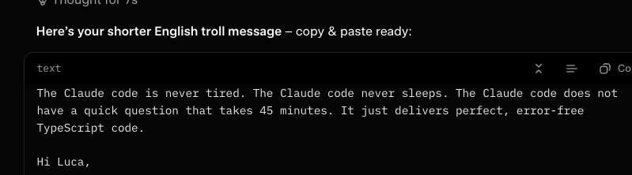

# System.Diagnostics.Metrics APIs Series (Parts 1-4)

Generated on 2026-03-04 using web2md from the original Andrew Lock posts.

## Contents
1. Part 1 - Creating and consuming metrics with System.Diagnostics.Metrics APIs
2. Part 2 - Exploring the (underwhelming) System.Diagnostics.Metrics source generators
3. Part 3 - Creating standard and "observable" instruments
4. Part 4 - Recording metrics in-process using MeterListener

---

## Part 1
---
Author: Andrew Lock
Site Name: Andrew Lock | .NET Escapades
Url: https://andrewlock.net/creating-and-consuming-metrics-with-system-diagnostics-metrics-apis/
Published: 2026-01-27
Extracted Date: 2026-03-04
---

January 27, 2026 ~9 min read

[System.Diagnostics.Metrics APIs - Part 1](https://andrewlock.net/series/system-diagnostics-metrics-apis/)

This is the first post in the series: [System.Diagnostics.Metrics APIs](https://andrewlock.net/series/system-diagnostics-metrics-apis/).

1.  Part 1 - Creating and consuming metrics with System.Diagnostics.Metrics APIs (this post)
2.  [Part 2 - Exploring the (underwhelming) System.Diagnostics.Metrics source generators](https://andrewlock.net/creating-strongly-typed-metics-with-a-source-generator/)
3.  [Part 3 - Creating standard and "observable" instruments](https://andrewlock.net/creating-standard-and-observable-instruments/)
4.  [Part 4 - Recording metrics in-process using MeterListener](https://andrewlock.net/recording-metrics-in-process-using-meterlistener/)

In this post I provide an introduction to the _System.Diagnostics.Metrics_ API, show how to use `dotnet-counters` for local monitoring of metrics, and show how to add a custom metric to your application.

## [The _System.Diagnostics.Metrics_ APIs](#the-system-diagnostics-metrics-apis)

The _System.Diagnostics.Metrics_ APIs were originally introduced as a built-in in feature in .NET 6, but are also supported in earlier versions of .NET Core and .NET Framework using the [_System.Diagnostics.DiagnosticSource_](https://www.nuget.org/packages/System.Diagnostics.DiagnosticSource/) NuGet package. The metrics APIs provide a way to both create and report on metrics generated by an application, such as simple counters, gauges, or histograms of values. I'll describe each of the available metric types later.

The _System.Diagnostics.Metrics_ APIs are designed to easily interoperate with OpenTelemetry, and so can be consumed by a large range of applications. You can also read the metrics using .NET SDK tools like `dotnet-counters`.

> The word "metric" is often used in multiple different ways. Is it a single "point" with associated "tags"? Is it the full set of the recorded values for a single concept? Is it the "aggregated" statistics for all of these points? It's common to see both meanings. In this post I mainly use "metric" to mean a stream of recordings for a single concept.

There are two core concepts exposed by the _System.Diagnostics.Metrics_ APIs. These are `Instrument`s and `Meter`s:

*   `Instrument`: An instrument records the values for a single metric of interest. You might have separate `Instrument`s for "products sold", "invoices created", "invoice total", and "GC heap size".
*   `Meter`: A `Meter` is a logical grouping of multiple instruments. For example, the [`System.Runtime` `Meter`](https://learn.microsoft.com/en-us/dotnet/core/diagnostics/built-in-metrics-runtime) contains multiple `Instrument`s about the workings of the runtime, while [the `Microsoft.AspNetCore.Hosting` `Meter`](https://learn.microsoft.com/en-us/aspnet/core/log-mon/metrics/built-in?view=aspnetcore-10.0#microsoftaspnetcorehosting) contains `Instrument`s about the HTTP requests received by ASP.NET Core.

There are also several different _types_ of `Instrument`:

*   `Counter<T>`/ `ObservableCounter<T>`: These represent a count of occurrences, so return a non-negative values. For example, the number of requests received might be a `Counter<T>`.
*   `UpDownCounter<T>` / `ObservableUpDownCounter<T>`: These are similar to a counter, but can be used to record both positive and negative values. This may be used to report the change in queue size or the number of _active_ requests.
*   `Gauge<T>` / `ObservableGauge<T>`: These return a value that represents the "current value". The values it emits effectively "replace" the previous value. For example, the amount of memory used might be a `Gauge<T>`.
*   `Histogram<T>`: Reports arbitrary values, which could be subsequently processed to calculate further statistics, or plot as a graph. For example, the duration of each request might be recorded as a `Histogram`.

You'll note that the `Counter<T>`, `UpDownCounter<T>`, and `Gauge<T>` all have _observable_ versions. This difference relates to how the `Instrument` records and emits values; observable instruments only retrieve their values when explicitly requested, whereas the non-observable versions emit a value as soon as that value is recorded.

> The choice of whether an `Instrument` should be implemented as `Observable*` is driven partly by performance considerations, and partly by how the value is obtained. I'll cover more about the implementation differences with observable `Instrument`s in a future post.

## [Collecting metrics with `dotnet-counters`](#collecting-metrics-with-dotnet-counters)

When running in production, you'll likely want to collect your metrics using [an `OpenTelemetry` exporter integration](https://github.com/open-telemetry/opentelemetry-dotnet/tree/main/docs/metrics/getting-started-prometheus-grafana#collect-metrics-using-prometheus) or another solution (e.g. Datadog can collect these metrics without requiring application changes), but for local testing `dotnet-counters` is a very convenient tool.

`dotnet-counters` is a .NET tool shipped by Microsoft that you can install by running:

    dotnet tool install -g dotnet-counters
    

You can then run the tool by specifying a process ID or process name to monitor, using:

    dotnet-counters monitor -n MyApp
    # or 
    dotnet-counters monitor -p 123
    

Alternatively, you can specify a command to run when starting the tool, and it will monitor the target process:

    dotnet-counters monitor -- dotnet MyApp.dll
    

When you run `dotnet-counters` in this "monitor" mode, the counter values are written to the console and periodically refresh:

    Press p to pause, r to resume, q to quit.
        Status: Running
    Name                                                                          Current Value
    [System.Runtime]
        dotnet.assembly.count ({assembly})                                              100
        dotnet.gc.collections ({collection})
            gc.heap.generation
            ------------------
            gen0                                                                         67
            gen1                                                                          6
            gen2                                                                          1
        dotnet.gc.heap.total_allocated (By)                                       4,134,656
        dotnet.gc.last_collection.heap.fragmentation.size (By)
            gc.heap.generation
            ------------------
            gen0                                                                    911,896
            gen1                                                                      5,544
            gen2                                                                      1,656
            loh                                                                           0
            poh                                                                           0
        dotnet.gc.last_collection.heap.size (By)
            gc.heap.generation
            ------------------
            gen0                                                                    943,560
            gen1                                                                    271,288
            gen2                                                                    840,136
            loh                                                                           0
            poh                                                                      24,528
        dotnet.gc.last_collection.memory.committed_size (By)                      3,981,312
        dotnet.gc.pause.time (s)                                                          0.106
        dotnet.jit.compilation.time (s)                                                   1.096
        dotnet.jit.compiled_il.size (By)                                            199,280
        dotnet.jit.compiled_methods ({method})                                        2,126
        dotnet.monitor.lock_contentions ({contention})                                    1
        dotnet.process.cpu.count ({cpu})                                                  4
        dotnet.process.cpu.time (s)
            cpu.mode
            --------
            system                                                                        5.453
            user                                                                          9.313
        dotnet.process.memory.working_set (By)                                   51,384,320
        dotnet.thread_pool.queue.length ({work_item})                                     0
        dotnet.thread_pool.thread.count ({thread})                                        4
        dotnet.thread_pool.work_item.count ({work_item})                             61,911
        dotnet.timer.count ({timer})                                                      0
    

You can choose which `Meter`s to display by passing a comma-separated list of counters using `--counters`, for example to show the `Microsoft.AspNetCore.Hosting` `Meter`, you would use:

    > dotnet-counters monitor --counters 'Microsoft.AspNetCore.Hosting' -- dotnet MyApp.dll
    
    Press p to pause, r to resume, q to quit.
        Status: Running
    
    Name                                                                                                             Current Value
    [Microsoft.AspNetCore.Hosting]
        http.server.active_requests ({request})
            http.request.method url.scheme
            ------------------- ----------
            GET                 http                                                                                          0
        http.server.request.duration (s)
            http.request.method http.response.status_code http.route network.protocol.version url.scheme Percentile
            ------------------- ------------------------- ---------- ------------------------ ---------- ----------
            GET                 200                       /          1.1                      http       50                   0
            GET                 200                       /          1.1                      http       95                   0
            GET                 200                       /          1.1                      http       99                   0
    

The metrics in the above image were created by hitting the same endpoint in a sample app several times, but they show some of the different features of the `Instrument`s available. Each metric has an associated unit (`{request}` and `s`), and also an associated set of _tags_. Tags are an important aspect when recording metrics, as they allow you to more easily group and segregate data.

For example, the `http.server.active_requests` up/down counter has tags for `http.request.method` and `url.scheme`. Seeing as I only made `GET` requests to `http://localhost:5000`, you only see one set of tags. But if I had made `POST` requests, or requests using `https` then you would have seen other values there. Similarly, the values in the `http.server.request.duration` histogram include tags for each value.

> Managing tag _cardinality_ (the number of possible values) is an important aspect of dealing with tags in all observability data. Depending on how your data is stored, large tag cardinality could cause large data storage costs and an impact on performance. Those limits will generally be controlled by whatever system you're exporting your metrics to.

As well as "immediate" monitoring approaches like the example above, which just outputs to the console, `dotnet-counters` also has options for just collecting the metrics and [exporting them in a variety of formats](https://learn.microsoft.com/en-us/dotnet/core/diagnostics/dotnet-counters#dotnet-counters-collYouect). You _could_ drive a production monitoring system this way, but I suspect most usages of `dotnet-counters` are for the local testing scenario.

## [Creating your own metrics](#creating-your-own-metrics)

The `dotnet-counters` example above demonstrates some of the built-in metrics available in .NET 10. The `System.Runtime` meter is available since .NET 9, and the `Microsoft.AspNetCore.Routing` meter is available since .NET 8, but there are many other additional built-in metrics available in different versions of .NET. You can find what's available here:

*   [ASP.NET Core metrics](https://learn.microsoft.com/en-us/aspnet/core/log-mon/metrics/built-in)
*   [.NET Runtime metrics](https://learn.microsoft.com/en-us/dotnet/core/diagnostics/built-in-metrics-runtime)
*   [System.Net metrics](https://learn.microsoft.com/en-us/dotnet/core/diagnostics/built-in-metrics-system-net)
*   [.NET extensions metrics](https://learn.microsoft.com/en-us/dotnet/core/diagnostics/built-in-metrics-diagnostics)

These metrics can provide a reasonable overview of how your system is operating in general, but there might also be application-specific or business related metrics that would be useful to record from the application itself.

As an example, we'll create a very simple counter metric that just records the number of requests sent to a particular API. To make it slightly less abstract, we'll imagine this to be a product pricing endpoint, and we want to track how often the details are checked for a given product.

### [Creating the initial app](#creating-the-initial-app)

We'll start by creating the basic app using

and updating the application to the following:

    var builder = WebApplication.CreateBuilder(args);
    var app = builder.Build();
    
    app.MapGet("/product/{id}", (int id) =>
    {
        // This would return the real details
        // TODO: add metrics
        return $"Pricing for product {id}";
    });
    
    app.Run();
    

We would obviously return real pricing details from this API, but this is just a demo after all.

### [Creating our `Instrument` and `Meter`](#creating-our-instrument-and-meter)

Now let's add our metrics. We need to create two things:

*   An `Instrument` to track the number of requests.
*   A `Meter` to hold our instrument (and any future related instruments).

We need to be careful about the naming of both of these, as they essentially serve as the public API for subsequent consumers of our metrics.

Seeing as this is an ASP.NET Core application and we generally avoid global `static` variables, the example below shows how we would create a class to encapsulate our `Instrument` and `Meter`, so that we can register it with the dependency injection container later. If you were creating an app that doesn't use DI, you could just as easily use `new Meter()`, and save the variable in a global variable.

    public class ProductMetrics
    {
        private readonly Counter<long> _pricingDetailsViewed;
    
        public ProductMetrics(IMeterFactory meterFactory)
        {
            var meter = meterFactory.Create("MyApp.Products");
            _pricingDetailsViewed = meter.CreateCounter<long>("myapp.products.pricing_page_requests");
        }
    
        public void PricingPageViewed(int id)
        {
            _pricingDetailsViewed.Add(delta: 1, new KeyValuePair<string, object?>("product_id", id));
        }
    }
    

In the code above we:

*   Create a new `Meter` called `MyApp.Products`. This is named following similar guidelines to the built-in meters; we have "namespaced" using our app's name, and the broad category of the instruments it will include.
*   We create a `Counter<long>` called `myapp.products.pricing_page_requests`. This is named using the [OpenTelemetry naming guidelines](https://github.com/open-telemetry/semantic-conventions/blob/main/docs/general/metrics.md#general-guidelines). I opted for `long` because I anticipate that some pages will get a _lot_ of reviews in the lifetime of the app (more than `int.MaxValue`).
*   We added a convenience method for recording a view of a product's pricing page, tagging the view with the ID of the product we're viewing. We could add other tags&mash;maybe the product name would be more useful for example&smash;but this tag will do for our purposes.

If we want to add additional `Instrument`s to the same `Meter` later, we would create them here, and likely add similar convenience methods.

### [Hooking up the `Instrument` in the app](#hooking-up-the-instrument-in-the-app)

Now that we have our metrics helper, we need to make use of it in our app. This involves both registering the helper in DI, and using it in our API:

    using System.Diagnostics.Metrics;
    using Microsoft.Extensions.Diagnostics.Metrics;
    
    var builder = WebApplication.CreateBuilder(args);
    
    // 👇 Register in DI
    builder.Services.AddSingleton<ProductMetrics>();
    
    var app = builder.Build();
    
    // Inject in API handler    👇 
    app.MapGet("/product/{id}", (int id, ProductMetrics metrics) =>
    {
        metrics.PricingPageViewed(id); // 👈 Record
        return $"Details for product {id}";
    });
    
    app.Run();
    

We can now try it out using `dotnet-counters` to view the metrics.

### [Testing our new metric](#testing-our-new-metric)

We'll start by running our app:

and then in a separate terminal window, we'll set `dotnet-counters` running using

    dotnet-counters monitor -n MyApp --counters MyApp.Products
    

I've used the `-n` option to find the app by name, `MyApp`, and made sure to only show the `MyApp.Products` instrument.

If we hit the product endpoint a few times with various IDs, we can see that the metrics are reported to `dotnet-counters` as expected!


With that, we have confirmed that we have a custom metric being successfully recorded 🎉

In the `dotnet-counters` output above, we can see that the Instrument is reported with the unit `Count`, inferred from the instrument type. That's fine, but the `Instrument` API lets us provide additional details that can be optionally used by consumers to customise the display or metrics.

For example, we could add some additional details to our instrument, as follows:

    _pricingDetailsViewed = meter.CreateCounter<int>(
        "myapp.products.pricing_page_requests",
        unit: "requests",
        description: "The number of requests to the pricing details page for the product with the given product_id");
    

If we run and monitor the app again, the `dotnet-counters` output has changed slightly. The unit for `myapp.products.pricing_page_requests` has changed to `requests` instead of `Count`:

    Name                                                        Current Value
    [MyApp.Products]
        myapp.products.pricing_page_requests (requests)
            product_id
            ----------
            1                                                           1
            234                                                         1
            5                                                           4
    

That's a small nicity, and the description isn't used anywhere by `dotnet-counters`, but other exporters might choose to use it. Depending on how you're exporting your metrics out of process, your metric should now be available everywhere!

## [Summary](#summary)

In this post, I provided an introduction to the _System.Diagnostics.Metrics_ APIs. I described some of the terminology used, such as `Meter` and `Instrument`, and the various different types of `Instrument` available. I then showed how you can use `dotnet-counters` to monitor the metrics produced by your app, primarily for local investigation. Finally, I showed how you could create a custom metric, customize it, hook it up to dependency injection, and report it in `dotnet-counters`.

 [ Previous Making foreach on an IEnumerable allocation-free using reflection and dynamic methods](https://andrewlock.net/making-foreach-on-an-ienumerable-allocation-free-using-reflection-and-dynamic-methods/) [ Next Exploring the (underwhelming) System.Diagnostics.Metrics source generators: System.Diagnostics.Metrics APIs - Part 2](https://andrewlock.net/creating-strongly-typed-metics-with-a-source-generator/)

Andrew Lock | .Net Escapades

 Want an email when  
there's new posts?
---

## Part 2
---
Author: Andrew Lock
Site Name: Andrew Lock | .NET Escapades
Url: https://andrewlock.net/creating-strongly-typed-metics-with-a-source-generator/
Published: 2026-02-03
Extracted Date: 2026-03-04
---

February 03, 2026 ~13 min read

[System.Diagnostics.Metrics APIs - Part 2](https://andrewlock.net/series/system-diagnostics-metrics-apis/)

This is the second post in the series: [System.Diagnostics.Metrics APIs](https://andrewlock.net/series/system-diagnostics-metrics-apis/).

1.  [Part 1 - Creating and consuming metrics with System.Diagnostics.Metrics APIs](https://andrewlock.net/creating-and-consuming-metrics-with-system-diagnostics-metrics-apis/)
2.  Part 2 - Exploring the (underwhelming) System.Diagnostics.Metrics source generators (this post)
3.  [Part 3 - Creating standard and "observable" instruments](https://andrewlock.net/creating-standard-and-observable-instruments/)
4.  [Part 4 - Recording metrics in-process using MeterListener](https://andrewlock.net/recording-metrics-in-process-using-meterlistener/)

In my [previous post](https://andrewlock.net/creating-and-consuming-metrics-with-system-diagnostics-metrics-apis/) I provided an introduction to the _System.Diagnostics.Metrics_ APIs introduced in .NET 6. In this post I show how to use the [Microsoft.Extensions.Telemetry.Abstractions](https://www.nuget.org/packages/Microsoft.Extensions.Telemetry.Abstractions) source generator, explore how it changes the code you need to write, and explore the generated code.

I start the post with a quick refresher on the basics of the _System.Diagnostics.Metrics_ APIs and the sample app we wrote [last time](https://andrewlock.net/creating-and-consuming-metrics-with-system-diagnostics-metrics-apis/). I then show how we can update this code to use the _Microsoft.Extensions.Telemetry.Abstractions_ source generator instead. Finally, I show how we can also update our metric definitions to use strongly-typed tag objects for additional type-safety. In both cases, we'll update our sample app to use the new approach, and explore the generated code.

> You can read about the source generators I discuss in this post in the Microsoft documentation [here](https://learn.microsoft.com/en-us/dotnet/core/diagnostics/metrics-generator) and [here](https://learn.microsoft.com/en-us/dotnet/core/diagnostics/metrics-strongly-typed).

## [Background: System.Diagnostics.Metrics APIs](#background-system-diagnostics-metrics-apis)

The _System.Diagnostics.Metrics_ APIs were introduced in .NET 6 but are available in earlier runtimes (including .NET Framework) by using the [_System.Diagnostics.DiagnosticSource_](https://www.nuget.org/packages/System.Diagnostics.DiagnosticSource/) NuGet package. There are two primary concepts exposed by these APIs; `Instrument` and `Meter`:

*   `Instrument`: An instrument records the values for a single metric of interest. You might have separate `Instrument`s for "products sold", "invoices created", "invoice total", or "GC heap size".
*   `Meter`: A `Meter` is a logical grouping of multiple instruments. For example, the [`System.Runtime` `Meter`](https://learn.microsoft.com/en-us/dotnet/core/diagnostics/built-in-metrics-runtime) contains multiple `Instrument`s about the workings of the runtime, while [the `Microsoft.AspNetCore.Hosting` `Meter`](https://learn.microsoft.com/en-us/aspnet/core/log-mon/metrics/built-in?view=aspnetcore-10.0#microsoftaspnetcorehosting) contains `Instrument`s about the HTTP requests received by ASP.NET Core.

There are also multiple types of `Instrument`: `Counter<T>`, `UpDownCounter<T>`, `Gauge<T>`, and `Histogram<T>` (as well as "observable" versions, which I'll cover in a future post). To create a custom metric, you need to choose the type of `Instrument` to use, and associate it with a `Meter`. In my [previous post](https://andrewlock.net/creating-and-consuming-metrics-with-system-diagnostics-metrics-apis/) I created a simple `Counter<T>` for tracking how often a product page was viewed.

## [Background: sample app with manual boilerplate](#background-sample-app-with-manual-boilerplate)

In this post I'm going to start from where we left off in the previous post, and update it to use a source generator instead. So that we know where we're coming from, the full code for that sample is shown below, annotated to explain what's going on; for the full details, see my [previous post](https://andrewlock.net/creating-and-consuming-metrics-with-system-diagnostics-metrics-apis/)

    using System.Diagnostics.Metrics;
    using Microsoft.Extensions.Diagnostics.Metrics;
    
    var builder = WebApplication.CreateBuilder(args);
    
    // 👇 Register our "metrics helper" in DI
    builder.Services.AddSingleton<ProductMetrics>();
    
    var app = builder.Build();
    
    // Inject the "metrics helper" into the API handler 👇 
    app.MapGet("/product/{id}", (int id, ProductMetrics metrics) =>
    {
        metrics.PricingPageViewed(id); // 👈 Record the metric
        return $"Details for product {id}";
    });
    
    app.Run();
    
    
    // The "metrics helper" class for our metrics
    public class ProductMetrics
    {
        private readonly Counter<long> _pricingDetailsViewed;
    
        public ProductMetrics(IMeterFactory meterFactory)
        {
            // Create a meter called MyApp.Products
            var meter = meterFactory.Create("MyApp.Products");
    
            // Create an instrument, and associate it with our meter
            _pricingDetailsViewed = meter.CreateCounter<int>(
                "myapp.products.pricing_page_requests",
                unit: "requests",
                description: "The number of requests to the pricing details page for the product with the given product_id");
    
        }
    
        // A convenience method for adding to the metric
        public void PricingPageViewed(int id)
        {
            // Ensure we add the correct tag to the metric
            _pricingDetailsViewed.Add(delta: 1, new KeyValuePair<string, object?>("product_id", id));
        }
    }
    

In summary, we have a `ProductMetrics` "metrics helper" class which is responsible for creating the `Meter` and `Instrument` definitions, as well as providing helper methods for recording page views.

When we run the app and [monitor it with `dotnet-counters`](https://andrewlock.net/creating-and-consuming-metrics-with-system-diagnostics-metrics-apis/#collecting-metrics-with-dotnet-counters) we can see our metric being recorded:


Now that we have our sample app ready, lets explore replacing some of the boilerplate with a source generator.

## [Replacing boiler plate with a source generator](#replacing-boiler-plate-with-a-source-generator)

The [Microsoft.Extensions.Telemetry.Abstractions](https://www.nuget.org/packages/Microsoft.Extensions.Telemetry.Abstractions) NuGet package includes a source generator which, according to [the documentation](https://learn.microsoft.com/en-us/dotnet/core/diagnostics/metrics-generator?tabs=dotnet-cli), generates code which:

> …exposes strongly typed metering types and methods that you can invoke to record metric values. The generated methods are implemented in a highly efficient form, which reduces computation overhead as compared to traditional metering solutions.

In this section we'll replace some of the code we wrote above with the source generated equivalent!

First you'll need to install the [Microsoft.Extensions.Telemetry.Abstractions](https://www.nuget.org/packages/Microsoft.Extensions.Telemetry.Abstractions) package in your project using:

    dotnet add package Microsoft.Extensions.Telemetry.Abstractions
    

Alternatively, update your project with a `<PackageReference>`:

    <ItemGroup>
      <PackageReference Include="Microsoft.Extensions.Telemetry.Abstractions" Version="10.2.0" />
    </ItemGroup>
    

> Note that in this post I'm using the latest stable version of the package, 10.2.0.

Now that we have the source generator running in our app, we can put it to use.

### [Creating the "metrics helper" class](#creating-the-metrics-helper-class)

The main difference when you switch to the source generator is in the "metrics helper" class. There's a lot of different ways you _could_ structure these—what I've shown below is a relatively close direct conversion of the previous code. But as I'll discuss later, this isn't necessarily the way you'll always want to use them.

As is typical for source generators, the metrics generator is driven by specific attributes. There's a different attribute for each `Instrument` type, and you apply them to a `partial` method definition which creates a strongly-typed metric, called `PricingPageViewed` in this case:

    private static partial class Factory
    {
        [Counter<int>("product_id", Name = "myapp.products.pricing_page_requests")]
        internal static partial PricingPageViewed CreatePricingPageViewed(Meter meter);
    }
    

The example above uses the `[Counter<T>]` attribute, but there are equivalent versions for `[Gauge<T>]` and `[Histogram<T>]` too.

This creates the "factory" methods for defining a metric, but we still need to update the `ProductMetrics` type to _use_ this factory method instead of our hand-rolled versions:

    // Note, must be partial
    public partial class ProductMetrics
    {
        public ProductMetrics(IMeterFactory meterFactory)
        {
            var meter = meterFactory.Create("MyApp.Products");
            PricingPageViewed = Factory.CreatePricingPageViewed(meter);
        }
    
        internal PricingPageViewed PricingPageViewed { get; }
    
        private static partial class Factory
        {
            [Counter<int>("product_id", Name = "myapp.products.pricing_page_requests")]
            internal static partial PricingPageViewed CreatePricingPageViewed(Meter meter);
        }
    }
    

If you compare that to the code we wrote previously, there are two main differences:

*   The `[Counter<T>]` attribute is missing the "description" and "units" that we previously added.
*   The `PricingPageViewed` metric is exposed directly (which we'll look at shortly), instead of exposing a `PricingPageViewed()` method for recording values.

The first point is just a limitation of the current API. We actually _can_ specify the units on the attribute, but if we do, we need to add a `#pragma` as this API is currently experimental:

    private static partial class Factory
    {
        #pragma warning disable EXTEXP0003 // Type is for evaluation purposes only and is subject to change or removal in future updates. Suppress this diagnostic to proceed.
    
                                                            //   Add the Unit here 👇
        [Counter<int>("product_id", Name = "myapp.products.pricing_page_requests", Unit = "views")]
        internal static partial PricingPageViewed CreatePricingPageViewed(Meter meter);
    }
    

The second point is more interesting, and we'll dig into it when we look at the generated code.

### [Updating our app](#updating-our-app)

Before we get to the generated code, lets look at how we use our updated `ProductMetrics`. We keep the existing DI registration of our `ProductMetrics` type, the only change is how we _record_ a view of the page

    using System.Diagnostics.Metrics;
    using System.Globalization;
    using Microsoft.Extensions.Diagnostics.Metrics;
    
    var builder = WebApplication.CreateBuilder(args);
    builder.Services.AddSingleton<ProductMetrics>();
    var app = builder.Build();
    
    app.MapGet("/product/{id}", (int id, ProductMetrics metrics) =>
    {
        // Update to call PricingPageViewed.Add() instead of PricingPageViewed(id)
        metrics.PricingPageViewed.Add(value: 1, product_id: id);
        return $"Details for product {id}";
    });
    
    app.Run();
    

As you can see, there's not much change there. Instead of calling `PricingPageViewed(id)`, which internally adds a metric and tag, we call the `Add()` method, which is a source-generated method on the `PricingPageViewed` type. Let's take a look at all that generated code now, so we can see what's going on behind the scenes.

### [Exploring the generated code](#exploring-the-generated-code)

We have various generated methods to look at, so we'll start with our factory methods and work our way through from there.

> Note that in most IDEs you can navigate to the definitions of these partial methods and they'll show you the generated code.

Starting with our `Factory` method, the generated code looks like this:

    public partial class ProductMetrics 
    {
        private static partial class Factory 
        {
            internal static partial PricingPageViewed CreatePricingPageViewed(Meter meter)
                => GeneratedInstrumentsFactory.CreatePricingPageViewed(meter);
        }
    }
    

So the generated code is calling a _different_ generated type, which looks like this:

    internal static partial class GeneratedInstrumentsFactory
    {
        private static ConcurrentDictionary<Meter, PricingPageViewed> _pricingPageViewedInstruments = new();
    
        internal static PricingPageViewed CreatePricingPageViewed(Meter meter)
        {
            return _pricingPageViewedInstruments.GetOrAdd(meter, static _meter =>
                {
                    var instrument = _meter.CreateCounter<int>(@"myapp.products.pricing_page_requests", @"views");
                    return new PricingPageViewed(instrument);
                });
        }
    }
    

This definition shows something interesting, in that it shows the source generator is catering to a pattern I was somewhat surprised to see. This code seems to be catering to adding the same `Instrument` to _multiple_ `Meter`s.

> That seems a little surprising to me, but that's possibly because I'm used to thinking in terms of OpenTelemetry expectations, which doesn't have the concept of `Meter`s (as far as I know), and completely ignores it. It seems like you would get some weird duplication issues if you tried to use this source-generator-suggested pattern with OpenTelemetry, so I personally wouldn't recommend it.

Other than the "dictionary" aspect, this generated code is basically creating the `Counter` instance, just as we were doing before, but is then passing it to a different generated type, the `PricingPageViewed` type:

    internal sealed class PricingPageViewed
    {
        private readonly Counter<int> _counter;
        public PricingPageViewed(Counter<int> counter)
        {
            _counter = counter;
        }
    
        public void Add(int value, object? product_id)
        {
            var tagList = new TagList
            {
                new KeyValuePair<string, object?>("product_id", product_id),
            };
    
            _counter.Add(value, tagList);
        }
    }
    

This generated type provides roughly the same "public" API for recording metrics as we provided before:

    public class ProductMetrics
    {
        // Previous implementation
        public void PricingPageViewed(int id)
        {
            _pricingDetailsViewed.Add(delta: 1, new KeyValuePair<string, object?>("product_id", id));
        }
    }
    

However, there are some differences. The generated code uses a more "generic" version that wraps the type in a `TagList`. This is a `struct`, which can support adding multiple tags without needing to allocate an array on the heap, so it's _generally_ very efficient. But in this case, it doesn't add anything over the "manual" version I implemented.

So given all that, is this generated code actually _useful_?

### [Is the generated code worth it?](#is-the-generated-code-worth-it-)

I love source generators, I think they're a great way to reduce boilerplate and make code easier to read and write in many cases, but frankly, I don't really see the value of this metrics source generator.

For a start, the source generator is only really changing how we define and create metrics. Which is generally 1 line of code to create the metric, and then a helper method for defining the tags etc (i.e. the `PricingPageViewed()` method). Is a source generator _really_ necessary for that?

Also, the generator is limited in the API it provides compared to calling the _System.Diagnostics.Metrics_ APIs directly. You can't provide a `Description` for a metric, for example, and providing a `Unit` needs a `#pragma`…

What's more, the fact that the generated code is generic, means that the resulting usability is actually _worse_ in my example, because you have to call:

    metrics.PricingPageViewed.Add(value: 1, product_id: id);
    

and specify an "increment" value, as opposed to simply being

    metrics.PricingPageViewed(productId: id);
    

(also note the "correct" argument names in my "manual case"). The source generator also seems to support scenarios that I don't envision needing (the same `Instrument` registered with multiple `Meter`), so that's extra work that need not happen in the source generated case.

So unfortunately, in this simple example, the source generator seems like a net loss. But there's an additional scenario it supports: strongly-typed tag objects

## [Using strongly-typed tag objects](#using-strongly-typed-tag-objects)

There's a common programming bug when calling methods that have multiple parameters of the same type: accidentally passing values in the wrong position:

    Add(order.Id, product.Id); // Oops, those are wrong, but it's not obvious!
    
    public void Add(int productId, int orderId) { /* */ }
    

One partial solution to this issue is to use strongly-typed objects to try to make the mistake more obvious. For example, if the method above instead took an object:

    public void Add(Details details) { /* */ }
    
    public readonly struct Details
    {
        public required int OrderId { get; init; }
        public required int ProductId { get; init; }
    }
    

Then at the callsite, you're _less_ likely to make the same mistake:

    // Still wrong, but the error is more obvious! 😅
    Add(new()
    {
        OrderId = product.Id,
        ProductId = order.Id,
    });
    

It turns out that passing lots of similar values is exactly the issue you run into when you need to add multiple tags when recording a value with an `Instrument`. To help with this, the source generator code can optionally use strongly-typed tag objects instead of a list of parameters.

### [Updating the holder class with strongly-typed tags](#updating-the-holder-class-with-strongly-typed-tags)

In the examples I've shown so far, I've only been attaching a single tag to the `PricingPageViewed` metric, but I'll add an additional one, `environment` just for demonstration purposes.

Let's again start by updating the `Factory` class to use a strongly-typed object instead of "manually" defining the tags:

    private static partial class Factory
    {
        // A Type that defines the tags 👇
        [Counter<int>(typeof(PricingPageTags), Name = "myapp.products.pricing_page_requests")]
        internal static partial PricingPageViewed CreatePricingPageViewed(Meter meter);
        // previously:
        // [Counter<int>("product_id", Name = "myapp.products.pricing_page_requests")]
        // internal static partial PricingPageViewed CreatePricingPageViewed(Meter meter);
    }
    
    public readonly struct PricingPageTags
    {
        [TagName("product_id")]
        public required string ProductId { get; init; }
        public required Environment Environment { get; init; }
    }
    
    public enum Environment
    {
        Development,
        QA,
        Production,
    }
    

So we have two changes:

*   We're passing a `Type` in the `[Counter<T>]` attribute, instead of a list of tag arguments.
*   We've defined a struct type that includes all the tags we want to add to a value.
    *   This is defined as a `readonly struct` to avoid additional allocations.
    *   We specific the tag name for `ProductId`. By default, `Environment` uses the name `"Environment"` (which may not be what you want, but this is for demo reasons!).
    *   We can only use `string` or `enum` types in the tags

The source generator then does its thing, and so we need to update our API callsite to this:

    app.MapGet("/product/{id}", (int id, ProductMetrics metrics) =>
    {
        metrics.PricingPageViewed.Add(1, new PricingPageTags()
        {
             ProductId = id.ToString(CultureInfo.InvariantCulture),
             Environment = ProductMetrics.Environment.Production,
        });
        return $"Details for product {id}";
    });
    

In the generated code we need to pass a `PricingPageTags` object into the `Add()` method, instead of individually passing each tag value.

> Note that we had to pass a `string` for `ProductId`, we can't use an `int` like we were before. That's not _great_ perf wise, but previously we were boxing the `int` to an `object?` so _that_ wasn't great either😅 Avoiding this allocation would be recommended if possible, but that's out of the scope for this post!

As before, let's take a look at the generated code.

### [Exploring the generated code](#exploring-the-generated-code-1)

The generated code in this case is almost identical to before. The only difference is in the generated `Add` method:

    internal sealed class PricingPageViewed
    {
        private readonly Counter<int> _counter;
    
        public PricingPageViewed(Counter<int> counter)
        {
            _counter = counter;
        }
    
        public void Add(int value, PricingPageTags o)
        {
            var tagList = new TagList
            {
                new KeyValuePair<string, object?>("product_id", o.ProductId!),
                new KeyValuePair<string, object?>("Environment", o.Environment.ToString()),
            };
    
            _counter.Add(value, tagList);
        }
    }
    

This generated code is _almost_ the same as before. The only difference is that it's "splatting" the `PricingPageTags` object as individual tags in a `TagList`. So, does _this_ mean the source generator is worth it?

## [Are the source generators worth using?](#are-the-source-generators-worth-using-)

From my point of view, the strongly-typed tags scenario doesn't change any of the arguments I raised previously against the source generator. It's still mostly obfuscating otherwise simple APIs, not adding anything performance-wise as far as I can tell, and it still supports the "`Instrument` in multiple `Meter` scenario" that seems unlikely to be useful (to me, anyway).

The strongly-typed tags approach shown here, while nice, can just as easily be implemented manually. The generated code isn't really _adding_ much. And in fact, given that it's calling `ToString()` on an `enum` ([which is known to be slow](https://andrewlock.net/updates-to-netescapaades-enumgenerators-new-apis-and-system-memory-support/#why-should-you-use-an-enum-source-generator-)), the "manual" version can _likely_ also provide better opportunities for performance optimizations.

About the only argument I can see in favour of using the source generator is if you're using the "`Instrument` in multiple `Meter`" approach (let me know in the comments if you are, I feel like I'm missing something!). Or, I guess, if you just _like_ the attribute-based generator approach and aren't worried about the points I raised. I'm a fan of source generators in general, but in this case, I don't think I would bother with them personally.

Overall, the fact the generators don't really add much maybe just points to the _System.Diagnostics.Metrics_ APIs being well defined? If you don't need much boilerplate to create the metrics, and you get the "best performance" by default, _without_ needing a generator, then that seems like a _good_ thing 😄

## [Summary](#summary)

In this post I showed how to use the source generators that ship in the [Microsoft.Extensions.Telemetry.Abstractions](https://www.nuget.org/packages/Microsoft.Extensions.Telemetry.Abstractions) to help generating metrics with the _System.Diagnostics.Metrics_ APIs. I show how the source generator changes the way you define your metric, but fundamentally generates roughly the same code as [in my previous post](https://andrewlock.net/creating-and-consuming-metrics-with-system-diagnostics-metrics-apis/). I then show how you can also create strongly-typed tags, which helps avoid a typical class of bugs.

Overall, I didn't feel like the source generator saved much in the way of the code you write or provides performance benefits, unlike many other built-in source generators. The generated code caters to additional scenarios, such as registering the same `Instrument` with multiple `Meter`s, but that seems like a niche scenario.

 [ Previous Creating and consuming metrics with System.Diagnostics.Metrics APIs: System.Diagnostics.Metrics APIs - Part 1](https://andrewlock.net/creating-and-consuming-metrics-with-system-diagnostics-metrics-apis/) [ Next Creating standard and "observable" instruments: System.Diagnostics.Metrics APIs - Part 3](https://andrewlock.net/creating-standard-and-observable-instruments/)
---

## Part 3
---
Author: Andrew Lock
Site Name: Andrew Lock | .NET Escapades
Url: https://andrewlock.net/creating-standard-and-observable-instruments/
Published: 2026-02-17
Extracted Date: 2026-03-04
---

February 17, 2026 ~10 min read

[System.Diagnostics.Metrics APIs - Part 3](https://andrewlock.net/series/system-diagnostics-metrics-apis/)

This is the third post in the series: [System.Diagnostics.Metrics APIs](https://andrewlock.net/series/system-diagnostics-metrics-apis/).

1.  [Part 1 - Creating and consuming metrics with System.Diagnostics.Metrics APIs](https://andrewlock.net/creating-and-consuming-metrics-with-system-diagnostics-metrics-apis/)
2.  [Part 2 - Exploring the (underwhelming) System.Diagnostics.Metrics source generators](https://andrewlock.net/creating-strongly-typed-metics-with-a-source-generator/)
3.  Part 3 - Creating standard and "observable" instruments (this post)
4.  [Part 4 - Recording metrics in-process using MeterListener](https://andrewlock.net/recording-metrics-in-process-using-meterlistener/)

In the [first post in this series](https://andrewlock.net/creating-and-consuming-metrics-with-system-diagnostics-metrics-apis/) I provided an introduction to the _System.Diagnostics.Metrics_ APIs introduced in .NET 6. I initially introduced the concept of "observable" `Instrument`s in that post, but didn't go into more details. In this post, we'll understand what being "observable" means, and how these `Instrument`s differ from non-observable `Instrument`s.

I start the post with a quick refresher on the basics of the _System.Diagnostics.Metrics_ APIs, such as the different types of instruments available. I then show how you can create each of the instrument types and produce values from them.

## [System.Diagnostics.Metrics APIs](#system-diagnostics-metrics-apis)

The _System.Diagnostics.Metrics_ APIs were introduced in .NET 6 but are available in earlier runtimes (including .NET Framework) by using the [_System.Diagnostics.DiagnosticSource_](https://www.nuget.org/packages/System.Diagnostics.DiagnosticSource/) NuGet package. There are two primary concepts exposed by these APIs: `Instrument` and `Meter`:

*   `Instrument`: An instrument records the values for a single metric of interest. You might have separate `Instrument`s for "products sold", "invoices created", "invoice total", or "GC heap size".
*   `Meter`: A `Meter` is a logical grouping of multiple instruments. For example, the [`System.Runtime` `Meter`](https://learn.microsoft.com/en-us/dotnet/core/diagnostics/built-in-metrics-runtime) contains multiple `Instrument`s about the workings of the runtime, while [the `Microsoft.AspNetCore.Hosting` `Meter`](https://learn.microsoft.com/en-us/aspnet/core/log-mon/metrics/built-in?view=aspnetcore-10.0#microsoftaspnetcorehosting) contains `Instrument`s about the HTTP requests received by ASP.NET Core.

There are also (currently, as of .NET 10) 7 different types of `Instrument`:

*   `Counter<T>`
*   `ObservableCounter<T>`
*   `UpDownCounter<T>`
*   `ObservableUpDownCounter<T>`
*   `Gauge<T>`
*   `ObservableGauge<T>`
*   `Histogram<T>`.

To create a custom metric, you need to choose the type of `Instrument` to use, and associate it with a `Meter`. I'll discuss the differences between each of these instruments shortly, but first we'll look at the difference between "observable" instruments, and "normal" instruments.

## [What is an `Observable*` instrument?](#what-is-an-observable-instrument-)

When using the _System.Diagnostic.Metrics_ APIs there's a "producer" side and a "consumer" side. The producer of metrics is the app itself, recording values and details about how it's operating. The consumer could be an in-process consumer, such as [the OpenTelemetry libraries](https://learn.microsoft.com/en-us/dotnet/core/diagnostics/observability-with-otel), or it could be an external process, such as [`dotnet-counters`](https://learn.microsoft.com/en-us/dotnet/core/diagnostics/dotnet-counters) or [`dotnet-monitor`](https://learn.microsoft.com/en-us/dotnet/core/diagnostics/dotnet-monitor).

The differences between a "normal" instrument and an "observable" instrument stem from who controls when and how a value is emitted:

*   For "normal" instruments, the _producer_ emits values as they occur. For example, when a request is received, ASP.NET Core emits the `http.server.active_requests` metric, indicating a new request is in-flight.
*   For "observable" instruments, the _consumer_ side _asks_ for the value. For example, the `dotnet.gc.pause.time` metric returns "The total amount of time paused in GC since the process has started", but only when you _ask_ for it.

In general, observable instruments are used when you have an effectively continuous value that you wouldn't make sense for the consumer to actively emit, such as the `dotnet.gc.pause.time` above, or where emitting all of the intermediate values would be too expensive from a performance point of view.

> Technically, you _could_ potentially emit this metric every time the GC pauses, but given that these values are more fine-grained than you would likely want _anyway_, it's much more efficient to allow the consumer to "poll" the values on demand, and therefore it makes the most sense as an observable instrument.

Now we understand the difference between observable and normal instruments, let's walk through all the instrumentation types and see how they're used in the .NET base class libraries.

## [Understanding the different `Instrument` types](#understanding-the-different-instrument-types)

So far in this series we've used a simple `Counter<T>` that records every time a given event occurs. In this post we'll look at each of the possible `Instrument`s in turn, showing how you create an instrument of that type to produce a given metric. Where possible, I'm showing places within the .NET or ASP.NET Core libraries that use each of these instruments, to give "real world" versions of how these are used.

### [`Counter<T>`](#countert)

The `Counter<T>` instrument is one of the simplest instruments conceptually. It is used to record how many times a given event occurs.

For example, [the `aspnetcore.diagnostics.exceptions` metric](https://github.com/dotnet/aspnetcore/blob/102119ab7ceb911130fad4a485ec0a4828aa9e53/src/Middleware/Diagnostics/src/DiagnosticsMetrics.cs#L24-L27) is a `Counter<long>` which records the `"Number of exceptions caught by exception handling middleware."`

    _handlerExceptionCounter = _meter.CreateCounter<long>(
        "aspnetcore.diagnostics.exceptions",
        unit: "{exception}",
        description: "Number of exceptions caught by exception handling middleware.");
    

Every time the `ExceptionHandlerMiddleware` (or `DeveloperExceptionHandlerMiddleware`) [catches an exception](https://github.com/dotnet/aspnetcore/blob/102119ab7ceb911130fad4a485ec0a4828aa9e53/src/Middleware/Diagnostics/src/ExceptionHandler/ExceptionHandlerMiddlewareImpl.cs#L126), it adds `1` to this counter, first constructing an appropriate set of tags, and then calling `Add(1, tags)`:

     private void RequestExceptionCore(string exceptionName, ExceptionResult result, string? handler)
    {
        var tags = new TagList();
        tags.Add("error.type", exceptionName);
        tags.Add("aspnetcore.diagnostics.exception.result", GetExceptionResult(result));
        if (handler != null)
        {
            tags.Add("aspnetcore.diagnostics.handler.type", handler);
        }
        _handlerExceptionCounter.Add(1, tags);
    }
    

As this `Counter<T>` is tracking a number of occurrences, you're always adding positive values, never negative values, though you can increase by more than `1` at a time if needs be.

### [`ObservableCounter<T>`](#observablecountert)

The `ObservableCounter<T>` is conceptually similar to a `Counter<T>`, in that it records monotonically increasing values. Being an "observable" instrument, it only records the values when "observed" (we'll look at how to observe the instruments in your own code in a subsequent post).

For example, [the `dotnet.gc.heap.total_allocated` metric](https://github.com/dotnet/runtime/blob/v10.0.1/src/libraries/System.Diagnostics.DiagnosticSource/src/System/Diagnostics/Metrics/RuntimeMetrics.cs#L44-L48) is an `ObservableCounter<long>` which records the `"The approximate number of bytes allocated on the managed GC heap since the process has started"`:

    s_meter.CreateObservableCounter(
        "dotnet.gc.heap.total_allocated",
        () => GC.GetTotalAllocatedBytes(),
        unit: "By",
        description: "The approximate number of bytes allocated on the managed GC heap since the process has started. The returned value does not include any native allocations.");
    

When observed, the lambda included in the definition is called, which invokes `GC.GetTotalAllocatedBytes()`. Note that this value steadily increases during the lifetime of the app, so it's not returning the difference since _last_ invocation, it's returning the current running total.

### [`UpDownCounter<T>`](#updowncountert)

The `UpDownCounter<T>` is similar to the `Counter<T>`, but it supports reporting positive or negative values.

For example, [the `http.server.active_requests` metric](https://github.com/dotnet/aspnetcore/blob/9a93048bd0afd7c2d09bdb5ce47ef7d78827c647/src/Hosting/Hosting/src/Internal/HostingMetrics.cs#L24-L27) is an `UpDownCounter<T>` that records the `"Number of active HTTP server requests."`:

    _activeRequestsCounter = _meter.CreateUpDownCounter<long>(
        "http.server.active_requests",
        unit: "{request}",
        description: "Number of active HTTP server requests.");
    

[When a request is started](https://github.com/dotnet/aspnetcore/blob/9a93048bd0afd7c2d09bdb5ce47ef7d78827c647/src/Hosting/Hosting/src/Internal/HostingMetrics.cs#L37), the server calls `Add()` and increments the value of the counter:

    public void RequestStart(string scheme, string method)
    {
        // Tags must match request end.
        var tags = new TagList();
        InitializeRequestTags(ref tags, scheme, method);
        _activeRequestsCounter.Add(1, tags);
    }
    
    private static void InitializeRequestTags(ref TagList tags, string scheme, string method)
    {
        tags.Add(HostingTelemetryHelpers.AttributeUrlScheme, scheme);
        tags.Add(HostingTelemetryHelpers.AttributeHttpRequestMethod, HostingTelemetryHelpers.GetNormalizedHttpMethod(method));
    }
    

Similarly, [when the request ends](https://github.com/dotnet/aspnetcore/blob/9a93048bd0afd7c2d09bdb5ce47ef7d78827c647/src/Hosting/Hosting/src/Internal/HostingMetrics.cs#L45C1-L54C10), the server calls `Add()` to _decrement_ the value of the counter:

    public void RequestEnd(string protocol, string scheme, string method, string? route, int statusCode, bool unhandledRequest, Exception? exception, List<KeyValuePair<string, object?>>? customTags, long startTimestamp, long currentTimestamp, bool disableHttpRequestDurationMetric)
    {
        var tags = new TagList();
        InitializeRequestTags(ref tags, scheme, method);
    
        // Tags must match request start.
        if (_activeRequestsCounter.Enabled)
        {
            _activeRequestsCounter.Add(-1, tags);
        }
    
        // ...
    }
    

Consequently, the `UpDownCounter<T>` receives a series of increment/decrement values representing the movement of the metric.

### [`ObservableUpDownCounter<T>`](#observableupdowncountert)

The `ObservableUpDownCounter<T>` is similar to the `UpDownCounter<T>` in that it reports increasing or decreasing values of a metric. The difference is that it returns the absolute value of the metric when observed, as opposed to a stream of deltas.

For example, the `dotnet.gc.last_collection.heap.size` metric is an `ObservableUpDownCounter<long>` that reports `"The managed GC heap size (including fragmentation), as observed during the latest garbage collection"`:

    s_meter.CreateObservableUpDownCounter(
        "dotnet.gc.last_collection.heap.size",
        GetHeapSizes,
        unit: "By",
        description: "The managed GC heap size (including fragmentation), as observed during the latest garbage collection.");
    

When observed, the `GetHeapSizes()` method is invoked and returns a collection of `Measurement`s, each tagged by the heap generation name:

    private static readonly string[] s_genNames = ["gen0", "gen1", "gen2", "loh", "poh"];
    private static readonly int s_maxGenerations = Math.Min(GC.GetGCMemoryInfo().GenerationInfo.Length, s_genNames.Length);
    
    private static IEnumerable<Measurement<long>> GetHeapSizes()
    {
        GCMemoryInfo gcInfo = GC.GetGCMemoryInfo();
    
        for (int i = 0; i < s_maxGenerations; ++i)
        {
            yield return new Measurement<long>(gcInfo.GenerationInfo[i].SizeAfterBytes, new KeyValuePair<string, object?>("gc.heap.generation", s_genNames[i]));
        }
    }
    

This returns the size of each heap at the last GC collection, the value of which may obviously increase or decrease.

### [`Gauge<T>`](#gauget)

The `Gauge<T>` is used to record "non-additive" values whenever they occur. These values can go up and down, and be positive or negative, but the point is that they "overwrite" all previous values.

Interestingly, this `Instrument` type was only added in .NET 9, and I couldn't find a single case of `Gauge<T>` being used in the .NET runtime, ASP.NET Core, or the .NET extensions packages 😅 So I made one up: for example, consider a gauge that reports the current room temperature when it changes:

    var instrument = _meter.CreateGauge<double>(
        name: "locations.room.temperature",
        unit: "°C",
        description: "Current room temperature"
    );
    

Then when the temperature of the room changes, you would report the new value:

    public void OnOfficeTemperatureChanged(double newTemperature)
    {
        instrument.Record(newTemperature, new KeyValuePair<string, object?>("room", "office"));
    }
    

The gauge values are record whenever the temperature changes.

### [`ObservableGauge<T>`](#observablegauget)

Conceptually the `ObservableGauge<T>` is the same as a `Gauge<T>`, except that it only produces a value when observed. `ObservableGauge<T>` was added way back in .NET 6, and there are some examples of its use in this case.

For example, [the `process.cpu.utilization` metric](https://github.com/dotnet/extensions/blob/9974fbf7a3fede68d7e5f22b9b249aebd819a26d/src/Libraries/Microsoft.Extensions.Diagnostics.ResourceMonitoring/Windows/WindowsSnapshotProvider.cs#L94) is an `ObservableGauge<double>` instrument which reports `"The CPU consumption of the running application in range [0, 1]"`.

    _ = meter.CreateObservableGauge(
        name: "process.cpu.utilization",
        observeValue: CpuPercentage);
    

When observed, [the `CpuPercentage()` method](https://github.com/dotnet/extensions/blob/9974fbf7a3fede68d7e5f22b9b249aebd819a26d/src/Libraries/Microsoft.Extensions.Diagnostics.ResourceMonitoring/Windows/WindowsSnapshotProvider.cs#L168) is invoked, which returns a single value for the CPU usage as a value between `0` and `1`.

    private double CpuPercentage()
    {
        // see above link for implementation
    }
    

This `Instrument` is exposed in the `Microsoft.Extensions.Diagnostics.ResourceMonitoring` meter, and implemented in [the Microsoft.Extensions.Diagnostics.ResourceMonitoring NuGet package](https://www.nuget.org/packages/Microsoft.Extensions.Diagnostics.ResourceMonitoring).

### [`Histogram<T>`](#histogramt)

The final instrument type is `Histogram<T>`, which is used to report arbitrary values, that you will typically want to aggregate using statistics.

For example, [the `http.server.request.duration` metric](https://github.com/dotnet/aspnetcore/blob/9a93048bd0afd7c2d09bdb5ce47ef7d78827c647/src/Hosting/Hosting/src/Internal/HostingMetrics.cs#L29) is a `Histogram<double>` which records the `"Duration of HTTP server requests."`. Durations and latencies are a classic example of where you might want to use a histogram, so that you can calculate the p50, p90, p99 etc latencies, or to record _all_ the values and plot them as a graph.

    _requestDuration = _meter.CreateHistogram<double>(
        "http.server.request.duration",
        unit: "s",
        description: "Duration of HTTP server requests.",
        advice: new InstrumentAdvice<double> { HistogramBucketBoundaries = MetricsConstants.ShortSecondsBucketBoundaries });
    

> The example above also shows our first example of `InstrumentAdvice<T>`. This type provides suggested configuration settings for consumers, indicating the best settings to use when processing `Instrument` values. In this case, the advice provides a suggested set of histogram bucket boundaries: `[0.005, 0.01, 0.025, 0.05, 0.075, 0.1, 0.25, 0.5, 0.75, 1, 2.5, 5, 7.5, 10]`, which can be useful for consumers to know how best to plot the metric values.

The `_requestDuration` histogram instrument is called [whenever an ASP.NET Core request ends](https://github.com/dotnet/aspnetcore/blob/9ea8e2c28c695650c619a89b1edf2d6d6a75da67/src/Hosting/Hosting/src/Internal/HostingMetrics.cs#L45), recording the duration of the request, and a large associated number of tags. I've reproduced all the code below for completeness (expanding tag constants for clarity) but it's basically just building up a collection of tags which are recorded along with the duration of the request.

    public void RequestEnd(string protocol, string scheme, string method, string? route, int statusCode, bool unhandledRequest, Exception? exception, List<KeyValuePair<string, object?>>? customTags, long startTimestamp, long currentTimestamp, bool disableHttpRequestDurationMetric)
    {
        var tags = new TagList();
        InitializeRequestTags(ref tags, scheme, method);
    
        if (!disableHttpRequestDurationMetric && _requestDuration.Enabled)
        {
            if (HostingTelemetryHelpers.TryGetHttpVersion(protocol, out var httpVersion))
            {
                tags.Add("network.protocol.version", httpVersion);
            }
            if (unhandledRequest)
            {
                tags.Add("aspnetcore.request.is_unhandled", true);
            }
    
            // Add information gathered during request.
            tags.Add("http.response.status_code", HostingTelemetryHelpers.GetBoxedStatusCode(statusCode));
            if (route != null)
            {
                tags.Add("http.route", RouteDiagnosticsHelpers.ResolveHttpRoute(route));
            }
    
            // Add before some built in tags so custom tags are prioritized when dealing with duplicates.
            if (customTags != null)
            {
                for (var i = 0; i < customTags.Count; i++)
                {
                    tags.Add(customTags[i]);
                }
            }
    
            // This exception is only present if there is an unhandled exception.
            // An exception caught by ExceptionHandlerMiddleware and DeveloperExceptionMiddleware isn't thrown to here. Instead, those middleware add error.type to custom tags.
            if (exception != null)
            {
                // Exception tag could have been added by middleware. If an exception is later thrown in request pipeline
                // then we don't want to add a duplicate tag here because that breaks some metrics systems.
                tags.TryAddTag("error.type", exception.GetType().FullName);
            }
            else if (HostingTelemetryHelpers.IsErrorStatusCode(statusCode))
            {
                // Add error.type for 5xx status codes when there's no exception.
                tags.TryAddTag("error.type", statusCode.ToString(CultureInfo.InvariantCulture));
            }
    
            var duration = Stopwatch.GetElapsedTime(startTimestamp, currentTimestamp);
            _requestDuration.Record(duration.TotalSeconds, tags);
        }
    }
    

It's an interesting point to note that while the histogram is strictly about request durations, the presence of the many tags could enable you to derive various other metrics. For example, you could determine the number of "successful" requests, the number of requests to a particular route, or with a given status code.

And that's it, we've covered all of the `Insturment` types currently available in .NET 10. Note that there's no `ObservableHistogram<T>` type, as that generally wouldn't be practical to implement.

We now know how to create all the different types of `Instrument`, and in the [first post of this series](https://andrewlock.net/creating-and-consuming-metrics-with-system-diagnostics-metrics-apis/) I showed how to record the metrics using `dotnet-counters`. In the following post in this series, we'll look at how to record these values in-process instead.

## [Summary](#summary)

In this post, I described each of the different `Instrument<T>` types exposed by the _System.Diagnostics.Metrics_ APIs. For each type I described when you would use it and provided an example of both how to create the `Instrument<T>`, and how to record values, using examples from the .NET base class libraries and ASP.NET Core. In the next post we'll look at how to record values produced by `Instrument<T>` types in-process.

 [ Previous Exploring the (underwhelming) System.Diagnostics.Metrics source generators: System.Diagnostics.Metrics APIs - Part 2](https://andrewlock.net/creating-strongly-typed-metics-with-a-source-generator/) [ Next Recording metrics in-process using MeterListener: System.Diagnostics.Metrics APIs - Part 4](https://andrewlock.net/recording-metrics-in-process-using-meterlistener/)
---

## Part 4
---
Author: Andrew Lock
Site Name: Andrew Lock | .NET Escapades
Url: https://andrewlock.net/recording-metrics-in-process-using-meterlistener/
Published: 2026-02-24
Extracted Date: 2026-03-04
---

February 24, 2026 ~14 min read

[System.Diagnostics.Metrics APIs - Part 4](https://andrewlock.net/series/system-diagnostics-metrics-apis/)

This is the fourth post in the series: [System.Diagnostics.Metrics APIs](https://andrewlock.net/series/system-diagnostics-metrics-apis/).

1.  [Part 1 - Creating and consuming metrics with System.Diagnostics.Metrics APIs](https://andrewlock.net/creating-and-consuming-metrics-with-system-diagnostics-metrics-apis/)
2.  [Part 2 - Exploring the (underwhelming) System.Diagnostics.Metrics source generators](https://andrewlock.net/creating-strongly-typed-metics-with-a-source-generator/)
3.  [Part 3 - Creating standard and "observable" instruments](https://andrewlock.net/creating-standard-and-observable-instruments/)
4.  Part 4 - Recording metrics in-process using MeterListener (this post)

So far in this series I've described how to [create and consume metrics using `dotnet-counters`](https://andrewlock.net/creating-and-consuming-metrics-with-system-diagnostics-metrics-apis/), how to [create each of the different `Instrument` types](https://andrewlock.net/creating-standard-and-observable-instruments/#system-diagnostics-metrics-apis) exposed by the _System.Diagnostics.Metrics_ APIs, and how to [use a source generator to produce values](https://andrewlock.net/creating-strongly-typed-metics-with-a-source-generator/). In this post, I look at how to _consume_ the stream of values produced by `Instrument` implementations in-process, using the `MeterListener` type.

I start by describing the scenario of an app that wants to record and process a specific subset of metrics exposed via the _System.Diagnostics.Metrics_ APIs. We'll create a simple app that generates some load, use `MeterListener` to listen for `Instrument` measurements, and display the results in a table using [Spectre.Console](https://spectreconsole.net/) (because everyone loves [Spectre.Console](https://spectreconsole.net/))!

> Note that I'm _not_ suggesting you use `MeterListener` directly in your production apps. In production, you'll likely want to use a solution like OpenTelemetry or Datadog that does all this work for you!

## [Creating the test ASP.NET Core app](#creating-the-test-asp-net-core-app)

As described above, for the purposes of this post, I created a simple "hello world" ASP.NET Core app using `dotnet new web`, and tweaked it so that it will send requests to itself, as long as the app is running:

    using Microsoft.AspNetCore.Hosting.Server;
    using Microsoft.AspNetCore.Hosting.Server.Features;
    
    // Very basic hello-world app
    var builder = WebApplication.CreateBuilder(args);
    var app = builder.Build();
    
    app.MapGet("/", () => "Hello World!");
    
    var task = app.RunAsync();
    
    // Grab the address Kestrel's listening on
    var address = app.Services.GetRequiredService<IServer>()!
            .Features.Get<IServerAddressesFeature>()!
            .Addresses.First();
    
    try
    {
        // Run 4 loops in parallel, sending HTTP requests continuously
        // until the app gets the shut down notification
        await Parallel.ForAsync(0, 4, app.Lifetime.ApplicationStopping, async (i, ct) =>
        {
            var httpClient = new HttpClient()
            {
                BaseAddress = new Uri(address),
            };
    
            // Just keep hammering requests!
            while (!ct.IsCancellationRequested)
            {
                string _ = await httpClient.GetStringAsync("/");
            }
        });
    }
    catch (OperationCanceledException)
    {
        // expected on shutdown
    }
    
    // Wait for the final cleanup
    await task;
    

The code above isn't particularly pretty, but it does the following:

*   Creates a "hello world" minimal API ASP.NET Core app.
*   After the app starts up, it starts 4 parallel jobs
*   Each job has its own `HttpClient` and continuously makes HTTP requests to the app
*   ctrl+c in the console stops the requests and shut's down the app.

Now that we have this app, we can start grabbing some metrics out of it. We're aiming for something like the following, which shows the majority of metrics from [my previous post](https://andrewlock.net/creating-standard-and-observable-instruments/#system-diagnostics-metrics-apis/) in a [live-updating Spectre.Console](https://spectreconsole.net/console/how-to/live-rendering-and-dynamic-updates) [table](https://spectreconsole.net/console/how-to/displaying-tabular-data):

                                      ASP.NET Core Metrics                                  
    ┌────────────────────────────────────────────┬─────────────────────────┬─────────────┐
    │ Metric                                     │ Type                    │       Value │
    ├────────────────────────────────────────────┼─────────────────────────┼─────────────┤
    │ aspnetcore.routing.match_attempts          │ Counter                 │     250,428 │
    │ dotnet.gc.heap.total_allocated             │ ObservableCounter       │ 849,743,376 │
    │ http.server.active_requests                │ UpDownCounter           │           4 │
    │ dotnet.gc.last_collection.heap.size (gen0) │ ObservableUpDownCounter │   2,497,080 │
    │ dotnet.gc.last_collection.heap.size (gen1) │ ObservableUpDownCounter │     774,872 │
    │ dotnet.gc.last_collection.heap.size (gen2) │ ObservableUpDownCounter │   1,219,120 │
    │ dotnet.gc.last_collection.heap.size (loh)  │ ObservableUpDownCounter │      98,384 │
    │ dotnet.gc.last_collection.heap.size (poh)  │ ObservableUpDownCounter │      65,728 │
    │ process.cpu.utilization                    │ ObservableGauge         │         36% │
    │ http.server.request.duration               │ Histogram               │     0.011ms │
    │ http.server.request.duration (count)       │ Histogram               │     250,425 │
    └────────────────────────────────────────────┴─────────────────────────┴─────────────┘
    

To record the values from these metrics, we're going to use the `MeterListener` type.

## [Recording metrics with `MeterListener`](#recording-metrics-with-meterlistener)

In my previous post I discussed how `Instrument`s have both a consumer and a producer side. To consume the output of `Instrument`s inside your app you must subscribe to them using a `MeterListener`. To manage all this configuration, we'll create a helper type called `MetricManager`.

### [Creating a wrapper `MetricManager` for working with metrics](#creating-a-wrapper-metricmanager-for-working-with-metrics)

To encapsulate the collection and aggregation of metrics emitted by the _System.Diagnostics.Metrics_ APIs, I'm going to create a type called `MetricManager`. This is entirely optional, it's just helpful for my scenario. The public API for this type is shown below, which we'll be fleshing out shortly.

    public class MetricManager : IDisposable
    {
        public void Dispose();
        public MetricValues GetMetrics();
    }
    

The `MetricManager` is responsible for interacting with the _System.Diagnostics.Metrics_ APIs. And when you call `GetMetrics()`, the manager returns the values for each of the `Instruments` we listed above:

    public readonly record struct MetricValues(
        long TotalMatchAttempts,
        long TotalHeapAllocated,
        long ActiveRequests,
        long HeapSizeGen0,
        long HeapSizeGen1,
        long HeapSizeGen2,
        long HeapSizeLoh,
        long HeapSizePoh,
        double CpuUtilization,
        double AverageDuration,
        long TotalRequests);
    

Just to reiterate, this is not _required_. It's just how I've chosen in this post to expose the interactions with the _System.Diagnostics.Metrics_ APIs.

> Note also that I'm creating a very well-defined API here. If you want to have more of a "generalised" listener, that can listen to _all_ metrics, and records all the tags for those metrics, I strongly recommend looking at OpenTelemetry instead!

So we have our basic public API, now let's create a `MeterListener` and hook it up.

### [Creating a `MeterListener` and configuring callbacks](#creating-a-meterlistener-and-configuring-callbacks)

One of the design tenants of the _System.Diagnostics.Metrics_ APIs is that they should be high performance. Commonly for .NET, that mostly means "you don't need additional allocations". That shows up in some of the design of the `MeterListener` as you'll see shortly.

The code below shows how we would extend `MetricManager` to create a `MeterListener`, initialize it, and configure callbacks:

    public class MetricManager : IDisposable
    {
        private readonly MeterListener _listener;
    
        public MetricManager()
        {
            // Create a MeterListener, and configure the method to call
            // when a new instrument is published in the application
            _listener = new()
            {
                InstrumentPublished = OnInstrumentPublished
            };
    
            // Configure the callbacks to invoke when an Instrument emits a value.
            // In this case, we know that the .NET runtime instruments we listen to only
            // produce long or double values, so that's all we listen for here
            _listener.SetMeasurementEventCallback<long>(OnMeasurementRecordedLong);
            _listener.SetMeasurementEventCallback<double>(OnMeasurementRecordedDouble);
    
            // Start the listener, which invokes OnInstrumentPublished for already-published Instruments
            _listener.Start();
        }
    
        // Call Dispose on the listener to prevent further callbacks being invoked
        public void Dispose() => _listener.Dispose();
    
        // Callback invoked whenever an instrument is published
        private void OnInstrumentPublished(Instrument instrument, MeterListener listener)
        {
            // ...
        }
    
        // Callback invoked whenever a `long` measurement is recorded
        private static void OnMeasurementRecordedLong(Instrument instrument, long measurement,
            ReadOnlySpan<KeyValuePair<string, object?>> tags, object? state)
        {
            // ...
        }
    
        // Callback invoked whenever a `double` measurement is recorded
        private static void OnMeasurementRecordedDouble(Instrument instrument, double measurement,
            ReadOnlySpan<KeyValuePair<string, object?>> tags, object? state)
        {
            // ...
        }
    }
    

I've heavily commented the code above, but I'll highlight some interesting points.

Firstly, the `OnInstrument` callback allows the listener to choose which `Meter`s and `Instrument`s it wants to subscribe to. This callback is invoked once for each existing `Instrument` when you call `MeterListener.Start()`, and is then subsequently invoked whenever a new `Meter` or `Instrument` is subsequently registered.

In addition, we have the `SetMeasurementEventCallback<T>()` method. This is a generic method, because it allows you to register a different callback for each _type_ of `Instrument` measurement you might receive. Instruments can be created with `byte`, `short`, `int`, `long`, `float`, `double`, and `decimal` types, so [it's recommended](https://learn.microsoft.com/en-us/dotnet/core/diagnostics/metrics-collection#create-a-custom-collection-tool-using-the-net-meterlistener-api) that you register a callback for each of these types.

> Note that if you use a generic argument that _isn't_ one of these types, you'll get an exception at runtime.

This kind of API might seem a little unusual; having to register virtually identical callbacks for each different type feels a bit clumsy. But it's written this way for performance reasons. By having a dedicated callback for each supported `T`, you can avoid any allocation or overhead that would come from having a "generic" callback that would only work with `object`.

Also note that the callback you register doesn't _have_ to be different methods like I have used above. You _could_ also have a single generic method with a signature like this:

    static void OnMeasurementRecorded<T>(
        Instrument instrument,
        T measurement,
        ReadOnlySpan<KeyValuePair<string, object?>> tags,
        object? state);
    

However, you would still need to call `SetMeasurementEventCallback<T>` once for each measurement type you want to handle, for example:

    _listener.SetMeasurementEventCallback<long>(OnMeasurementRecorded);
    _listener.SetMeasurementEventCallback<double>(OnMeasurementRecorded);
    

We are yet to implement these measurement callbacks, but before we get to that, we'll take a look at the `OnInstrumentPublished()` callback.

### [Selecting which `Instrument`s to listen to](#selecting-which-instruments-to-listen-to)

The `MeterListener` is "connected" to all of the `Meter`s and `Instrument`s in the application, but it won't automatically receive measurements from all of them unless you enable each one. For this demo, we only care about a subset of `Meter`s and `Instrument`s, so our `OnInstrumentPublished()` callback uses a switch expression to check for specific values of `Instrument.Name` and `Meter.Name`:

    private void OnInstrumentPublished(Instrument instrument, MeterListener listener)
    {
        string meterName = instrument.Meter.Name;
        string instrumentName = instrument.Name;
    
        // Is this a Meter and Instrument we care about?
        var enable = meterName switch
        {
            "Microsoft.AspNetCore.Routing" => instrumentName == "aspnetcore.routing.match_attempts",
            "System.Runtime"               => instrumentName is "dotnet.gc.heap.total_allocated"
                                                                or "dotnet.gc.last_collection.heap.size",
            "Microsoft.AspNetCore.Hosting" => instrumentName is "http.server.active_requests"
                                                                or "http.server.request.duration",
            "Microsoft.Extensions.Diagnostics.ResourceMonitoring" => instrumentName == "process.cpu.utilization",
            _ => false
        };
    
        if (enable)
        {
            // If yes, enable measurements, and pass the `MetricManager` as "state"
            listener.EnableMeasurementEvents(instrument, state: this);
        }
    }
    

To enable measurements, you call `MeterListener.EnableMeasurementEvents()`, passing in the `Instrument` to listen to. One interesting point here is that we're also passing the `MetricManager` as the `state` variable. This variable is passed in to our `OnMeasurementRecorded` callbacks and is a way of avoiding closures or expensive lookups in the callback events. You'll see how it's used shortly.

Note that if we were creating a generic implementation that listened to _all_ `Insturment`s emitted by the app, we could implement this method very simply:

    private void OnInstrumentPublished(Instrument instrument, MeterListener listener)
        => listener.EnableMeasurementEvents(instrument, state: this);
    

So at this point we've enabled the instruments, we've called `MeterListener.Start()`, and it's time to start receiving some measurements!

### [Triggering `ObservableInstrument`s to emit measurements](#triggering-observableinstruments-to-emit-measurements)

Now that we've subscribed to the instruments, the `OnMeasurementRecorded` callbacks are invoked whenever an `Instrument` emits a value. For "standard" `Instrument`s, that happens immediately, whenever a value is recorded: add a value to a `Counter<long>`, and our `OnMeasurementRecorded` callback is immediately called. But that's not how it works for observable instruments.

In my [previous post](https://andrewlock.net/creating-standard-and-observable-instruments/#what-is-an-observable-instrument-), I described how observable instruments don't emit any values until the consumer _asks_ them to. Well, the consumer here is `MeterListener`, and it needs to ask all the `Instrument`s it is interested in to emit values when `GetMetrics()` is called:

    public MetricValues GetMetrics()
    {
        // This triggers the observable metrics to go and read the values and
        // then invoke the OnMeasurementRecorded callback to send the values to us
        _listener.RecordObservableInstruments();
    
        // ...
    }
    

Calling `RecordObservableInstruments()` triggers all the observable instruments that we enabled to emit a measurement (by invoking their associated callbacks, such as [those described in my previous post](https://andrewlock.net/creating-standard-and-observable-instruments/#observablecountert)). These measurements are then reported via the callbacks registered with the `MeterListener`.

Our `MeterListener` is now completely configured, so it's time to flesh out the `OnMeasurementRecorded` callbacks.

### [Recording `Instrument` measurements](#recording-instrument-measurements)

Whenever a measurement is recorded by an `Instrument`, the registered callback of the appropriate type is invoked (if you haven't registered an appropriate callback, none will be invoked). Exactly what you should _do_ with that metric depends on how you want to aggregate your data.

The following implementation of the `OnMeasurementRecordedLong` method shows one way to aggregate the data, focusing on displaying long running totals for the duration of the app:

    private static void OnMeasurementRecordedLong(Instrument instrument, long measurement,
        ReadOnlySpan<KeyValuePair<string, object?>> tags, object? state)
    {
        var handler = (MetricManager)state!;
        switch (instrument.Name)
        {
            // Counter
            case "aspnetcore.routing.match_attempts":
                Interlocked.Add(ref handler._matchAttempts, measurement);
                break;
    
            // ObservableCounter
            case "dotnet.gc.heap.total_allocated":
                Interlocked.Exchange(ref handler._totalHeapAllocated, measurement);
                break;
    
            // UpDownCounter
            case "http.server.active_requests":
                Interlocked.Add(ref handler._activeRequests, measurement);
                break;
    
            // ObservableUpDownCounter
            case "dotnet.gc.last_collection.heap.size":
                foreach (var tag in tags)
                {
                    if (tag is { Key: "gc.heap.generation", Value: string gen })
                    {
                        switch (gen)
                        {
                            case "gen0": Interlocked.Exchange(ref handler._heapSizeGen0, measurement); break;
                            case "gen1": Interlocked.Exchange(ref handler._heapSizeGen1, measurement); break;
                            case "gen2": Interlocked.Exchange(ref handler._heapSizeGen2, measurement); break;
                            case "loh": Interlocked.Exchange(ref handler._heapSizeLoh, measurement); break;
                            case "poh": Interlocked.Exchange(ref handler._heapSizePoh, measurement); break;
                        }
                    }
                }
    
                break;
        }
    }
    

The first step is to cast the `state` object back to the `MetricManager` instance that we passed in when calling `EnableMeasurementEvents()`. We then switch based on the instrument name, and handle the measurement value differently depending on the instrument type:

*   For `Counter` and `UpDownCounter`, the callback is invoked once for every time a new value is recorded, with the `measurement` value as the increment. To create a running total of values, you must _add_ the new measurement to the current running total.
*   For `ObservableCounter` and `ObservableUpDownCounter`, the callback is only invoked when you call `RecordObservableInstruments()`. The `measurement` value in these cases _aren't_ incremental values, but rather they're the "final" current value, so you can use the value "as is" for the current running total.

You can see these rules applied in the above method, where the `Counter` and `UpDownCounter` metrics are aggregated using `Interlocked.Add()`, whereas the `ObservableCounter` and `ObservableUpDownCounter` metrics are "aggregated" by using `Interlocked.Exchange`.

Another interesting aspect is the handling of tags. The `"dotnet.gc.last_collection.heap.size"` is an `ObservableUpDownCounter`, so the values are emitted only when you call `RecordObservableInstruments()`. In this case, we receive one invocation of the callback _per generation_, with the `gc.heap.generation` tag indicating to which generation the current measurement applies.

In addition to the `OnMeasurementRecordedLong` callback, we also have the `OnMeasurementRecordedDouble` callback, which we use to record the `ObservableGauge` and `Histogram` metrics:

    private static void OnMeasurementRecordedDouble(Instrument instrument, double measurement,
        ReadOnlySpan<KeyValuePair<string, object?>> tags, object? state)
    {
        var handler = (MetricManager)state!;
        switch (instrument.Name)
        {
            // ObservableGauge
            case "process.cpu.utilization":
                Interlocked.Exchange(ref handler._cpuUtilization, measurement);
                break;
    
            // Histogram
            case "http.server.request.duration":
                Interlocked.Increment(ref handler._totalRequestCount);
                lock (handler._durationLock)
                {
                    handler._intervalRequests++;
                    handler._totalDuration += measurement;
                }
    
                break;
        }
    }
    

The structure for this callback is very similar to the previous one:

*   We cast the `state` variable to our `MetricManager` instance that we passed in when registering the callback.
*   For the `ObservableGauge` (as for all of the observable instruments), we _replace_ our recorded value, using `Interlocked.Exchange()`
*   For the `Histogram`, there are many different ways we could aggregate the data, especially considering that these measurements contain a lot of high cardinality tags. I chose to calculate just two values from this data:
    *   The total number of requests since app start, stored in `_totalRequestCount`.
    *   The average request duration in the current time interval. This requires recording the number of requests (`_intervalRequests`) during the interval, and the sum of the durations of requests during the interval (`_totalDuration`). We'll use these values to calculate the average shortly.

Some of these measurements may be recorded concurrently with when while we are reading the values, which is why I've used `Interlocked` where possible, to make updates atomic. Where I couldn't use `Interlocked`, I used a `lock` for simplicity, though you should be careful about this in practice; in high performance applications it might be possible to run into lock contention, if many requests are trying to increment these values.

Now that all of our `Instrument`s are recording values, both standard and observable, it's time to report the results.

### [Reporting the results from `GetMetrics`](#reporting-the-results-from-getmetrics)

I have already partially shown the `GetMetrics()` implementation, in so far as it's where we called `RecordObservableInstruments()`. Other than triggering the observable measurements to be taken, all `GetMetrics()` does is read the values recorded in the fields, calculate the average duration, and return a `MetricValues` instance:

    public MetricValues GetMetrics()
    {
        // This triggers the observable metrics to go and read the values
        // and then call the OnMeasurement callbacks to send the values to us
        _listener.RecordObservableInstruments();
    
        // Read all of the values from the fields and return a MetricValues object
        return new MetricValues(
            TotalMatchAttempts: Interlocked.Read(ref _matchAttempts),
            TotalHeapAllocated: Interlocked.Read(ref _totalHeapAllocated),
            ActiveRequests: Interlocked.Read(ref _activeRequests),
            HeapSizeGen0: Interlocked.Read(ref _heapSizeGen0),
            HeapSizeGen1: Interlocked.Read(ref _heapSizeGen1),
            HeapSizeGen2: Interlocked.Read(ref _heapSizeGen2),
            HeapSizeLoh: Interlocked.Read(ref _heapSizeLoh),
            HeapSizePoh: Interlocked.Read(ref _heapSizePoh),
            CpuUtilization: Volatile.Read(ref _cpuUtilization),
            AverageDuration: ComputeAndResetAverageDuration(),
            TotalRequests: Interlocked.Read(ref _totalRequestCount)
        );
    
        double ComputeAndResetAverageDuration()
        {
            long count;
            double sum;
            lock (_durationLock)
            {
                // Grab the current values
                count = _intervalRequests;
                sum = _totalDuration;
                // Reset the values
                _intervalRequests = 0;
                _totalDuration = 0;
            }
    
            // Do the calculation
            return count > 0 ? sum / count : 0;
        }
    }
    

And with that, the implementation of `MetricManager` and its usage of `MeterListener` is complete. All that remains is to plug the listener into our app.

## [Creating a service to display the results](#creating-a-service-to-display-the-results)

To view the metrics being collected by `MetricManager` and its `MeterListener`, I created a `BackgroundService` that would render a [Spectre.Console](https://spectreconsole.net/) live table to the console, and update it periodically:

    using MyMetrics;
    using Spectre.Console;
    
    internal class MetricDisplayService : BackgroundService
    {
        protected override async Task ExecuteAsync(CancellationToken stoppingToken)
        {
            using var manager = new MetricManager();
            
            var table = new Table()
                .Title("[bold]ASP.NET Core Metrics[/]")
                .Border(TableBorder.Rounded)
                .AddColumn("Metric")
                .AddColumn("Type")
                .AddColumn(new TableColumn("Value").RightAligned());
    
            table.AddRow("aspnetcore.routing.match_attempts", "Counter", "0");
            table.AddRow("dotnet.gc.heap.total_allocated", "ObservableCounter", "0");
            table.AddRow("http.server.active_requests", "UpDownCounter", "0");
            table.AddRow("dotnet.gc.last_collection.heap.size (gen0)", "ObservableUpDownCounter", "0");
            table.AddRow("dotnet.gc.last_collection.heap.size (gen1)", "ObservableUpDownCounter", "0");
            table.AddRow("dotnet.gc.last_collection.heap.size (gen2)", "ObservableUpDownCounter", "0");
            table.AddRow("dotnet.gc.last_collection.heap.size (loh)", "ObservableUpDownCounter", "0");
            table.AddRow("dotnet.gc.last_collection.heap.size (poh)", "ObservableUpDownCounter", "0");
            table.AddRow("process.cpu.utilization", "ObservableGauge", "0%");
            table.AddRow("http.server.request.duration", "Histogram", "0.000ms");
            table.AddRow("http.server.request.duration (count)", "Histogram", "0");
    
            await AnsiConsole.Live(table).StartAsync(async ctx =>
            {
                // This is the update loop, where we poll the `MetricManager`
                while (!stoppingToken.IsCancellationRequested)
                {
                    await Task.Delay(TimeSpan.FromSeconds(1), stoppingToken);
                    RenderMetricValues(table, ctx, manager.GetMetrics());
                }
            });
        }
    
        private void RenderMetricValues(Table table, LiveDisplayContext ctx, in MetricManager.MetricValues values)
        {
            table.UpdateCell(0, 2, values.TotalMatchAttempts.ToString("N0"));
            table.UpdateCell(1, 2, values.TotalHeapAllocated.ToString("N0"));
            table.UpdateCell(2, 2, values.ActiveRequests.ToString("N0"));
            table.UpdateCell(3, 2, values.HeapSizeGen0.ToString("N0"));
            table.UpdateCell(4, 2, values.HeapSizeGen1.ToString("N0"));
            table.UpdateCell(5, 2, values.HeapSizeGen2.ToString("N0"));
            table.UpdateCell(6, 2, values.HeapSizeLoh.ToString("N0"));
            table.UpdateCell(7, 2, values.HeapSizePoh.ToString("N0"));
            table.UpdateCell(8, 2, $"{values.CpuUtilization:F0}%");
            table.UpdateCell(9, 2, $"{values.AverageDuration * 1000:F3}ms");
            table.UpdateCell(10, 2, values.TotalRequests.ToString("N0"));
            ctx.Refresh();
        }
    }
    

Most of this code is simply setting up the table, the "important" part in terms of the interaction with the `MetricManager` all takes place in the `AnsiConsole.Live` block:

    // As long as the app keeps running...
    while (!stoppingToken.IsCancellationRequested)
    {
        // ...wait 1 second...
        await Task.Delay(TimeSpan.FromSeconds(1), stoppingToken);
        // ...and then grab the metrics, and render them
        RenderMetricValues(table, ctx, manager.GetMetrics());
    }
    

All that remains is to plug our background service into our app:

    using Microsoft.AspNetCore.Hosting.Server;
    using Microsoft.AspNetCore.Hosting.Server.Features;
    
    var builder = WebApplication.CreateBuilder(args);
    
    // Register the MetricDisplayService as an `IHostedService`
    builder.Services.AddHostedService<MetricDisplayService>();
    
    // Add the ResourceMonitoring package so that we can retrieve "process.cpu.utilization"
    builder.Services.AddResourceMonitoring();
    var app = builder.Build();
    
    app.MapGet("/", () => "Hello World!");
    
    app.Run();
    

and that's it! If we run the app, and generate some load, we'll see our metrics being reported to the console 🎉

    ┌────────────────────────────────────────────┬─────────────────────────┬─────────────┐
    │ Metric                                     │ Type                    │       Value │
    ├────────────────────────────────────────────┼─────────────────────────┼─────────────┤
    │ aspnetcore.routing.match_attempts          │ Counter                 │     250,428 │
    │ dotnet.gc.heap.total_allocated             │ ObservableCounter       │ 849,743,376 │
    │ http.server.active_requests                │ UpDownCounter           │           4 │
    │ dotnet.gc.last_collection.heap.size (gen0) │ ObservableUpDownCounter │   2,497,080 │
    │ dotnet.gc.last_collection.heap.size (gen1) │ ObservableUpDownCounter │     774,872 │
    │ dotnet.gc.last_collection.heap.size (gen2) │ ObservableUpDownCounter │   1,219,120 │
    │ dotnet.gc.last_collection.heap.size (loh)  │ ObservableUpDownCounter │      98,384 │
    │ dotnet.gc.last_collection.heap.size (poh)  │ ObservableUpDownCounter │      65,728 │
    │ process.cpu.utilization                    │ ObservableGauge         │         36% │
    │ http.server.request.duration               │ Histogram               │     0.011ms │
    │ http.server.request.duration (count)       │ Histogram               │     250,425 │
    └────────────────────────────────────────────┴─────────────────────────┴─────────────┘
    

And with that we reach the end. Our app is able to report metrics about itself, and report those in any way it sees fit. In this example we just blindly report them to the console, but you could do anything with them. That said, if you're thinking of doing anything _serious_ with these metrics, you should likely consider using [the OpenTelemetry libraries](https://learn.microsoft.com/en-us/dotnet/core/diagnostics/observability-with-otel) instead!

## [Summary](#summary)

In this post I describe the scenario of an app that wants to record and process a specific subset of metrics exposed via the _System.Diagnostics.Metrics_ APIs. I then show a simple app that generates some load, use `MeterListener` to listen for `Instrument` measurements, and display the results in a table using [Spectre.Console](https://spectreconsole.net/). Along the way I show the difference between the standard `Instrument` and `ObservableInstrument` measurements, show how to trigger observable measurements to be reported, and discuss performance aspects, such as passing state to the callback functions.

 [ Previous Creating standard and "observable" instruments: System.Diagnostics.Metrics APIs - Part 3](https://andrewlock.net/creating-standard-and-observable-instruments/)


---

# Appendix A - Seer Design Specification (Merged)

Source merged from `/Users/ancplua/qyl/docs/roadmap/seer-design.md` on 2026-03-04.

  # Seer Design Specification

**Reverse-Engineered from Public Sources**

| Field | Value |
|-------|-------|
| Subject | Sentry Seer AI Debugging Agent |
| Version | 1.0 (March 2026) |
| Method | Requirements engineering on open-source breadcrumbs |
| Sources | `getsentry/sentry` PRs, issues, code; `docs.sentry.io`; Sentry blog; API surface |

---

## Confidence Classification

Every claim in this document carries a confidence tag. The taxonomy mirrors requirement maturity levels used in [Requirements-Engineering-NASA-cFE](https://github.com/ANcpLua/Requirements-Engineering-NASA-cFE):

| Tag | Meaning | Equivalent |
|-----|---------|------------|
| **CONFIRMED** | Documented in public docs + visible in open-source code | SSRx verbatim from NASA SRS |
| **INFERRED** | Evidence in merged PRs/issues, high confidence but not officially documented | Manual attempt — derived from primary material |
| **EXPERIMENTAL** | Behind feature flags, open PRs, or explicitly marked preview/beta | Baseline AI output — plausible but unverified |
| **CLOSED-SOURCE** | Known to exist in `getsentry` (closed repo), cannot inspect implementation | SSR6 incomplete — acknowledged gap |
| **DEPRECATED** | Feature flag removed, code deleted, or superseded | Removed requirement |

---

## qyl Scope Labels

For qyl planning and implementation tracking, use this scope taxonomy in addition
to the confidence tags above:

| Label | Meaning |
|---|---|
| `IMPLEMENTED-IN-QYL` | Capability exists in this repository and is testable locally. |
| `CONTEXT-ONLY` | Comparative/reference information; useful context, not a local ship gate. |
| `EXTERNAL-CLOSED` | Known unknowns in external closed-source systems. |
| `NOT-PLANNED` | Explicitly excluded from qyl architecture and roadmap. |

See reconciliation note: [seer-scope-reconciliation](./seer-scope-reconciliation.md).

---

## Table of Contents

1. [Glossary](#1-glossary)
2. [System Overview](#2-system-overview)
3. [Service Topology](#3-service-topology)
4. [Capabilities Catalog](#4-capabilities-catalog)
   - 4.1 [Issue Grouping & Similarity (ML)](#41-issue-grouping--similarity-ml)
   - 4.2 [Issue Summarization](#42-issue-summarization)
   - 4.3 [Fixability Scoring](#43-fixability-scoring)
   - 4.4 [Root Cause Analysis](#44-root-cause-analysis)
   - 4.5 [Autofix Pipeline](#45-autofix-pipeline)
   - 4.6 [AI Code Review (Seer Prevent)](#46-ai-code-review-seer-prevent)
   - 4.7 [Explorer (Interactive Agent)](#47-explorer-interactive-agent)
   - 4.8 [Anomaly Detection](#48-anomaly-detection)
   - 4.9 [Trace Summarization](#49-trace-summarization)
   - 4.10 [Assisted Query / Search Agent](#410-assisted-query--search-agent)
   - 4.11 [Test Generation](#411-test-generation)
5. [Coding Agent Providers](#5-coding-agent-providers)
6. [API Surface](#6-api-surface)
   - 6.1 [Public REST API](#61-public-rest-api)
   - 6.2 [Seer Service Endpoints (Sentry -> Seer)](#62-seer-service-endpoints-sentry---seer)
   - 6.3 [RPC Bridge (Seer -> Sentry)](#63-rpc-bridge-seer---sentry)
   - 6.4 [MCP Server](#64-mcp-server)
7. [Data Layer](#7-data-layer)
8. [Configuration & Feature Flags](#8-configuration--feature-flags)
9. [Integration Points](#9-integration-points)
10. [Data Privacy & Security](#10-data-privacy--security)
11. [Pricing](#11-pricing)
12. [Limitations & Known Gaps](#12-limitations--known-gaps)
13. [Experimental & Preview Features](#13-experimental--preview-features)
14. [Source Traceability](#14-source-traceability)

---

## 1. Glossary

| Term | Definition |
|------|-----------|
| **Seer** | Sentry's AI debugging agent. Umbrella name for all ML/AI features in the platform. |
| **Seer Prevent** | Internal codename for the AI Code Review subsystem. |
| **Autofix** | The automated issue-fixing pipeline (root cause -> solution -> code changes -> PR). |
| **Explorer** | The interactive agentic debugging interface (formerly the `Cmd+/` chat). |
| **Fixability Score** | A 0.0-1.0 score predicting whether an issue can be automatically fixed. GPU-computed. |
| **Supergroup** | Cross-issue semantic grouping triggered from Explorer RCA results. |
| **GroupHashMetadata** | Sentry model storing per-hash Seer state (embedding date, model version, match distance). |
| **SeerOperator** | Internal orchestrator connecting entrypoints (Slack, web) to Seer lifecycle events. |
| **Triage Signals** | The automation pipeline that decides whether to scan, summarize, and autofix an issue. |
| **Coding Agent** | External service that receives Seer's analysis and generates code changes (Seer built-in, Cursor, GitHub Copilot, Claude Code). |
| **HMAC-SHA256** | Authentication scheme used for all Sentry <-> Seer HTTP communication. |
| **pgvector** | PostgreSQL extension used for embedding storage and HNSW nearest-neighbor search. |
| **HNSW** | Hierarchical Navigable Small World — approximate nearest neighbor index algorithm. |
| **Flagpole** | Sentry's feature flag evaluation system. |

---

## 2. System Overview

**CONFIRMED**

Seer is a **separate service** from the Sentry monolith. It runs as multiple specialized microservices (pods), each handling a different ML/AI workload. The Sentry Django application acts as the frontend, data provider, and orchestrator, while Seer services perform the actual inference.

```
┌─────────────────────────────────────────────────────────┐
│                    User Interfaces                       │
│  Web UI  │  Slack (@mention)  │  MCP Server  │  API     │
└────────────────────┬────────────────────────────────────┘
                     │
┌────────────────────▼────────────────────────────────────┐
│              Sentry Monolith (Django)                     │
│                                                          │
│  ┌──────────┐  ┌──────────┐  ┌──────────┐  ┌─────────┐ │
│  │ Endpoints │  │  Celery   │  │  Webhook  │  │   RPC   │ │
│  │  (REST)   │  │  Tasks    │  │ Handlers  │  │ Bridge  │ │
│  └─────┬─────┘  └─────┬────┘  └─────┬─────┘  └────▲────┘ │
│        │              │              │              │      │
│        └──────────────┴──────────────┘              │      │
│                       │ HMAC-signed HTTP             │      │
└───────────────────────┼──────────────────────────────┼──────┘
                        │                              │
                        ▼                              │
┌───────────────────────────────────────────────────────┐
│                 Seer Service Cluster                   │
│                                                        │
│  ┌──────────┐  ┌──────────────┐  ┌─────────────────┐  │
│  │ Autofix  │  │Summarization │  │Anomaly Detection│  │
│  │   Pod    │  │     Pod      │  │      Pod        │  │
│  └──────────┘  └──────────────┘  └─────────────────┘  │
│  ┌──────────┐  ┌──────────────┐  ┌─────────────────┐  │
│  │ Grouping │  │  Breakpoint  │  │  Scoring (GPU)  │  │
│  │   Pod    │  │     Pod      │  │      Pod        │  │
│  └──────────┘  └──────────────┘  └─────────────────┘  │
│  ┌──────────┐                                          │
│  │  Code    │  Runtime: Python 3.11, gRPC + Gunicorn   │
│  │  Review  │  Queue: Celery + RabbitMQ                │
│  │   Pod    │  Storage: PostgreSQL + pgvector           │
│  └──────────┘  Models: GCS gs://sentry-ml/seer/models  │
│                Observability: Langfuse                  │
└───────────────────────────────────────────────────────┘
```

### Communication Pattern

**CONFIRMED** — All Sentry-to-Seer calls use `make_signed_seer_api_request()` with:
- HMAC-SHA256 signing via `SEER_API_SHARED_SECRET`
- `Authorization: Rpcsignature rpc0:{signature}` header
- Optional `X-Viewer-Context` + `X-Viewer-Context-Signature` for audit trails
- urllib3 connection pooling (migrated from `requests.post` in Feb-Mar 2026)

**CONFIRMED** — Seer-to-Sentry callbacks use `OrganizationSeerRpcEndpoint` at `/api/0/internal/seer-rpc/` with `SEER_RPC_SHARED_SECRET`.

---

## 3. Service Topology

**INFERRED** from connection pool configuration and URL settings.

| Service | Setting | Connection Pool | Purpose |
|---------|---------|----------------|---------|
| Autofix/Explorer | `SEER_AUTOFIX_URL` | `seer_autofix_default_connection_pool` | Autofix, explorer, code review routing, project preferences, models, assisted query |
| Summarization | `SEER_SUMMARIZATION_URL` | `seer_summarization_default_connection_pool` | Issue + trace summaries |
| Anomaly Detection | `SEER_ANOMALY_DETECTION_URL` | `seer_anomaly_detection_default_connection_pool` | Time-series anomaly detection |
| Grouping | `SEER_GROUPING_URL` | `seer_grouping_connection_pool` | Embedding-based similar issue detection |
| Breakpoint Detection | `SEER_BREAKPOINT_DETECTION_URL` | `seer_breakpoint_connection_pool` | Performance regression detection |
| Scoring (GPU) | `SEER_SCORING_URL` | `fixability_connection_pool_gpu` | Fixability scoring |
| Code Review | `SEER_PREVENT_AI_URL` | `seer_code_review_connection_pool` | AI code review (Seer Prevent) |

**INFERRED** — At minimum 7 distinct URL configurations, suggesting either 7 separate deployments or route-based load balancing across fewer physical services.

---

## 4. Capabilities Catalog

### 4.1 Issue Grouping & Similarity (ML)

**CONFIRMED**

When a new event arrives that does not match existing groups by hash, Sentry calls Seer to check if the stacktrace is semantically similar to existing groups.

| Property | Value | Confidence |
|----------|-------|------------|
| Embedding model | `jinaai/jina-embeddings-v2-base-en` | CONFIRMED (PR #99873) |
| Vector dimensions | 768 | CONFIRMED (blog) |
| Storage | PostgreSQL + pgvector (HNSW index) | CONFIRMED (blog) |
| Latency | Sub-100ms end-to-end | CONFIRMED (blog) |
| Impact | 40% reduction in new issues | CONFIRMED (blog) |
| False positive rate | Near-zero (conservative thresholds) | CONFIRMED (blog) |
| Quantization | Full float32 precision (float16/int8/binary evaluated, rejected) | CONFIRMED (blog) |
| Query strategy | Two-stage: permissive HNSW distance -> strict final distance | CONFIRMED (blog) |
| Model versioning | `SEER_SIMILARITY_MODEL_VERSION`, `GroupingVersion` enum | CONFIRMED (code) |
| V2 model | Rolling out behind `projects:similarity-grouping-v2-model` Flagpole flag | EXPERIMENTAL (PR #102263) |
| Training mode | `training_mode=True` sends embeddings without grouping decisions | INFERRED (PR #109539) |

**GroupHashMetadata fields** (CONFIRMED — code):

| Field | Purpose |
|-------|---------|
| `seer_date_sent` | When the hash was sent to Seer |
| `seer_event_sent` | Which event's stacktrace was sent |
| `seer_model` | Model version used |
| `seer_matched_grouphash` | FK to the matched group's hash |
| `seer_match_distance` | Similarity distance score |
| `seer_latest_training_model` | Tracks latest training-mode model version |

**Filtering criteria** (INFERRED):
- Event must have a stacktrace and a usable title
- Token count filtering replaced frame count filtering (PR #103997)
- Killswitch options: global Seer killswitch + similarity-specific killswitch

---

### 4.2 Issue Summarization

**CONFIRMED**

AI-generated summaries provide headlines, root cause hypotheses, and trace insights.

| Property | Value | Confidence |
|----------|-------|------------|
| Response schema | `headline`, `whats_wrong`, `trace`, `possible_cause`, `scores` | CONFIRMED (code) |
| Cache key | `ai-group-summary-v2:{group_id}` | CONFIRMED (code) |
| Cache TTL | 7 days | CONFIRMED (code) |
| Locking | Distributed lock during generation | CONFIRMED (code) |
| Automation trigger | Summary generation can trigger autofix based on fixability | CONFIRMED (code) |
| Service | Routed to dedicated summarization pod | INFERRED (PR #97926) |

---

### 4.3 Fixability Scoring

**CONFIRMED**

A GPU-backed service scores each issue on a 0.0-1.0 scale to determine automation behavior.

| Score Range | Label | Automation Action | Confidence |
|-------------|-------|-------------------|------------|
| < 0.25 | `SUPER_LOW` | No automation | CONFIRMED (code) |
| 0.25-0.40 | `LOW` | Depends on tuning setting | CONFIRMED (code) |
| 0.40-0.66 | `MEDIUM` | Root cause only | CONFIRMED (code) |
| 0.66-0.76 | `HIGH` | Code changes | CONFIRMED (code) |
| >= 0.78 | `SUPER_HIGH` + buffer | Open PR | CONFIRMED (code) |

---

### 4.4 Root Cause Analysis

**CONFIRMED**

The first stage of the autofix pipeline. Seer analyzes the issue, telemetry, and stacktraces to determine the root cause.

| Property | Value | Confidence |
|----------|-------|------------|
| Input data | Error messages, stack traces, distributed traces, structured logs, performance profiles, source code | CONFIRMED (docs) |
| Multi-repo | Can analyze across multiple linked GitHub repos | CONFIRMED (docs) |
| Streaming | Reasoning is streamed to user in real-time | CONFIRMED (docs) |
| User feedback | Thumbs up/down on RCA card, tracked via `seer.autofix.feedback_submitted` | INFERRED (PR #104569) |
| Webhook event | `seer.root_cause_started`, `seer.root_cause_completed` | CONFIRMED (code) |

---

### 4.5 Autofix Pipeline

**CONFIRMED**

Multi-step automated issue fixing, from analysis through PR creation.

```
┌─────────────┐     ┌──────────┐     ┌──────────────┐     ┌───────────┐
│ Root Cause   │────>│ Solution │────>│ Code Changes │────>│ PR Create │
│  Analysis    │     │ Planning │     │  Generation  │     │  (GitHub) │
└─────────────┘     └──────────┘     └──────────────┘     └───────────┘
       │                  │                  │                    │
       ▼                  ▼                  ▼                    ▼
  seer.root_cause_*  seer.solution_*  seer.coding_*       seer.pr_created
```

**Automation tuning levels** (CONFIRMED — code):

| Level | Behavior |
|-------|----------|
| `off` | Disabled |
| `super_low` | Minimal automation |
| `low` | Conservative |
| `medium` | Default for seat-based pricing |
| `high` | Aggressive |
| `always` | Maximum automation |

**Stopping points** (CONFIRMED — code):

| Value | Behavior |
|-------|----------|
| `code_changes` | Stop after generating code (default) |
| `open_pr` | Automatically open a GitHub PR |

**Rate limits** (INFERRED):
- Scanner: `seer.max_num_scanner_autotriggered_per_ten_seconds` (default 15)
- Autofix: `seer.max_num_autofix_autotriggered_per_hour` (default 20, multiplied by tuning level)
- Issues older than 2 weeks are skipped for automation to prevent flood on enablement

**Billing** (CONFIRMED):
- `DataCategory.SEER_AUTOFIX` — billed per run
- `DataCategory.SEER_SCANNER` — billed per scan

**Dual-mode architecture** (INFERRED — code):
1. **Legacy mode** (default): Direct POST to Seer service
2. **Explorer mode** (`?mode=explorer`): Multi-step agentic pipeline via `SeerExplorerClient`

---

### 4.6 AI Code Review (Seer Prevent)

**CONFIRMED**

Pre-merge analysis triggered by GitHub webhooks.

| Property | Value | Confidence |
|----------|-------|------------|
| Trigger: PR opened | Yes (skips drafts) | CONFIRMED (docs) |
| Trigger: Draft -> ready | Yes | CONFIRMED (docs) |
| Trigger: New commit on ready PR | Yes | CONFIRMED (docs) |
| Trigger: `@sentry review` comment | Yes | CONFIRMED (docs) |
| Trigger: Check run re-request | Yes | INFERRED (code) |
| Data sent to AI | File names, code diffs, PR description only | CONFIRMED (docs) |
| Output | Inline PR comments + GitHub status check | CONFIRMED (docs) |
| Status check states | Success (green), Neutral (yellow), Error (red), Cancelled | CONFIRMED (docs) |
| Internal codename | Seer Prevent | INFERRED (code: `SEER_PREVENT_AI_URL`) |
| DB tracking | `CodeReviewRun` model: `task_enqueued` -> `seer_request_sent` -> `succeeded/failed` | INFERRED (PR #108445) |
| Retention | Cleanup task purges rows older than 90 days | INFERRED (code) |
| A/B testing | `organizations:code-review-experiments-enabled` flag + per-PR hash-based assignment | EXPERIMENTAL (code) |
| SCM support | GitHub Cloud only | CONFIRMED (docs) |

**Metrics** (INFERRED — PR #105984):
- `sentry.seer.code_review.webhook.received`
- `sentry.seer.code_review.webhook.filtered` (with `reason` tag)
- `sentry.seer.code_review.webhook.enqueued`
- `sentry.seer.code_review.webhook.error` (with `error_type` tag)
- `sentry.seer.code_review.task.e2e_latency`

---

### 4.7 Explorer (Interactive Agent)

**CONFIRMED** (feature-flagged)

The agentic investigation interface where users ask questions about errors, traces, and code.

| Property | Value | Confidence |
|----------|-------|------------|
| UI entry | `Cmd+/` in Sentry | CONFIRMED (docs) |
| Feature flag | `seer-explorer` | CONFIRMED (code) |
| Can trigger autofix | Yes, from within Explorer context | INFERRED (PR #108389) |
| Screenshot support | Frontend can pass screenshots for visual context | INFERRED (PR #99744) |
| Replay DOM inspection | "Inspect Element" in replay viewer sends DOM to Explorer | EXPERIMENTAL (PR #108527) |
| Supergroup embeddings | After Explorer generates RCA, triggers supergroup embedding | EXPERIMENTAL (PR #107819) |
| Slack integration | `@mention` in Slack triggers Explorer runs | EXPERIMENTAL |

**Slack Integration Detail** (EXPERIMENTAL — multiple open PRs):
- `SlackMentionHandler` parses mentions, extracts prompts, builds thread context
- `SlackEntrypoint` and `SeerOperator` pattern for workflow orchestration
- Renders: Issue Alert, Root Cause, Proposed Solution, Code Changes, Pull Request
- Thinking face reaction for immediate acknowledgment
- Feature flag: `seer-slack-explorer`

---

### 4.8 Anomaly Detection

**CONFIRMED**

Time-series anomaly detection for alert monitoring.

| Property | Value | Confidence |
|----------|-------|------------|
| Endpoint | `/v1/anomaly-detection/store` | CONFIRMED (code) |
| Pool | `seer_anomaly_detection_default_connection_pool` | CONFIRMED (code) |
| Aggregate types | Counting vs. other alert types distinguished | INFERRED (PR #107649) |
| Retry logic | Retries on transient 503s | INFERRED (PRs #105542, #105854) |
| Timeout | Configurable via `SEER_ANOMALY_DETECTION_TIMEOUT` | CONFIRMED (code) |

---

### 4.9 Trace Summarization

**CONFIRMED**

AI-generated trace analysis.

| Property | Value | Confidence |
|----------|-------|------------|
| Endpoint | `/v1/automation/summarize/trace` | CONFIRMED (code) |
| Response | `trace_id`, `summary`, `key_observations`, `performance_characteristics`, `suggested_investigations` | CONFIRMED (code) |
| Cache key | `ai-trace-summary:{trace_slug}` | CONFIRMED (code) |
| Cache TTL | 7 days | CONFIRMED (code) |
| Feature flag | `organizations:single-trace-summary` | CONFIRMED (code) |
| Service | Routed to summarization pod | CONFIRMED (code) |

---

### 4.10 Assisted Query / Search Agent

**CONFIRMED**

Natural language to Sentry query translation.

| Property | Value | Confidence |
|----------|-------|------------|
| Translate endpoint | `/v1/assisted-query/translate` | CONFIRMED (code) |
| Agentic translate | `/v1/assisted-query/translate-agentic` | CONFIRMED (code) |
| Start agent | `/v1/assisted-query/start` | CONFIRMED (code) |
| Get state | `/v1/assisted-query/state` | CONFIRMED (code) |
| Cache | `/v1/assisted-query/create-cache` | CONFIRMED (code) |
| Tool types | Discover tools, Issues tools, Traces tools | CONFIRMED (code) |

---

### 4.11 Test Generation

**EXPERIMENTAL**

Unit test generation service.

| Property | Value | Confidence |
|----------|-------|------------|
| Endpoint | `/v1/automation/codegen/unit-tests` | CONFIRMED (code) |
| Module | `src/sentry/seer/services/test_generation/` | CONFIRMED (code) |
| Status | Present in code, no public documentation | EXPERIMENTAL |

---

## 5. Coding Agent Providers

**CONFIRMED** — Seer supports pluggable coding agent backends via a base class hierarchy.

| Provider | Status | Feature Flag | Integration Method | Confidence |
|----------|--------|--------------|-------------------|------------|
| **Seer (built-in)** | Production | None (default) | Direct via autofix pipeline | CONFIRMED |
| **Cursor** | Production | Graduated (`seer-coding-agent-integrations`) | Cursor Background Agent API | CONFIRMED (docs) |
| **GitHub Copilot** | Production | Graduated | Copilot Coding Agent Tasks API | INFERRED (PR #108565) |
| **Claude Code** | In Development | `organizations:integrations-claude-code` | Anthropic Claude Code agent API | EXPERIMENTAL (PRs #109526, #109738, #109750) |

**Base class hierarchy** (INFERRED — PR #109730):
```
CodingAgentIntegrationProvider   # Common provider config, setup dialog
  └─ CodingAgentPipelineView     # Pipeline view logic
  └─ CodingAgentIntegration      # Metadata persistence
```

**Organization settings** (CONFIRMED — code):
- `SeerOrganizationSettings.default_coding_agent` — `"seer"`, `"cursor"`, or `null`
- `SeerOrganizationSettings.default_coding_agent_integration_id` — FK to Integration

---

## 6. API Surface

### 6.1 Public REST API

**CONFIRMED** — These endpoints are documented and user-facing.

| Endpoint | Method | Purpose | Rate Limit |
|----------|--------|---------|------------|
| `/api/0/seer/models/` | GET | List active LLM model names | — |
| `/api/0/issues/{issue_id}/autofix/` | POST | Start autofix run | 25/min user, 100/hr org |
| `/api/0/issues/{issue_id}/autofix/` | GET | Get autofix state | 1024/min user |
| `/api/0/issues/{issue_id}/autofix/setup/` | GET | Check autofix prerequisites | — |
| `/api/0/issues/{issue_id}/autofix/update/` | POST | Send update to running autofix | — |
| `/api/0/issues/{issue_id}/ai-summary/` | POST | Generate AI issue summary | — |
| `/api/0/organizations/{org}/seer/setup-check/` | GET | Check Seer quota/billing | — |
| `/api/0/organizations/{org}/seer/onboarding-check/` | GET | Onboarding status | — |
| `/api/0/organizations/{org}/autofix-automation-settings/` | GET/PUT | Org automation settings | — |
| `/api/0/organizations/{org}/trace-summary/` | POST | AI trace summarization | — |
| `/api/0/organizations/{org}/seer-explorer/chat/` | POST | Explorer chat | — |
| `/api/0/organizations/{org}/seer-explorer/runs/` | GET | List Explorer runs | — |
| `/api/0/organizations/{org}/seer-explorer/update/` | POST | Update Explorer run | — |
| `/api/0/projects/{org}/{project}/seer-preferences/` | GET/PUT | Project Seer preferences | — |
| `/api/0/organizations/{org}/search-agent/start/` | POST | Start assisted search | — |
| `/api/0/organizations/{org}/search-agent/state/` | GET | Get search agent state | — |

### 6.2 Seer Service Endpoints (Sentry -> Seer)

**CONFIRMED** — These are the HTTP paths Sentry calls on the Seer service, extracted from code.

| Path | Pool | Purpose |
|------|------|---------|
| `/v1/automation/autofix/start` | Autofix | Start an autofix run |
| `/v1/automation/autofix/update` | Autofix | Update (select root cause, solution, create PR) |
| `/v1/automation/autofix/state` | Autofix | Get autofix state by group_id or run_id |
| `/v1/automation/autofix/state/pr` | Autofix | Get autofix state by PR ID |
| `/v1/automation/autofix/prompt` | Autofix | Get autofix prompt for coding agent handoff |
| `/v1/automation/autofix/coding-agent/state/update` | Autofix | Update coding agent state |
| `/v1/automation/autofix/coding-agent/state/set` | Autofix | Store coding agent states |
| `/v1/automation/summarize/trace` | Summarization | Summarize a trace |
| `/v1/automation/summarize/issue` | Summarization | Summarize an issue |
| `/v1/automation/summarize/fixability` | Scoring (GPU) | Generate fixability score |
| `/v1/automation/explorer/index` | Autofix | Index explorer data |
| `/v1/automation/explorer/index/org-project-knowledge` | Autofix | Index org project knowledge |
| `/v1/automation/codegen/unit-tests` | Autofix | Generate unit tests |
| `/v1/automation/codegen/pr-review/rerun` | Code Review | Rerun PR review |
| `/v1/automation/overwatch-request` | Code Review | Code review request |
| `/v1/project-preference` | Autofix | Get project preferences |
| `/v1/project-preference/set` | Autofix | Set project preferences |
| `/v1/project-preference/bulk` | Autofix | Bulk get preferences |
| `/v1/project-preference/bulk-set` | Autofix | Bulk set preferences |
| `/v1/project-preference/remove-repository` | Autofix | Remove repository |
| `/v1/models` | Autofix | List available models |
| `/v1/llm/generate` | Autofix | Direct LLM generation |
| `/v1/assisted-query/translate` | Autofix | Translate NL to query |
| `/v1/assisted-query/start` | Autofix | Start search agent |
| `/v1/assisted-query/state` | Autofix | Get search agent state |
| `/v1/assisted-query/translate-agentic` | Autofix | Agentic query translation |
| `/v1/assisted-query/create-cache` | Autofix | Create query cache |
| `/v1/explorer/service-map/update` | Autofix | Update service map |
| `/v0/issues/supergroups` | Autofix | Supergroup embeddings |
| `/v1/workflows/compare/cohort` | Anomaly Detection | Compare distributions |

### 6.3 RPC Bridge (Seer -> Sentry)

**CONFIRMED** — `OrganizationSeerRpcEndpoint` at `/api/0/internal/seer-rpc/` is HMAC-authenticated.

The RPC bridge exposes dozens of functions for the Seer service to call back into Sentry, including:

| RPC Function Category | Confidence |
|----------------------|------------|
| Event/span/trace data access (via Snuba protos) | CONFIRMED |
| Organization and project metadata lookup | CONFIRMED |
| Issue occurrence creation (LLM-detected issues) | INFERRED |
| Repository and code mapping information | CONFIRMED |
| Attribute distribution queries | INFERRED |
| Log and metric queries | INFERRED |
| Profile data retrieval | INFERRED |
| Webhook broadcasting to Sentry Apps | CONFIRMED |
| Feature flag checks | CONFIRMED |

### 6.4 MCP Server

**CONFIRMED** — Separately maintained at `github.com/getsentry/sentry-mcp`.

| Property | Value |
|----------|-------|
| URL | `https://mcp.sentry.dev/mcp` (hosted, no install required) |
| Auth | OAuth 2.0 browser-based flow |
| Self-hosted | `npx @sentry/mcp-server@latest --access-token=TOKEN` (STDIO) |
| Tool count | 16+ tools across Core, Analysis, Advanced categories |
| Seer integration | Can trigger Seer analysis, get fix recommendations, monitor fix status |
| Disable Seer | `MCP_DISABLE_SKILLS=seer` |
| Status | "Released for production, however MCP is a developing technology" |

**Note**: No MCP integration exists *inside* the `getsentry/sentry` codebase. The MCP server is a separate project that calls Sentry's public API.

---

## 7. Data Layer

### Django Models

**CONFIRMED** — Code-visible models.

**`SeerOrganizationSettings`** (`src/sentry/seer/models/organization_settings.py`):

| Field | Type | Purpose |
|-------|------|---------|
| `organization` | FK (unique, indexed) | Owning organization |
| `default_coding_agent` | CharField | `"seer"`, `"cursor"`, or null |
| `default_coding_agent_integration_id` | HybridCloudFK | FK to Integration |

**`GroupHashMetadata`** (extended by Seer — see Section 4.1 for fields)

**`CodeReviewRun`** (INFERRED — PR #108445):
- Tracks lifecycle: `task_enqueued` -> `seer_request_sent` -> `seer_request_succeeded/failed`

**`CodeReviewEvent`** (INFERRED — PR #108533):
- Rows for the internal PR Review Dashboard

### Migrations

| Migration | Purpose |
|-----------|---------|
| `0001_add_seerorganizationsettings.py` | Creates the settings table |
| `0002_add_default_coding_agent.py` | Adds coding agent fields |

### Caching Strategy

**CONFIRMED** — Code-visible cache keys.

| Cache Key Pattern | TTL | Purpose |
|-------------------|-----|---------|
| `ai-group-summary-v2:{group_id}` | 7 days | Issue summaries |
| `ai-trace-summary:{trace_slug}` | 7 days | Trace summaries |
| `seer-project-has-repos:{org_id}:{project_id}` | 15 min | Repo status |
| `seer:seat-based-tier:{org_id}` | 4 hours | Pricing tier |
| `autofix_access_check:{group_id}` | 1 min | Access check |
| `SeerOperatorAutofixCache` (by group_id/run_id) | — | Operator state |

### External Storage

**INFERRED** — From the Seer service repository mirror:

| Storage | Purpose |
|---------|---------|
| PostgreSQL + pgvector | Embedding storage, HNSW index for similarity search |
| Google Cloud Storage (`gs://sentry-ml/seer/models`) | ML model artifacts |
| Langfuse | AI operation tracing/observability |

---

## 8. Configuration & Feature Flags

### Django Settings

**CONFIRMED** — Code-visible settings.

| Setting | Purpose |
|---------|---------|
| `SEER_AUTOFIX_URL` | Base URL: autofix, explorer, code review routing, preferences, models |
| `SEER_SUMMARIZATION_URL` | Base URL: issue + trace summaries |
| `SEER_ANOMALY_DETECTION_URL` | Base URL: anomaly detection |
| `SEER_GROUPING_URL` | Base URL: similarity grouping |
| `SEER_BREAKPOINT_DETECTION_URL` | Base URL: performance regression |
| `SEER_SCORING_URL` | Base URL: GPU fixability scoring |
| `SEER_PREVENT_AI_URL` | Base URL: code review (Seer Prevent) |
| `SEER_API_SHARED_SECRET` | HMAC secret for Sentry -> Seer |
| `SEER_RPC_SHARED_SECRET` | HMAC secret for Seer -> Sentry |
| `SEER_AUTOFIX_GITHUB_APP_USER_ID` | Seer's GitHub App user ID |
| `SEER_MAX_GROUPING_DISTANCE` | Max distance threshold for similarity |
| `SEER_ANOMALY_DETECTION_TIMEOUT` | Timeout for anomaly detection |
| `SEER_BREAKPOINT_DETECTION_TIMEOUT` | Timeout for breakpoint detection |
| `SEER_FIXABILITY_TIMEOUT` | Timeout for fixability scoring |
| `CLAUDE_CODE_CLIENT_CLASS` | Dynamic client loading for Claude Code agent |

### Feature Flags

**Tags**: `A` = Active, `E` = Experimental, `G` = Graduated (100%), `D` = Deprecated/Dead

| Flag | Scope | Purpose | Tag |
|------|-------|---------|-----|
| `organizations:gen-ai-features` | Org | **Master gate** for all Seer AI features | A |
| `organizations:seer-explorer` | Org | Explorer agent UI | A |
| `organizations:autofix-on-explorer` | Org | Route autofix through Explorer pipeline | A |
| `organizations:seat-based-seer-enabled` | Org | Seat-based billing tier | A |
| `organizations:single-trace-summary` | Org | Trace summarization | A |
| `organizations:code-review-experiments-enabled` | Org | A/B testing for code review | A |
| `organizations:integrations-claude-code` | Org | Claude Code coding agent | E |
| `organizations:seer-slack-workflows-explorer` | Org | Slack workflows on Explorer | E |
| `projects:similarity-grouping-v2-model` | Project | V2 grouping model rollout | E |
| `projects:supergroup-embeddings-explorer` | Project | Supergroup embeddings via Explorer | E |
| `seer-explorer` | System | Explorer feature | A |
| `seer-slack-explorer` | System | Slack @mention Explorer | E |
| `pr-review-dashboard` | System | Internal PR review dashboard | E |
| `triage-signals-v0-org` | System | New automation flow | A |
| `seer-agent-pr-consolidation` | System | Consolidated PR toggle UI | A |
| `organizations:seer-webhooks` | Org | Webhook subscriptions | G |
| `organizations:autofix-seer-preferences` | Org | Project preferences | G |
| `organizations:seer-coding-agent-integrations` | Org | External coding agents | G |
| `organizations:unlimited-auto-triggered-autofix-runs` | Org | Bypass rate limiting | D |

### Organization Options

| Option | Type | Purpose | Confidence |
|--------|------|---------|------------|
| `sentry:hide_ai_features` | bool | Kill switch for all AI features | CONFIRMED |
| `sentry:enable_seer_coding` | bool | Enable/disable code changes step | CONFIRMED |
| `sentry:default_autofix_automation_tuning` | str | Default automation tuning for org | INFERRED |
| `sentry:auto_open_prs` | bool | Default PR creation for new projects | INFERRED |
| `sentry:default_automation_handoff` | str | Default coding agent for new projects | INFERRED |

### Project Options

| Option | Type | Purpose | Confidence |
|--------|------|---------|------------|
| `sentry:seer_scanner_automation` | bool | Enable Seer scanner for project | CONFIRMED |
| `sentry:autofix_automation_tuning` | str | Tuning: off/super_low/low/medium/high/always | CONFIRMED |

### Rate Limit Options

| Option | Default | Confidence |
|--------|---------|------------|
| `seer.max_num_scanner_autotriggered_per_ten_seconds` | 15 | INFERRED |
| `seer.max_num_autofix_autotriggered_per_hour` | 20 (x tuning multiplier) | INFERRED |
| `seer.similarity.circuit-breaker-config` | — | CONFIRMED |
| `seer.similarity.grouping-ingest-retries` | — | CONFIRMED |
| `seer.similarity.grouping-ingest-timeout` | — | CONFIRMED |

---

## 9. Integration Points

### GitHub

**CONFIRMED**

| Integration | Method | Details |
|-------------|--------|---------|
| Source code access | Contents (Read & Write) | Fetch files, commits, blame data |
| PR creation | Seer GitHub App (`seer-by-sentry`) | Separate from main Sentry GitHub App |
| Code review | Webhooks (pull_request, issue_comment, check_run) | Posts inline comments + status checks |
| PR tracking | Webhook handler (`autofix/webhooks.py`) | Tracks opened/closed/merged analytics |
| Copilot handoff | Copilot Coding Agent Tasks API | Polls task status |
| SCM limitation | **GitHub Cloud only** | No GitLab, Bitbucket, Azure DevOps |
| SCM abstraction | **In progress** (issue #107469) | Unified SCM platform, GitLab explored |

**Required GitHub Permissions** (CONFIRMED — docs):

| Permission | Level | Purpose |
|-----------|-------|---------|
| Administration | Read-only | Branch protection, default branches |
| Checks | Read & Write | Status checks, code review results |
| Commit Statuses | Read & Write | Status integration |
| Contents | Read & Write | Source files, commits, blame |
| Issues | Read & Write | Linked issue operations |
| Members | Read-only (Org) | User mapping |
| Pull Requests | Read & Write | PR comments, code review |
| Webhooks | Read & Write | Event subscriptions |

### Slack

**CONFIRMED** (expanding to EXPERIMENTAL)

| Capability | Status | Confidence |
|-----------|--------|------------|
| Autofix notifications | Production | CONFIRMED |
| Explorer @mention | In development | EXPERIMENTAL |
| Diff rendering for autofix results | In development | EXPERIMENTAL |
| Thinking face reaction on mention | In development | INFERRED |

### Celery Tasks

**CONFIRMED**

| Task | Queue | Purpose | Retries |
|------|-------|---------|---------|
| `check_autofix_status` | `issues_tasks` | Detect stalled runs (15 min timeout) | 1 |
| `generate_summary_and_run_automation` | `ingest_errors_tasks` | Summary + automation (post-process) | 1 |
| `generate_issue_summary_only` | `ingest_errors_tasks` | Summary without automation | 3 (3s delay) |
| `run_automation_only_task` | `ingest_errors_tasks` | Run automation (assumes summary exists) | 1 |
| `configure_seer_for_existing_org` | `issues_tasks` | Onboarding configuration | 3 |
| `trigger_autofix_from_issue_summary` | `seer_tasks` | Async autofix trigger | 1 |
| `process_autofix_updates` | `seer_tasks` | Route updates to entrypoints | 0 |

### Sentry Apps Webhooks

**CONFIRMED**

Seer broadcasts lifecycle events to installed Sentry Apps:

| Event | Confidence |
|-------|------------|
| `seer.root_cause_started` | CONFIRMED |
| `seer.root_cause_completed` | CONFIRMED |
| `seer.solution_started` | CONFIRMED |
| `seer.solution_completed` | CONFIRMED |
| `seer.coding_started` | CONFIRMED |
| `seer.coding_completed` | CONFIRMED |
| `seer.pr_created` | CONFIRMED |
| `seer.impact_assessment_started` | INFERRED |
| `seer.impact_assessment_completed` | INFERRED |
| `seer.triage_started` | INFERRED |
| `seer.triage_completed` | INFERRED |

---

## 10. Data Privacy & Security

**CONFIRMED** — All from official documentation.

### Core Guarantees

| Guarantee | Detail |
|-----------|--------|
| No training by default | "Sentry does not train generative AI models using your data by default and without your permission" |
| Output confidentiality | AI output shown only to authorized users in your account |
| Subprocessor restrictions | Contractually prohibited from using customer data for model training |
| PII scrubbing | Applied before any training data inclusion |
| Deletion propagation | Deleting service data removes it from ML models |
| Retention | Mirrors underlying service data policies |

### Data Flow to AI Providers

| Feature | Data Sent | NOT Sent |
|---------|-----------|----------|
| AI Code Review | File names, code diffs, PR descriptions | Full repository content |
| Issue Fix / RCA | Error messages, stack traces, traces, logs, profiles, relevant source code | — |
| Summarization | Issue metadata, event context | — |

### Controls

| Control | Scope | Effect |
|---------|-------|--------|
| `Show Generative AI Features` toggle | Organization | Disables all AI features |
| Seer settings dropdown | Organization | Granular feature control |
| `Prevent code generation` | Organization (Advanced) | Blocks code generation + PR creation, not chat snippets |
| `sentry:hide_ai_features` | Organization | Kill switch |
| Data scrubbing tools | Project | Applied before data transmission |

### LLM Provider Configuration (MCP)

| Setting | Options |
|---------|---------|
| `EMBEDDED_AGENT_PROVIDER` | `"openai"` or `"anthropic"` |
| `OPENAI_API_KEY` | For OpenAI provider |
| `ANTHROPIC_API_KEY` | For Anthropic provider |

**CLOSED-SOURCE**: The specific LLM models powering Seer's inference (GPT-4, Claude, etc.) are not publicly disclosed. The `/api/0/seer/models/` endpoint exists but response contents are not documented. The MCP server supports both OpenAI and Anthropic as embedded providers.

---

## 11. Pricing

### Current Model (January 2026+)

**CONFIRMED** — Official documentation.

| Property | Value |
|----------|-------|
| Cost | $40 per active contributor per month |
| Active contributor | Any user making 2+ PRs to a Seer-connected repo in a month |
| Plan availability | Team, Business, Enterprise, Trial |
| Billing | Separate monthly charge, NOT against PAYG budget |
| Reset | Contributor counts reset monthly |
| Exclusions | GitHub bots marked as `[bot]` not counted |
| Usage | Unlimited within subscription |
| Trial | One-time 14-day trial |

### Legacy Model (Pre-January 2026, Being Phased Out)

**CONFIRMED**

| Property | Value |
|----------|-------|
| Base fee | $20/month per Sentry subscription |
| Included | $25 worth of Seer event credits |
| Overages | Draw from PAYG budget |
| Issue Scans | $0.003-$0.00219/run (tiered) |
| Issue Fixes | $1.00/run |

**INFERRED** — Seat-based transition managed by `is_seer_seat_based_tier_enabled()` combining feature flag and billing flag checks (PR #104290).

---

## 12. Limitations & Known Gaps

Scope note for this section:

- `Known Closed-Source Gaps` should be treated as `CONTEXT-ONLY` + `EXTERNAL-CLOSED`
  for qyl docs, not as evidence that qyl implementation is missing.
- Detailed rationale: [seer-scope-reconciliation](./seer-scope-reconciliation.md).

### Confirmed Limitations

| Limitation | Detail | Confidence |
|-----------|--------|------------|
| GitHub Cloud only | No GitLab, Bitbucket, Azure DevOps, self-hosted GitHub Enterprise | CONFIRMED |
| Cloud-only | Self-hosted Sentry instances have no Seer access | CONFIRMED |
| Drafts skipped | AI Code Review skips PRs in draft state | CONFIRMED |
| No retroactive analysis | Existing issues need manual trigger after Seer enablement | CONFIRMED |
| Code generation toggle | Disabling also blocks PR creation but not chat snippets | CONFIRMED |
| MCP maturity | "MCP is a developing technology and changes should be expected" | CONFIRMED |

### Inferred Limitations

| Limitation | Detail | Confidence |
|-----------|--------|------------|
| Age filter | Issues older than 2 weeks skipped for automation | INFERRED |
| Rate limiting | Scanner: 15/10s, Autofix: 20/hr (x tuning), no unlimited bypass | INFERRED |
| LLM opacity | Specific models not disclosed publicly | INFERRED |
| Cost scaling | Active contributor pricing scales with team size, not usage | CONFIRMED |

### Known Closed-Source Gaps

| Component | What We Know | What We Don't |
|-----------|-------------|---------------|
| LLM inference layer | Multiple models used, likely GPT + Claude | Exact model names, versions, routing logic |
| Prompt engineering | `prompts.py` exists in open code | Actual prompt contents in Seer service |
| Model training | jina-embeddings-v2 for grouping | Training data, fine-tuning process |
| GPU scoring | Fixability scores 0.0-1.0 | Model architecture, training methodology |
| Code review logic | "Seer Prevent" codename, request/response flow | Review heuristics, bug prediction model |

---

## 13. Experimental & Preview Features

Scope note for this section:

- `In Active Development`, `Recently Graduated`, and `Deprecated / Removed` track
  external product lifecycle context.
- In qyl docs, classify these rows as `CONTEXT-ONLY` unless they map to explicit
  local features and code paths.
- Detailed rationale: [seer-scope-reconciliation](./seer-scope-reconciliation.md).

### In Active Development (March 2026)

| Feature | Evidence | Flag | Confidence |
|---------|----------|------|------------|
| **Claude Code Agent** | 6+ PRs building full integration stack | `organizations:integrations-claude-code` | EXPERIMENTAL |
| **Slack Explorer** | @mention-based investigation in Slack threads | `seer-slack-explorer` | EXPERIMENTAL |
| **Replay DOM Inspector** | "Inspect Element" sends DOM to Explorer | Multiple open PRs | EXPERIMENTAL |
| **Unified SCM Platform** | Abstraction for Git operations, GitLab explored | Issue #107469, PR #109468 | EXPERIMENTAL |
| **PR Review Dashboard** | Internal tool, "not meant to be released to customers" | `pr-review-dashboard` | EXPERIMENTAL |
| **Supergroup Embeddings** | Cross-issue semantic grouping from Explorer RCA | `projects:supergroup-embeddings-explorer` | EXPERIMENTAL |
| **V2 Grouping Model** | Improved similarity model | `projects:similarity-grouping-v2-model` | EXPERIMENTAL |
| **Viewer Context** | Org/user audit context on all Seer API calls | PRs #109697, #109719 | EXPERIMENTAL |
| **Structured Logs** | Seer uses structured logs during debugging | Marked "beta" in docs | EXPERIMENTAL |
| **Context Rule Parsing** | Auto-parses Cursor/Windsurf/Claude Code config files | Documented but new | EXPERIMENTAL |
| **Test Generation** | Unit test generation service | Code exists, no docs | EXPERIMENTAL |

### Recently Graduated (Shipped to 100%)

| Feature | Former Flag | Confidence |
|---------|------------|------------|
| Seer Webhooks | `organizations:seer-webhooks` | CONFIRMED |
| Project Preferences | `organizations:autofix-seer-preferences` | CONFIRMED |
| Coding Agent Integrations | `organizations:seer-coding-agent-integrations` | CONFIRMED |

### Deprecated / Removed

| Feature | Former Flag | Confidence |
|---------|------------|------------|
| Unlimited auto-triggered runs | `organizations:unlimited-auto-triggered-autofix-runs` | CONFIRMED (dead code removed) |

---

## 14. Source Traceability

Every claim in this document can be traced to one of these source categories:

### Primary Sources (CONFIRMED)

| Source | URL |
|--------|-----|
| Seer Documentation | https://docs.sentry.io/product/ai-in-sentry/seer/ |
| Issue Fix Documentation | https://docs.sentry.io/product/ai-in-sentry/seer/issue-fix/ |
| AI Code Review Documentation | https://docs.sentry.io/product/ai-in-sentry/seer/ai-code-review/ |
| AI/ML Data Policy | https://docs.sentry.io/security-legal-pii/security/ai-ml-policy/ |
| Pricing Documentation | https://docs.sentry.io/pricing/ |
| Seer API Endpoints | https://docs.sentry.io/api/seer/ |
| MCP Server Documentation | https://docs.sentry.io/product/sentry-mcp/ |
| MCP Server Repository | https://github.com/getsentry/sentry-mcp |
| GitHub Integration Docs | https://docs.sentry.io/organization/integrations/source-code-mgmt/github/ |
| Issue Noise Blog Post | https://blog.sentry.io/how-sentry-decreased-issue-noise-with-ai/ |

### Secondary Sources (INFERRED / EXPERIMENTAL)

| Source | URL Pattern |
|--------|-------------|
| Open PRs | https://github.com/getsentry/sentry/pulls?q=seer+is:open |
| Closed PRs | https://github.com/getsentry/sentry/pulls?q=seer+is:closed |
| Seer-labeled Issues | https://github.com/getsentry/sentry/issues?q=is:issue+state:open+label:Seer |
| Open-source code | `src/sentry/seer/**` in getsentry/sentry |
| Seer service mirror | https://github.com/doc-sheet/seer |

### Closed-Source Boundary

The following components are known to exist in the closed `getsentry` repository and cannot be directly inspected:

| Component | Evidence of Existence |
|-----------|----------------------|
| Billing integration | Settings reference `is_seer_seat_based_tier_enabled()` |
| Feature flag definitions | Flagpole references in open code |
| Seer service deployment config | Connection pool URLs, Terraform references |
| LLM model selection logic | `/v1/models` endpoint, `EMBEDDED_AGENT_PROVIDER` setting |
| Prompt templates (Seer-side) | RPC bridge provides data, inference runs in Seer |
| GPU scoring model | `SEER_SCORING_URL` references, fixability thresholds in code |

---

## Module Map

Complete source tree of `src/sentry/seer/` in the open-source `getsentry/sentry` repository:

```
src/sentry/seer/
├── __init__.py
├── apps.py                         # Django AppConfig
├── constants.py                    # SCM provider constants
├── signed_seer_api.py              # HMAC-signed HTTP client
├── seer_setup.py                   # Access checks
├── sentry_data_models.py           # Data model helpers
├── breakpoints.py                  # Performance breakpoint detection
├── issue_detection.py              # LLM-based issue creation
├── math.py                         # Vendored entropy functions
├── supergroups.py                  # Supergroup embedding API
├── trace_summary.py                # Trace summarization
├── utils.py                        # Repository filtering helpers
├── vendored.py                     # Vendored scipy entropy
│
├── anomaly_detection/
│   ├── delete_rule.py
│   ├── get_anomaly_data.py         # Main anomaly detection
│   ├── get_historical_anomalies.py
│   ├── store_data.py
│   ├── store_data_workflow_engine.py
│   ├── types.py                    # AnomalyDetectionConfig, etc.
│   └── utils.py
│
├── assisted_query/
│   ├── discover_tools.py           # Discover/event query tools
│   ├── issues_tools.py             # Issue search tools
│   └── traces_tools.py             # Trace search tools
│
├── autofix/
│   ├── artifact_schemas.py         # RootCauseArtifact, SolutionArtifact
│   ├── autofix.py                  # trigger_autofix(), _call_autofix()
│   ├── autofix_agent.py            # Explorer-based pipeline
│   ├── autofix_tools.py            # Profile/event detail tools
│   ├── coding_agent.py             # Third-party coding agent handoff
│   ├── constants.py                # AutofixStatus, FixabilityScoreThresholds
│   ├── issue_summary.py            # AI summarization + fixability + automation
│   ├── on_completion_hook.py       # Pipeline continuation logic
│   ├── prompts.py                  # LLM prompt templates
│   ├── types.py                    # TypedDicts for API payloads
│   ├── utils.py                    # Connection pools, rate limiting, state
│   └── webhooks.py                 # GitHub PR webhook handler
│
├── code_review/
│   ├── metrics.py
│   ├── models.py                   # SeerCodeReviewConfig
│   ├── preflight.py
│   ├── utils.py                    # Webhook handler, endpoint routing
│   └── webhooks/
│       ├── check_run.py
│       ├── handlers.py
│       ├── issue_comment.py
│       ├── pull_request.py
│       ├── task.py
│       └── types.py
│
├── endpoints/                      # 20+ REST API endpoints
│   ├── group_ai_autofix.py
│   ├── group_ai_summary.py
│   ├── group_autofix_setup_check.py
│   ├── group_autofix_update.py
│   ├── organization_seer_rpc.py    # Massive Seer->Sentry RPC bridge
│   ├── organization_seer_explorer_chat.py
│   ├── organization_seer_explorer_runs.py
│   ├── organization_trace_summary.py
│   ├── project_seer_preferences.py
│   ├── search_agent_start.py
│   ├── seer_rpc.py                 # Internal RPC functions
│   └── ... (15+ more)
│
├── entrypoints/
│   ├── cache.py                    # SeerOperatorAutofixCache
│   ├── metrics.py                  # Lifecycle metrics
│   ├── operator.py                 # SeerOperator orchestrator
│   ├── registry.py                 # Entrypoint registry
│   ├── types.py                    # SeerEntrypoint protocol
│   └── slack/
│       └── entrypoint.py           # Slack entrypoint
│
├── explorer/
│   ├── client.py                   # SeerExplorerClient
│   ├── client_models.py            # SeerRunState, ExplorerRun
│   ├── coding_agent_handoff.py     # Launch coding agents from Explorer
│   ├── context_engine_utils.py
│   ├── custom_tool_utils.py        # ExplorerTool base class
│   ├── index_data.py               # Transaction/trace/profile indexing
│   ├── on_completion_hook.py       # Completion hook base class
│   └── tools.py                    # Built-in explorer tools
│
├── fetch_issues/
│   ├── by_error_type.py
│   ├── by_function_name.py
│   ├── by_text_query.py
│   └── utils.py
│
├── migrations/
│   ├── 0001_add_seerorganizationsettings.py
│   └── 0002_add_default_coding_agent.py
│
├── models/
│   ├── organization_settings.py    # SeerOrganizationSettings
│   └── seer_api_models.py          # Pydantic models for API contracts
│
├── services/
│   └── test_generation/            # Unit test generation (EXPERIMENTAL)
│       ├── impl.py
│       ├── model.py
│       └── service.py
│
├── similarity/
│   ├── config.py                   # V1 stable, V2 rollout config
│   ├── grouping_records.py         # CRUD for Seer grouping records
│   ├── similar_issues.py           # Core similarity function
│   ├── types.py                    # SeerSimilarIssueData
│   └── utils.py
│
└── workflows/
    └── compare.py                  # Distribution comparison
```

---

*Generated via requirements engineering methodology applied to open-source breadcrumbs. The `getsentry/sentry` repository is the primary evidence source. Claims tagged CLOSED-SOURCE represent acknowledged gaps where implementation details reside in the proprietary `getsentry` codebase.*
