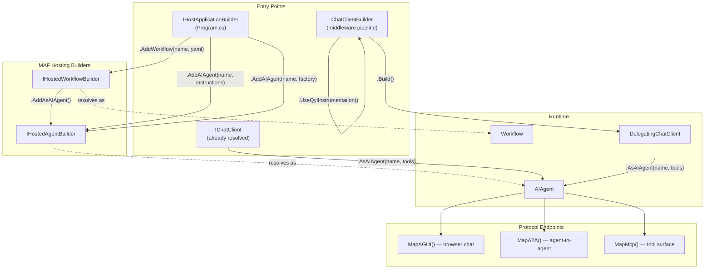

# MAF Builder Map for qyl

Decision: [maf_migration_decision.md](../memory/maf_migration_decision.md) — delete custom wrappers, use MAF native.

## Builder Hierarchy



## Decision Table

| You have | You need | Use this | NOT this |
|----------|----------|----------|----------|
| `IHostApplicationBuilder` | YAML workflow | `.AddWorkflow(name, yaml)` | ~~`DeclarativeWorkflowBuilder.Build<T>()`~~ |
| `IHostedWorkflowBuilder` | Agent from workflow | `.AddAsAIAgent()` | ~~`workflow.AsAIAgent()`~~ |
| `IHostApplicationBuilder` | Named agent | `.AddAIAgent(name, instructions, chatClientServiceKey)` | ~~`QylAgentBuilder.FromChatClient()`~~ |
| `IHostApplicationBuilder` | Agent + tools | `.AddAIAgent(...).WithAITools(tools)` | ~~manual tool wiring~~ |
| `IChatClient` | Ephemeral agent (no DI) | `client.AsAIAgent(name, tools)` | Only valid in qyl.mcp |
| `ChatClientBuilder` | OTel spans | `.UseQylInstrumentation()` | ~~`new InstrumentedChatClient()`~~ |
| `ChatClientBuilder` | Tool loops | `.UseFunctionInvocation()` | ~~manual agent loops~~ |
| `AIAgent` | Browser chat | `app.MapAGUI(agent, path)` | ~~`CopilotAguiEndpoints`~~ |
| `AIAgent` | Agent-to-agent | `app.MapA2A(agent, path)` | ~~custom SSE endpoints~~ |

## Target: qyl.collector Program.cs

```csharp
var builder = WebApplication.CreateBuilder(args);
builder.UseQyl();  // observability: done

// Keyed IChatClient — replaces LlmProviderFactory
builder.Services.AddKeyedSingleton<IChatClient>("llm", (sp, _) =>
    new ChatClientBuilder(CreateFromEnv(sp))
        .UseQylInstrumentation()
        .Build());

// Loom agents — replaces QylAgentBuilder + DeclarativeEngine
builder.AddAIAgent("loom-triage",
    instructions: LoomPrompts.Triage,
    chatClientServiceKey: "llm");

builder.AddAIAgent("loom-autofix",
    instructions: LoomPrompts.Autofix,
    chatClientServiceKey: "llm")
    .WithAITools(mcpTools);

builder.AddAIAgent("loom-review",
    instructions: LoomPrompts.CodeReview,
    chatClientServiceKey: "llm");

// Loom pipeline — replaces DeclarativeEngine + WorkflowParser
builder.AddWorkflow("loom-pipeline", (sp, key) =>
    AgentWorkflowBuilder.BuildSequential(key,
        sp.GetRequiredKeyedService<AIAgent>("loom-triage"),
        sp.GetRequiredKeyedService<AIAgent>("loom-autofix"),
        sp.GetRequiredKeyedService<AIAgent>("loom-review")))
    .AddAsAIAgent();

// Copilot — replaces QylCopilotAdapter
builder.AddAIAgent("copilot",
    instructions: "You are qyl's observability assistant.",
    chatClientServiceKey: "llm")
    .WithAITools(observabilityTools);

var app = builder.Build();

app.MapAGUI("/api/v1/copilot/chat", "copilot");  // browser
app.MapA2A("/a2a/loom", "loom-pipeline");          // agent-to-agent
app.MapMcp();                                       // tool surface
```

## Deletion Manifest

| Delete | Lines | MAF replacement |
|--------|------:|----------------|
| `QylAgentBuilder` | 78 | `builder.AddAIAgent()` |
| `QylCopilotAdapter` | 556 | `builder.AddAIAgent()` + `MapAGUI()` |
| `DeclarativeEngine` | 238 | `AgentWorkflowBuilder.BuildSequential()` |
| `WorkflowParser` | ~150 | MAF YAML `DeclarativeWorkflowBuilder` |
| `CopilotAguiEndpoints` | 55 | `app.MapAGUI()` directly |
| `LlmProviderFactory` | ~100 | Keyed `IChatClient` DI |
| `TrackModeRouter` | ~80 | Keyed services per track |
| `ChunkingPipeline` | ~200 | Out of scope (not observability) |
| **Total** | **~1,450** | **MAF native** |

## What qyl Keeps (the real value)

| Component | Why it stays |
|-----------|-------------|
| `UseQyl()` | Zero-config OTel setup, auto-discovery, capability manifests |
| `InstrumentedChatClient` | `DelegatingChatClient` for gen_ai.* spans — moves to qyl.instrumentation |
| `InstrumentedAIFunction` | OTel wrapping for tool calls — moves to qyl.instrumentation |
| Source generators | `[Traced]`, `[GenAi]`, `[Db]` compile-time interceptors |
| Collector auto-discovery | `QYL_COLLECTOR_URL` resolution |

## Per-Project Role After Migration

| Project | Role |
|---------|------|
| **qyl.collector** | Composition root. `builder.AddAIAgent()`, `builder.AddWorkflow()`, `app.Map*()` |
| **qyl.instrumentation** | SDK. `UseQyl()`, `InstrumentedChatClient`, source generators |
| **qyl.mcp** | Ephemeral agents only. `ChatClientBuilder.UseFunctionInvocation().Build().AsAIAgent()` |
| **qyl.loom** | Domain logic only. Prompts, services, analysis. No agent construction. |
| ~~qyl.agents~~ | **Deleted.** `InstrumentedChatClient` moves to qyl.instrumentation |
| ~~qyl.workflows~~ | **Deleted.** MAF native `AddWorkflow()` + `AddAsAIAgent()` |
