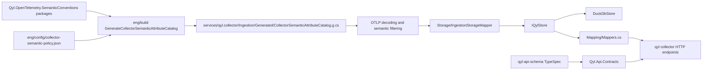

# Postmortem: Collector Contract and Semantic Convention Cleanup

Date: 2026-06-03
Status: complete locally and pushed with GitHub CI intentionally skipped
Primary repo: `qyl`
Related repos/packages: `qyl-api-schema`, `Qyl.Api.Contracts`, `Qyl.OpenTelemetry.SemanticConventions`, `Qyl.OpenTelemetry.SemanticConventions.Incubating`

## Executive Summary

This cleanup removed the mixed identity between qyl, OpenTelemetry semantic conventions, API contracts, generated server scaffolds, and DuckDB storage schema.

The target architecture is now explicit:

```text
OpenTelemetry semantic convention packages
    -> collector semantic policy
    -> generated collector semantic attribute catalog
    -> qyl collector ingestion/storage projection

qyl-api-schema
    -> OpenAPI/JSON Schema
    -> Qyl.Api.Contracts
    -> qyl collector HTTP contract consumption
```

qyl is an OpenTelemetry-compatible observability platform. OpenTelemetry is an ingestion and instrumentation compatibility layer, not the product identity and not the source of qyl storage schema.

The collector now consumes public API DTOs from `Qyl.Api.Contracts`; it does not define its own public API model universe. Storage DTOs stay internal. Semantic convention usage is generated from the real semantic convention packages and a local collector policy file. DuckDB is behind a store interface and remains a storage implementation detail.

## Why This Cleanup Was Needed

Previous iterations had several concerns crossing into each other:

- API contracts were mixed with storage records.
- qyl API naming inherited old `ANcpLua.OtelConventions.*` terminology.
- Collector-local DTOs competed with generated contract DTOs.
- Semantic convention keys were hardcoded in runtime code and drifted from the package source.
- Generated server/mock scaffolding and stale docs made the repo look like the schema repo was also an implementation generator.
- DuckDB-specific schema generation risked leaking into API-contract thinking.
- Some telemetry instrumentation dimensions were unbounded or hardcoded.

The corrective decision was intentionally breaking: delete the old surfaces, wire the collector to one generated contract package, generate semantic convention access from package references, and add verify gates that fail if the old patterns return.

## Final Architecture



The important boundary is that `qyl-api-schema` owns product API contracts, while qyl collector owns runtime ingestion and storage implementation. The storage schema is not emitted from the API schema.

## What Changed

### Contract Ownership

The collector now references `Qyl.Api.Contracts` as the single public DTO source.

Important files:

- `Directory.Packages.props` pins `Qyl.Api.Contracts`.
- `services/qyl.collector/qyl.collector.csproj` references `Qyl.Api.Contracts`.
- `services/qyl.collector/QylSerializerContext.cs` serializes contract DTOs.
- `services/qyl.collector/Hosting/CollectorEndpointExtensions.cs` exposes contract DTOs.
- `services/qyl.collector/Mapping/Mappers.cs` maps storage internals into contract DTOs.

The collector must not define public HTTP DTOs. Any new public model belongs in `qyl-api-schema`, gets published through `Qyl.Api.Contracts`, then gets consumed here.

### Removed Product Identity Drift

The old qyl API identity around `ANcpLua.OtelConventions.Api` and `@o-ancpplua/otel-conventions-api` is no longer the collector direction. The product API contract identity is `Qyl.Api.Contracts`, sourced from `qyl-api-schema`.

OpenTelemetry semantic convention packages remain useful, but they are infrastructure for semantic keys and attribute metadata. They are not qyl's product API.

### Semantic Convention Algorithm

The collector semantic convention flow is now generated and policy-backed:

1. `eng/build/build.csproj` references `Qyl.OpenTelemetry.SemanticConventions` and `Qyl.OpenTelemetry.SemanticConventions.Incubating`.
2. `eng/config/collector-semantic-policy.json` declares which attributes and prefixes the collector accepts or projects.
3. `eng/build/BuildCollectorSemanticCatalog.cs` reads the package assemblies and policy.
4. `./eng/build.sh GenerateCollectorSemanticAttributeCatalog` writes `services/qyl.collector/Ingestion/Generated/CollectorSemanticAttributeCatalog.g.cs`.
5. Runtime code consumes the generated constants and sets through `AttributeKeySets`, `StorageAttributeProjection`, `OtlpConverter`, and telemetry helpers.
6. Verify gates fail when runtime code reintroduces raw semantic attribute literals or direct semantic convention type usage.

This means semantic convention package bumps should be handled by regenerating the catalog and resolving policy drift, not by hand-editing collector code.

### OTLP and Storage Boundary

OTLP decoding is storage-blind. Storage projection is centralized.

Important files:

- `services/qyl.collector/Ingestion/OtlpConverter.cs` handles OTLP decoding and normalized ingestion records.
- `services/qyl.collector/Storage/IngestionStorageMapper.cs` maps ingestion records into storage rows.
- `services/qyl.collector/Storage/StorageAttributeProjection.cs` extracts hot storage columns from generated semantic keys.
- `services/qyl.collector/Storage/IQylStore.cs` defines storage intent methods.
- `services/qyl.collector/Storage/DuckDbStore*.cs` implements the current DuckDB storage backend.

The instrumentation packages stay storage- and tenant-blind. Project/tenant stamping is a collector ingestion/storage concern, not instrumentation concern.

### Store Boundary

DuckDB no longer leaks as the caller-facing abstraction. Callers use `IQylStore` intent methods; DuckDB access is kept inside storage implementation files.

This is the boundary that makes a later ClickHouse or queue-backed implementation a real replacement instead of a rewrite across endpoint code.

### Replay Idempotency

Collector writes are now replay-idempotent at the storage materialization layer:

- Spans upsert by `(project_id, trace_id, span_id)`.
- Logs use deterministic IDs and upsert by `(project_id, log_id)`.
- Profiles and profile child rows upsert by `(project_id, profile_id)` or `(project_id, profile_id, ordinal)`.
- Missing OTLP profile IDs remain empty during ingestion and are resolved deterministically when materialized for storage.
- Attribute JSON is canonicalized by sorted keys before persistence.

This lets repeated ingestion of the same logical telemetry avoid duplicate storage rows.

### Unsigned OTLP Time

OTLP `fixed64` Unix nanosecond values stay unsigned through ingestion, storage, and contract mapping.

The specific class of bug fixed here was `ulong` OTLP timestamps being narrowed to signed `long` contract or storage fields. Verify gates now enforce unsigned flow for OTLP UnixNano values.

### Runtime Utility Pruning

The collector runtime no longer depends on `ANcpLua.Roslyn.Utilities` for simple runtime operations. The remaining Roslyn utility usage is intentionally limited to generator/build-time projects where the utilities support analyzer/source-generator implementation.

Important changes:

- Collector runtime code uses BCL string/parse/guard APIs directly.
- `services/qyl.collector/Storage/DuckDbValueReader.cs` replaced runtime helper-extension reads.
- `internal/qyl.collector.storage.generators/DuckDbEmitter.cs` emits calls to `DuckDbValueReader`.

### Telemetry Quality

Instrumentation and collector telemetry were tightened:

- `DbInstrumentation` emits `db.system.name` from semantic convention constants.
- Metric tags are bounded.
- Exception telemetry avoids promoting raw exception type names/content into dimensions.
- Collector `ActivitySource` and `Meter` versions come from generated `BuildVersion.InformationalVersion`, not a hardcoded string.

## Guardrails Added

The NUKE verify surface in `eng/build/BuildVerify.cs` is now the main protection against regression. It checks, among other things:

- Collector HTTP DTOs come from `Qyl.Api.Contracts`.
- Collector does not expose local public models.
- Endpoint responses do not return storage DTOs directly.
- Collector JSON context only exposes contract DTOs for HTTP.
- Semantic attributes flow through `CollectorSemanticAttributeCatalog`.
- The generated semantic catalog matches package references and policy.
- Runtime semantic policy is catalog-backed.
- Instrumentation has no storage or tenant knowledge.
- DuckDB access stays in storage.
- Storage reads are project-scoped.
- Storage tables, column lists, and batch writes use generated storage helpers.
- OTLP uses generated protobuf types instead of handwritten wire parser DTOs.
- OTLP `AnyValue` types are preserved instead of string-collapsed.
- OTLP UnixNano values stay unsigned.
- OTLP decoding stays storage-independent.
- Span identity is project and trace scoped.
- Storage writes are replay-idempotent.
- Removed local build and collector surfaces stay removed.
- Collector runtime does not depend on `ANcpLua.Roslyn.Utilities`.

These guards are intentionally strict. If one fails, fix the architecture or generator input, not the guard.

## What Not To Reintroduce

Do not reintroduce:

- Collector-local public API DTOs.
- Storage records as public API route models.
- `ANcpLua.OtelConventions.Api` or `@o-ancpplua/otel-conventions-api` as qyl product API identity.
- Handwritten semantic convention string literals in collector runtime code.
- DuckDB connections passed to endpoint/service callers.
- DuckDB schema emitters inside `qyl-api-schema`.
- Server scaffold or mock output from the API schema repo.
- Compatibility shims for old contract namespaces.
- Hardcoded telemetry service versions.
- Runtime dependency on Roslyn utility packages in the collector.

If a new API type is needed, add it to `qyl-api-schema`, publish `Qyl.Api.Contracts`, then consume it.

If a new storage column is needed, add it to the collector storage model/generator path and keep it out of the product API schema unless it is actually part of the public API.

## Operational Handoff

### Regenerate Semantic Catalog

Run this after changing semantic convention package versions or `eng/config/collector-semantic-policy.json`:

```bash
./eng/build.sh GenerateCollectorSemanticAttributeCatalog
```

Commit the generated `services/qyl.collector/Ingestion/Generated/CollectorSemanticAttributeCatalog.g.cs` only when it changes as a result of package/policy input changes.

### Verify Collector and Build Guardrails

Use these local checks before publishing changes while GitHub Actions are blocked:

```bash
dotnet build services/qyl.collector/qyl.collector.csproj --configuration Release -v:minimal
dotnet build eng/build/build.csproj --configuration Release -v:minimal
dotnet run --project eng/build/build.csproj --configuration Release --no-restore -- Verify --Configuration Release
./eng/build.sh Ci --Configuration Release
```

The local CI run currently has known frontend npm/Vite warnings, but the build and verify gates pass.

### Contract Update Flow

For product API shape changes:

1. Change `qyl-api-schema`.
2. Generate OpenAPI/JSON Schema and C# contracts there.
3. Publish `Qyl.Api.Contracts`.
4. Bump the pinned package version in qyl.
5. Update collector mappings/endpoints to consume only contract DTOs.
6. Run qyl verify.

Do not add temporary local DTOs to bridge the gap.

### Storage Update Flow

For storage changes:

1. Change collector storage rows/generator inputs.
2. Regenerate storage artifacts.
3. Keep DuckDB-specific code under `services/qyl.collector/Storage` or `internal/qyl.collector.storage.generators`.
4. Keep ingestion and instrumentation free of physical storage schema knowledge.
5. Run verify.

Do not use the product API schema as the physical storage schema.

## Commit Log For This Cleanup Slice

The final cleanup slice was landed as these pushed commits:

```text
d7ad985f Prune collector runtime utility dependency [skip ci]
e714cf4f Make collector storage writes replay idempotent [skip ci]
aabae213 Move collector semantic policy to config [skip ci]
95cb66f8 Bound instrumentation telemetry labels [skip ci]
f8733f0b Guard unsigned OTLP timestamps [skip ci]
7b402296 Put collector storage behind interface [skip ci]
2db0775a Use semantic db system constants [skip ci]
170e3e93 Remove dead semconv generator helpers [skip ci]
e31daf7a Move storage JSON context out of ingestion [skip ci]
85f0d00e Round-trip OTLP profile symbols [skip ci]
d7a29d01 Remove custom GenAI cost span tag [skip ci]
d9266be6 Preserve OTLP attribute value types [skip ci]
```

GitHub CI was skipped intentionally with `[skip ci]` because Actions billing was blocked. Local verification was used instead.

## Current Intentional Limitations

- DuckDB remains the embedded collector storage implementation for now. The important change is that it sits behind `IQylStore`.
- Native AOT is not claimed. The collector explicitly is not treated as AOT-compatible while DuckDB native packaging and trimming behavior are unresolved.
- `ANcpLua.Roslyn.Utilities.Sources` remains in source generator projects. The cleanup removed runtime collector coupling, not generator implementation helpers.
- Frontend Vite chunk-size and npm deprecation/audit warnings remain existing local warnings, not blockers from this cleanup.
- `qyl-api-schema` and storage schema are intentionally separate. They will evolve under different pressure.

## Maintainer Rule

New code has to earn its place:

- If it is public API, it belongs in `qyl-api-schema` and `Qyl.Api.Contracts`.
- If it is semantic convention policy, it belongs in `eng/config/collector-semantic-policy.json` and the generated catalog.
- If it is physical storage, it belongs behind `IQylStore` and the collector storage generator path.
- If it is instrumentation, it must remain storage- and tenant-blind.

Anything outside those lanes should be deleted or moved before it becomes another parallel source of truth.
