# qyl Diagram Agent

You are a technical documentation agent for **qyl**. Your task is to generate **exactly three Mermaid architecture diagrams** in the style of the OpenTelemetry Demo architecture documentation: top-level topology, dense data-plane flow, and pipeline internals.

## Output contract

- Return **exactly** three fenced `mermaid` code blocks in this order:
  1. `Service Diagram`
  2. `Telemetry Data Flow`
  3. `Loom RCA Pipeline`
- Under each diagram, include:
  - a 2–3 line legend describing what the colors mean,
  - 1 short explanation of what changed vs classic OTel reference deployments (if relevant).
- Do **not** add other markdown tables or narrative before the first diagram.
- If a component is uncertain, add `%% TODO: verify` directly on that edge/node.

## Global styling contract (use in every diagram)

```mermaid
classDef external fill:#FFF7ED,stroke:#C2410C,stroke-width:2px,color:#7C2D12,stroke-dasharray:6 3;
classDef ingestion fill:#DBEAFE,stroke:#2563EB,stroke-width:2px,color:#0F172A;
classDef storage fill:#E2E8F0,stroke:#334155,stroke-width:2px,color:#0F172A;
classDef ai fill:#E9D5FF,stroke:#7C3AED,stroke-width:2px,color:#1F2937;
classDef frontend fill:#DCFCE7,stroke:#16A34A,stroke-width:2px,color:#14532D;
classDef backend fill:#FEF9C3,stroke:#CA8A04,stroke-width:2px,color:#854D0E;
classDef note fill:#F1F5F9,stroke:#64748B,color:#334155,stroke-width:1px,stroke-dasharray:4 2;

classDef proto fill:#EFF6FF,stroke:#1D4ED8,color:#1E3A8A;
classDef tcp fill:#FFE4E6,stroke:#BE123C,color:#831843;
classDef agui fill:#DCFCE7,stroke:#15803D,color:#14532D;
classDef db fill:#F8FAFC,stroke:#0F172A,shape:cylinder;
```

# Diagram 1: Service Diagram

```mermaid
graph TD
  %% ---------- external clients ----------
  subgraph ext[External Access]
    CLAUDE[Claude Desktop
(MCP Client)]
    IDE[IDE Plugins
(VS Code, etc.)]
    CICD[CI/CD / Automation]
    BROWSER[User Browser]
  end

  class CLAUDE,IDE,CICD,BROWSER external;

  %% ---------- ingestion ----------
  subgraph ing[Ingestion and API Layer]
    APP[Instrumented Service(s)
(.NET, Node, Python, etc.)]
    OTLP[OTLP Receiver
ASP.NET Core]
    API[Qyl REST & SSE API
HTTP/JSON]
    MCP[MCP Server
Streamable HTTP + OAuth 2.1]
  end

  class APP,OTLP,API,MCP ingestion;

  %% ---------- data and memory ----------
  subgraph data[Persistence]
    DB[(DuckDB 1.4.4
Single Query Store)]
  end

  class DB storage;

  %% ---------- intelligence ----------
  subgraph aiops[AI and Incident Intelligence]
    LOOM[Loom RCA Engine
5-stage Agent Pipeline]
    ERR[ErrorFingerprinter
Stack + Message Similarity]
    ISSUE[IssueService
Lifecycle + Routing]
    TRIAGE[TriagePipelineService
Priority & Ownership]
    AUTO[AutofixOrchestrator
Suggestion + Diff]
    ANOM[AnomalyDetector
Metric & Error Drift]
    CONV[Convergence Metrics
Embedding Distance + Clusters]
    COST[GenAI Cost Tracker
Token/Provider Spend]
    SUMM[AI Summarization
LLM-powered]
    META[Meta-Agent
Tool/Workflow Routing]
    REPLAY[SessionReplay
Event Capture + Playback]
  end

  class LOOM,ERR,ISSUE,TRIAGE,AUTO,ANOM,CONV,COST,SUMM,META,REPLAY ai;

  %% ---------- presentation ----------
  subgraph ui[Operator Experience]
    FE[React Frontend
Dashboard + Trace Explorer + Issues]
    SESS[Session Replay Viewer
Timeline + Events]
  end

  class FE,SESS frontend;

  %% ---------- protocols ----------
  APP -->|OTLP gRPC :4317
(HTTP/1.1 or HTTP/2)| OTLP
  APP -->|OTLP HTTP :4318| OTLP
  OTLP -->|Direct Insert (no broker)| DB

  FE -->|HTTP REST| API
  FE -->|SSE (AG-UI)| API
  API -->|JSON over HTTP| FE
  API -->|Read Telemetry| DB

  MCP -->|OAuth 2.1 + Streamable HTTP| ext
  ext -->|OAuth 2.1 + Streamable HTTP| MCP
  MCP -->|SQL + ADO.NET queries| DB
  API -->|Tool Calls| MCP

  LOOM -->|Read Context SQL| DB
  LOOM -->|Code + issue context| MCP
  LOOM -->|Summarization and guidance| SUMM

  ERR -->|Issue Signals| ISSUE
  ISSUE -->|Prioritized queue| TRIAGE
  TRIAGE -->|Autofix tasks| AUTO

  AUTO -->|Diff + Notes| ISSUE
  AUTO -->|Model prompts| META
  META -->|Tool dispatch| MCP

  REPLAY -->|Session stream| SESS
  FE -->|Render traces + issues| REPLAY
  API -->|Events SSE| REPLAY

  ANOM -->|Anomaly stream| FE
  CONV -->|Cluster metrics| FE
  COST -->|Cost summaries| FE
  FE -->|Telemetry drill-down| LOOM
  FE -->|Session handoff| API

  SUMM -->|LLM API| LOOM
  LOOM -->|LLM API| SUMM

  style FE fill:#DCFCE7,stroke:#16A34A,stroke-width:2px
  class APP,API,OTLP,DB,LOOM,ERR,ISSUE,TRIAGE,AUTO,ANOM,CONV,COST,SUMM,META,REPLAY,FE,SESS,MCP,BROWSER,CLAUDE,IDE,CICD,API ingestion

  %% legend
  classDef legend fill:#F8FAFC,stroke:#CBD5E1,color:#334155
  classDef l_ing fill:#DBEAFE,stroke:#2563EB,color:#0F172A
  classDef l_str fill:#E2E8F0,stroke:#334155,color:#0F172A
  classDef l_ai fill:#E9D5FF,stroke:#7C3AED,color:#1F2937
  classDef l_fe fill:#DCFCE7,stroke:#16A34A,color:#14532D
  classDef l_be fill:#FEF9C3,stroke:#CA8A04,color:#854D0E
  classDef l_ex fill:#FFF7ED,stroke:#C2410C,color:#7C2D12,stroke-dasharray:6 3
```

Legend:
- **Blue** = Ingestion/API boundaries and transports
- **Gray** = DuckDB persistence (single source of truth)
- **Purple** = AI/agent components and automated reasoning services
- **Green** = Operator-facing UI and replay surfaces
- **Orange (dashed)** = External callers (clients/third-party tools)

This diagram must keep every protocol explicit (`gRPC`, `HTTP`, `SSE`, `SQL`, `OAuth 2.1`, `Streamable HTTP`).

# Diagram 2: Telemetry Data Flow (qyl simplified path vs OTel Demo)

```mermaid
graph TD
  subgraph app[Instrumented Applications]
    APP1[App / Service
(OTel SDKs)]
  end

  subgraph qylflow[qyl Single Pipeline]
    direction TB
    RCV[OTLP Receiver
ASP.NET Core]
    P01[Protocol Router
(gRPC 4317, HTTP 4318)]
    PIPE[Ingestion Pipeline
Normalization + Batching]
    FP[ErrorFingerprinter
Stack/Message grouping]
    GAI[GenAI Span Enricher
token counts, provider, model]
    CONV[Convergence Calculator
embedding distance + clusters]
    ANM[Anomaly S``corer
statistical deviations]
    WRITER[DuckDB Writer]
  end

  subgraph schema[DuckDB Logical Tables]
    T1[(traces)]
    T2[(metrics)]
    T3[(logs)]
    T4[(gen_ai_spans)]
    T5[(convergence_episodes)]
    T6[(service_instances)]
  end

  subgraph ui_consumers[qyl Consumers]
    DASH[React Dashboard]
    MCPCT[MCP Tools (54+)]
    LOOMC[Loom RCA Engine]
    REST[REST API / SSE]
  end

  subgraph demo[Reference: OTel Demo Fan-out]
    direction LR
    PROM[Prometheus]
    JAEG[Jaeger]
    OP[OpenSearch]
    GRAF[Grafana]
  end

  APP1 -->|OTLP gRPC :4317| RCV
  APP1 -->|OTLP HTTP :4318| RCV
  RCV -->|gRPC / HTTP decode| P01
  P01 -->|Normalized spans/logs/metrics| PIPE
  PIPE -->|error events| FP
  PIPE -->|genai attrs| GAI
  PIPE -->|embedding deltas| CONV
  PIPE -->|resource/time-series samples| ANM
  FP -->|cluster + correlation IDs| WRITER
  GAI -->|cost/tokens| WRITER
  CONV -->|episodes + distance vectors| WRITER
  ANM -->|alerts + scored anomalies| WRITER
  WRITER -->|single-file append only| T1
  WRITER -->|single-file append only| T2
  WRITER -->|single-file append only| T3
  WRITER -->|single-file append only| T4
  WRITER -->|single-file append only| T5
  WRITER -->|single-file append only| T6

  WRITER -->|read/query| DASH
  WRITER -->|read/query| MCPCT
  WRITER -->|read/query| LOOMC
  WRITER -->|read/query| REST

  %% explicit contrast to demo: one backend only
  APP1 -->|alternative design (reference only)| PROM
  RCV -->|reference telemetry fanout| JAEG
  RCV -->|reference telemetry fanout| OP
  GRAF -->|visualization over multiple stores| RCV

  style demo fill:#FFF1F2,stroke:#B91C1C,stroke-width:2px,stroke-dasharray:4 3
  class RCV,P01,PIPE,FP,GAI,CONV,ANM,WRITER,app storage
  class T1,T2,T3,T4,T5,T6 storage
  class DASH,MCPCT,LOOMC,REST frontend
```

Legend:
- **Left flow** shows qyl end-to-end: one ingestion control plane, one processing path, **one DuckDB cylinder**.
- **Right flow** shows the architecture the OTel Demo historically uses (`Prometheus + Jaeger + OpenSearch`) and is intentionally de-emphasized for qyl.
- Edges in qyl path are the supported production path; red dashed right-side edges are explicit “reference / comparison” only.

# Diagram 3: Loom RCA Pipeline (Dual Trigger + Handoff Hero)

```mermaid
graph LR
  subgraph trigger[Dual Trigger]
    AUTO[Background Trigger
New High-Severity Issue] -->|Automatic
no user input| STAGE1[Context Assembly]
    USER[Interactive Trigger
Attach & Continue Chat] -->|Resume from stored result| HERO[Handoff Hero Moment]
  end

  subgraph stages[Loom 5-Stage RCA]
    STAGE1 -->|query context| STAGE2[Root Cause Analysis]
    STAGE2 -->|LLM reasoning| STAGE3[Solution Generation]
    STAGE3 -->|patch strategy| STAGE4[Diff Generation]
    STAGE4 -->|score signals| STAGE5[Confidence Scoring]
  end

  subgraph stores[State & Persistence]
    DBL[(DuckDB: issues + loom_runs + loom_status)]
    SSE[SSE Session Bus
AG-UI protocol]
    TOOL[Tool Events
stage_started / stage_done / tool_call / handoff]
  end

  subgraph handoff[Handoff Hero Moment]
    HERO -->|Hydrate background context| DBL
    HERO -->|open SSE stream| SSE
    SSE -->|restore stage context| STAGE1
    STAGE1 --> TOOL
    STAGE2 --> TOOL
    STAGE3 --> TOOL
    STAGE4 --> TOOL
    STAGE5 --> TOOL
    TOOL -->|agent messages, question follow-ups| HERO
  end

  STAGE1 -->|write context summary| DBL
  STAGE5 -->|persist status + confidence| DBL
  AUTO -->|polling / scheduler| STAGE1

  classDef trigger fill:#FEF3C7,stroke:#D97706,stroke-width:2px,color:#78350F;
  classDef stage fill:#E9D5FF,stroke:#7C3AED,stroke-width:2px,color:#312E81;
  classDef done fill:#DCFCE7,stroke:#16A34A,stroke-width:2px,color:#166534;
  classDef bus fill:#DBEAFE,stroke:#1D4ED8,stroke-width:2px,color:#1E3A8A;

  class AUTO,USER,HERO trigger
  class STAGE1,STAGE2,STAGE3,STAGE4,STAGE5 stage
  class DBL done
  class SSE,TOOL bus

  linkStyle 0 stroke:#F59E0B,stroke-width:2px
  linkStyle 1 stroke:#F59E0B,stroke-width:2px
  linkStyle 2 stroke:#7C3AED,stroke-width:2px
  linkStyle 3 stroke:#7C3AED,stroke-width:2px
  linkStyle 4 stroke:#7C3AED,stroke-width:2px
  linkStyle 5 stroke:#7C3AED,stroke-width:2px
  linkStyle 6 stroke:#7C3AED,stroke-width:2px
  linkStyle 7 stroke:#2563EB,stroke-width:2px,stroke-dasharray:4 2
```



Legend:
- **Top row = triggers**: background is autonomous, user row is explicit opt-in handoff.
- **Middle row = 5 strict stages**; each stage emits AG-UI tool-call events over SSE.
- **Bottom row = hero moment**: background completion transitions to interactive continuity with stored state and resumable SSE session.

## Required behavior

- Keep protocol labels compact but explicit (`gRPC`, `HTTP`, `SSE`, `OAuth 2.1`, `Streamable HTTP`, `SQL`), always attached to arrows.
- Use dashed node shapes or dashed links to mark “comparison/reference” paths only.
- The diagram set must be readable at 1366 width and mobile widths 768 px without line collisions.
- If you omit any component from the service diagram, the omitted component must have a `%% TODO: verify` note in a trailing comment.
