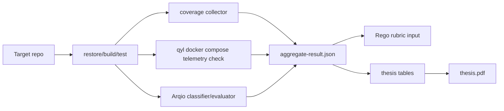

# Arqio/qyl Thesis Evaluation Status

Run: `20260519-173709-local`

## Changed qyl Components

- Added corpus configuration under `research/arqio/corpus/targets.json`.
- Added result schemas under `research/arqio/schemas`.
- Added corpus, aggregation, and thesis table automation under `eng/automation/arqio`.
- Added .NET coverage runner under `eng/automation/coverage`.
- Added SemConv verification wrapper under `eng/automation/semconv`.
- Added thesis source and build files under `research/thesis`.

## Arqio Consumption

- Arqio was consumed as a corpus target from `/Users/ancplua/RiderProjects/Arqio`.
- Arqio build failed in the measured run with `NU1009` in `Arqio.DependencyAnalyzer.Sample.csproj`.
- No Arqio source files were modified.

## Coverage Source

- Coverage is attempted through `dotnet test --collect:"XPlat Code Coverage"` using `eng/automation/coverage/coverlet.runsettings`.
- No `coverage.cobertura.xml` file was produced in the latest run because coverage-required targets either failed build or failed test execution.

## SemConv Checks

- `eng/automation/semconv/verify-qyl-semconv.sh` built qyl stable, incubating, and package semantic-convention projects successfully.
- The semconv-testbed script failed because Docker Desktop was not reachable.

## Telemetry Flow



Telemetry was unavailable in the latest run because `docker compose -f eng/compose.yaml config` required `OPENAI_API_KEY`.

## Reproduce

```sh
cd /Users/ancplua/RiderProjects/qyl
CORPUS_REPETITIONS=1 eng/automation/arqio/run-corpus.sh research/arqio/corpus/targets.json
eng/automation/semconv/verify-qyl-semconv.sh research/arqio/results/20260519-173709-local
cd research/thesis
make pdf
```
